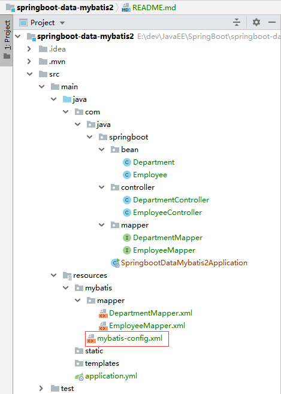

springboot-data-mybatis2
==

## 常见问题
### SpringBoot集成myBatis时，mapper接口注入失败的问题
* 项目目录结构
    
* [mybatis-config.xml]()
    ```xml
    <?xml version="1.0" encoding="UTF-8" ?>
    <!DOCTYPE configuration
            PUBLIC "-//mybatis.org//DTD Config 3.0//EN"
            "http://mybatis.org/dtd/mybatis-3-config.dtd">
    <configuration>
        <settings>
            <setting name="mapUnderscoreToCamelCase" value="true"/>
        </settings>
        <mappers>
            <package name="com.java.springboot.mapper"/>
        </mappers>
    </configuration>
    ```

* [application.yml](src/main/resources/application.yml)
    ```yaml
    spring:
      datasource:
        driver-class-name: com.mysql.cj.jdbc.Driver
        url: jdbc:mysql://10.100.240.209:13306/mydata?useUnicode=true&characterEncoding=UTF-8&serverTimezone=GMT%2B8&useSSL=false&allowMultiQueries=true
        username: root
        password: py123456
        type: com.alibaba.druid.pool.DruidDataSource
        druid:
        ...
    mybatis:
      config-location: classpath:mybatis/mybatis-config.xml
      mapper-locations: classpath:mybatis/mapper/*.xml
    ```

* 启动应用报错信息
    ```text
    Error starting ApplicationContext. To display the conditions report re-run your application with 'debug' enabled.
    2021-05-13 11:31:45.512 ERROR 16020 --- [           main] o.s.b.d.LoggingFailureAnalysisReporter   : 
    
    ***************************
    APPLICATION FAILED TO START
    ***************************
    
    Description:
    
    Field departmentMapper in com.java.springboot.controller.DepartmentController required a bean of type 'com.java.springboot.mapper.DepartmentMapper' that could not be found.
    
    The injection point has the following annotations:
        - @org.springframework.beans.factory.annotation.Autowired(required=true)
    
    
    Action:
    
    Consider defining a bean of type 'com.java.springboot.mapper.DepartmentMapper' in your configuration.
    
    
    Process finished with exit code 1
    ```

* **疑惑**
    ```text
    为什么mybatis-config指定了mappers所在的包，依旧无法加载对应的mnapper。
           
    但是直接给接口上添加@Mapper注释或是在SpringBoot入口处，增加@MapperScan指定要扫描的包就能正常启动。
    ```
    * 解疑
        ```text
        通过beanfactory，我们去获取对应的bean。
        
        发现直接获取对应的mapper时，确实不存在对应的bean。
        
        但是获取sqlsession后，在从sqlsession中查找对应的mapper时，发现已经存在对应的mapper代理。
        
        这才想起来，mybatis-config中只是会为对应的mapper创建代理类，
        而想真正包装成bean，注入到spring容器中，还是需要靠AutoConfiguredMapperScannerRegistrar，
        它会根据扫描@Mapper注释或是@MapperScan指定的包下的接口，将其注册为bean。
        ```