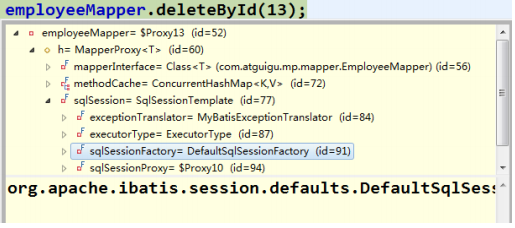
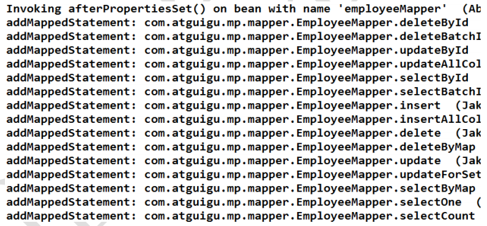
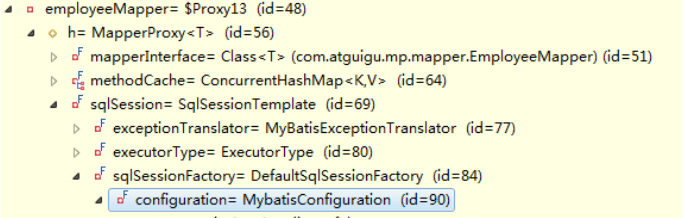
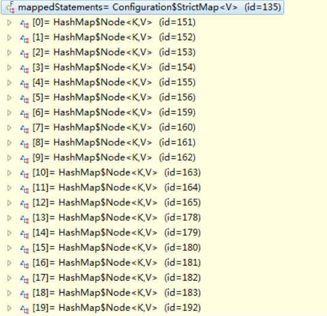
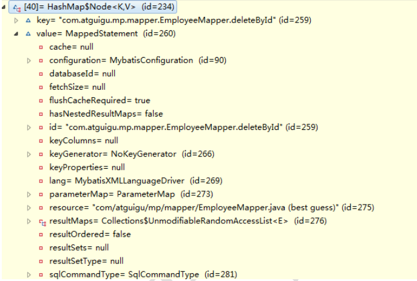

Mybatis-Plus
==

## Mybatis-plus概述
MyBatis-Plus（简称 MP）是一个 MyBatis的增强工具，在 MyBatis 的基础上只做增强不做改变，
为简化开发、提高效率而生。
比较适用于单表操作，尤其是JavaBean

* 特性
    * 无侵入
    * 损耗小
    * 强大的CRUD操作
    * 支持Lambda形式调用
    * 支持Sequence主键自动生成
    * 支持ActiveRecord模式
    * 支持自定义全局通用方法注入
    * 内置代码生成器（支持Mapper、Model、Service、Controller层代码的生成，支持模板引擎）
    * 内置分页插件
    * 内置性能分析插件
    * 内置全局拦截器

* 框架结构
    

* [官网](https://baomidou.com)
* [Mybatis-plus githug](https://github.com/baomidou/mybatis-plus)
    
## Spring集成Mybatis-plus步骤
* 前置知识
    * Mybatis
    * Spring 
    * Maven

1. 创建数据表
    这里以mysql为例，[sql脚本](../MyBatisPlus/sql/mp.sql)

2. 创建工程  
    参见[maven的使用](./maven的使用.md)
3. 添加maven依赖，编辑pom.xml文件
    添加mybatis-plus、spring、JDBC连接池、mysql驱动、log4j
    
    参考[pom.xml](../MyBatisPlus/mp00/pom.xml)

* 配置Spring环境、数据库连接信息、mybatis、log4j2
    * [applicationContext.xml](../MyBatisPlus/mp00/src/main/resources/applicationContext.xml)
    * [db.properties](../MyBatisPlus/mp00/src/main/resources/db.properties)
    * [mybatis-config.xml](../MyBatisPlus/mp00/src/main/resources/mybatis-config.xml)
    * [log4j2.xml](../MyBatisPlus/mp00/src/main/resources/log4j2.xml)
4. 测试
    [testDataSource()](../MyBatisPlus/mp00/src/test/java/com/java/mp/TestMP.java)

## HelloWorld入门
项目：[mp00(Mybatis-plus 3.4)](../MyBatisPlus/mp00)

项目：[mp00(Mybatis-plus 2.3)](../MyBatisPlus/mp01)

* 指[定实体类](../MyBatisPlus/mp00/src/main/java/com/java/mp/bean/Employee.java)要操作的表、主键策略
    
    MybatisPlus 默认使用实体类的类名到数据库找对应的表名，即此类名全部字母小写对应的表名
    * 方式1：可以在定义实体类时，加注释指定要操作的表、主键策略，可指定表中不存在的字段
        ```text
        @TableName(value = "tbl_employee")
        public class Employee {
            ...
            @TableId(value = "id", type = IdType.AUTO)
            private Integer id;
            
            // @TableField(exist = false)，表示非表的字段
            @TableField(exist = false)
            private Double salary;
            ...  
        }
        ```
    * 方式2：在applicationContext.xml通过dbConfig定义表前缀
        ```text
            <!-- 定义dbConfig -->
            <bean id="dbConfig" class="com.baomidou.mybatisplus.core.config.GlobalConfig.DbConfig">
                <!-- 全局的主键策略
                 AUTO(0, "数据库ID自增"),
                 INPUT(1, "用户输入ID"),
                 ID_WORKER(2, "全局唯一ID"),
                 UUID(3, "全局唯一ID"),
                 NONE(4, "该类型为未设置主键类型"),
                 ID_WORKER_STR(5, "字符串全局唯一ID");
                 -->
                <property name="idType" value="AUTO"></property>
                <!-- 全局的表前缀策略配置 -->
                <property name="tablePrefix" value="tbl_"></property>
            </bean>
      
            <!-- 定义MybatisPlus的全局策略配置-->
            <bean id ="globalConfig" class="com.baomidou.mybatisplus.core.config.GlobalConfig">
                <property name="dbConfig" ref="dbConfig"></property>
            </bean>
      
            <bean id="sqlSessionFactory" class="com.baomidou.mybatisplus.extension.spring.MybatisSqlSessionFactoryBean">
                <property name="dataSource" ref="dataSource"/>
                <!-- 注入MybatisPlus的全局策略配置 -->
                <property name="globalConfig" ref="globalConfig"></property>
            </bean>
        ```
    
### 通过CRUD
* 场景
    ```text
    有一张有tbl_employee，对应的实体类Employee，需要实现对tbl_employee表CRUD操作，应如何做？
    ```
* 实现方式
    * 基于Mybatis
        ```text
        1. 编写EmployeeMapper接口，定义CRUD方法
        2. 添加EmployeeMapper.xml映射文件，编写每个方法对应的SQL语句
        ```
    * 基于Mybatis-plus
        ```text
        1. 编写Employee接口，接口继续BaseMapper接口即可。
        这样就实现了多部分通用的方法，可以不创建SQL映射文件
        ```
#### 插入操作
```text
int insert(T entity)

支持主键自增的数据库插入数据获取主键值
Mybatis: 需要通过 useGeneratedKeys 以及 keyProperty 来设置
MP: 自动将主键值回写到实体类中
```

* 示例 [testCommonInsert()](../MyBatisPlus/mp00/src/test/java/com/java/mp/TestMP.java)

    [testInsert2()](../MyBatisPlus/mp00/src/test/java/com/java/mp/TestMP.java)

    

#### 更新操作
```text
int updateById(@Param("et") T entity)
```

* 示例 [testCommonUpdate()](../MyBatisPlus/mp00/src/test/java/com/java/mp/TestMP.java)

#### 查询操作
```text
T selectById(Serializable id)
T selectOne(@Param("ew") Wrapper<T> queryWrapper)
List<T> selectBatchIds(@Param("coll") Collection<? extends Serializable> idList)
List<T> selectByMap(@Param("cm") Map<String, Object> columnMap)
<E extends IPage<T>> E selectPage(E page, @Param("ew") Wrapper<T> queryWrapper)
```

* 示例 [testCommonSelect() - testCommonSelect5()](../MyBatisPlus/mp00/src/test/java/com/java/mp/TestMP.java)

#### 删除操作
```text
int delete(@Param("ew") Wrapper<T> queryWrapper)

int deleteById(Serializable id)

int deleteByMap(@Param("cm") Map<String, Object> columnMap)

int deleteBatchIds(@Param("coll") Collection<? extends Serializable> idList)
```

* 示例 [testCommonDelete() - testCommonDelete3()](../MyBatisPlus/mp00/src/test/java/com/java/mp/TestMP.java)

## Mybatis-plus启动时就注入SQL原理
1. xxxMapper接口继承了BaseMapper<T>，BaseMapper提供了通用的CRUD方法，方法来源的于BaseMapper。
有方法就必须有SQL语句，Mybatis最终还是需要通过SQL语句操作数据

2. employeeMpper的本质：org.apache.ibatis.binding.MapperProxy<T>

    MapperProxy中的sqlSession->SqlSessionFactory
    
    
    SqlSessionFactory->Configuration-MappedStatements
    一个mappedStatement对应Mapper接口中的一个方法与Mapper映射文件中的一个SQL语句
    
    MP在启动时就会逐个分析xxxMapper操中的方法，并且将对应的SQL语句处理好，保存到configuration对象
    的mappedStatement中
    
    本质:
    启动注入SQL 
    
    
    Configuration: Mybatis或MP全局配置对象
    MappedStatement: 一个 MappedStatement 对象对应 Mapper 配置文件中的一个
                     select/update/insert/delete 节点，主要描述的是一条 SQL 语句
                     
    SqlMethod: 枚举对象，MP支持的SQL方法
    TableInfo: 数据库表反射的信息，可以获取到数据库表相关的信息
    SqlSource: SQL语句处理对象
    MapperBuilderAssistant: 用于缓存、SQL参数、查询方法结果集处理等
    通过MapperBuilderAssistant将第一个mappedStatement添加到configuration对象的mappedstatement中
      
    
      
    
      


## 条件构造器
### AbstractWrapper
用于生成 sql 的 where 条件, entity 属性也用于生成 sql 的 where 条件。
注意: entity 生成的 where 条件与 使用各个 api 生成的 where 条件没有任何关联行为

是QueryWrapper、UpdateWrapper

* AbstractWrapper内置方法
可链式编程，因为每个方法最后都return this 对象本身

    https://baomidou.com/guide/wrapper.html#abstractwrapper

方法名 |说明 |语法 |示例
:---|:---|:---|:---
allEq |部eq(或个别isNull) |allEq(Map<R, V> params) <br>allEq(Map<R, V> params, boolean null2IsNull) <br>allEq(boolean condition, Map<R, V> params, boolean null2IsNull) |allEq({id:1,name:"老王",age:null}) --->id = 1 and name = '老王' and age is null 
eq |等于 = |eq(R column, Object val) <br>eq(boolean condition, R column, Object val) |eq("name", "老王") --->name = '老王' 
ne |不等于 <> |ne(R column, Object val) <br>ne(boolean condition, R column, Object val) |ne("name", "老王") --->name <> '老王' 
gt |大于 > |gt(R column, Object val) <br>gt(boolean condition, R column, Object val) |gt("age", 18) --->age > 18 
ge |大于等于 >= |ge(R column, Object val) <br>ge(boolean condition, R column, Object val) |ge("age", 18) --->age >= 18 
lt |小于 < |lt(R column, Object val) <br>lt(boolean condition, R column, Object val) |lt("age", 18) --->age < 18 
le |小于等于 <= |le(R column, Object val) <br>le(boolean condition, R column, Object val) |例: le("age", 18) --->age <= 18 
between |BETWEEN 值1 AND 值2 |between(R column, Object val1, Object val2) <br>between(boolean condition, R column, Object val1, Object val2) |between("age", 18, 30) --->age between 18 and 30 
notBetween |NOT BETWEEN 值1 AND 值2 |notBetween(R column, Object val1, Object val2) <br>notBetween(boolean condition, R column, Object val1, Object val2) |notBetween("age", 18, 30) --->age not between 18 and 30 
like |LIKE '%值%' |like(R column, Object val) <br>like(boolean condition, R column, Object val) |like("name", "王") --->name like '%王%' 
notLike |NOT LIKE '%值%' |notLike(R column, Object val) <br>notLike(boolean condition, R column, Object val) |notLike("name", "王") --->name not like '%王%' 
likeLeft |LIKE '%值' |likeLeft(R column, Object val) <br>likeLeft(boolean condition, R column, Object val) |likeLeft("name", "王") --->name like '%王'
likeRight |LIKE '值%' |likeRight(R column, Object val) <br>likeRight(boolean condition, R column, Object val) |likeRight("name", "王") --->name like '王%' 
isNull |字段 IS NULL |isNull(R column) <br>isNull(boolean condition, R column) |isNull("name")--->name is null 
isNotNull |字段 IS NOT NULL |isNotNull(R column) <br>isNotNull(boolean condition, R column) |isNotNull("name") --->name is not null 
in |字段 IN (value.get(0), value.get(1), ...) |in(R column, Collection<?> value) <br>in(boolean condition, R column, Collection<?> value) |in("age",{1,2,3})--->age in (1,2,3) 
notIn |字段 NOT IN (value.get(0), value.get(1), ...) <br><br>字段 NOT IN (v0, v1, ...) |notIn(R column, Collection<?> value) <br>notIn(boolean condition, R column, Collection<?> value) <br><br>notIn(R column, Object... values) <br>notIn(boolean condition, R column, Object... values) |notIn("age",{1,2,3}) --->age not in (1,2,3) <br><br>notIn("age", 1, 2, 3)---> age not in (1,2,3) 
inSql |字段 IN ( sql语句 ) |inSql(R column, String inValue) <br>inSql(boolean condition, R column, String inValue) |inSql("age", "1,2,3,4,5,6") ---> age in (1,2,3,4,5,6) <br><br>inSql("id", "select id from table where id < 3") ---> id in (select id from table where id < 3) 
notInSql |字段 NOT IN ( sql语句 ) |notInSql(R column, String inValue) <br>notInSql(boolean condition, R column, String inValue) |notInSql("age", "1,2,3,4,5,6") ---> age not in (1,2,3,4,5,6) <br><br>notInSql("id", "select id from table where id < 3") ---> id not in (select id from table where id < 3) 
groupBy |分组：GROUP BY 字段, ... |groupBy(R... columns) <br>groupBy(boolean condition, R... columns) |groupBy("id", "name") --->group by id,name 
orderByAsc |排序：ORDER BY 字段, ... ASC |orderByAsc(R... columns) <br>orderByAsc(boolean condition, R... columns) |orderByAsc("id", "name") ---> order by id ASC,name ASC 
orderByDesc |排序：ORDER BY 字段, ... DESC |orderByDesc(R... columns) <br>orderByDesc(boolean condition, R... columns) |orderByDesc("id", "name") ---> order by id DESC,name DESC 
orderBy |排序：ORDER BY 字段, ... |orderBy(boolean condition, boolean isAsc, R... columns) |orderBy(true, true, "id", "name") --->order by id ASC,name ASC 
having |HAVING ( sql语句 ) |having(String sqlHaving, Object... params) <br>having(boolean condition, String sqlHaving, Object... params) |having("sum(age) > 10") ---> having sum(age) > 10  <br><br>having("sum(age) > {0}", 11)---> having sum(age) > 11
func |func 方法(主要方便在出现if...else下调用不同方法能不断链) |func(Consumer<Children> consumer) <br>func(boolean condition, Consumer<Children> consumer) |func(i -> if(true) {i.eq("id", 1)} else {i.ne("id", 1)}) 
or |拼接 OR <br>主动调用or表示紧接着下一个方法不是用and连接<br>!(不调用or则默认为使用and连接) <br><br>OR 嵌套 |or() <br>or(boolean condition) <br><br>or(Consumer\<Param> consumer) <br>or(boolean condition, Consumer\<Param> consumer) |eq("id",1).or().eq("name","老王") ---> id = 1 or name = '老王'  <br><br>or(i -> i.eq("name", "李白").ne("status", "活着")) ---> or (name = '李白' and status <> '活着')
and |AND 嵌套 |and(Consumer\<Param> consumer) <br>and(boolean condition, Consumer\<Param> consumer) |and(i -> i.eq("name", "李白").ne("status", "活着")) ---> and (name = '李白' and status <> '活着') 
nested |正常嵌套 不带 AND 或者 OR |nested(Consumer\<Param> consumer) <br>nested(boolean condition, Consumer\<Param> consumer) |nested(i -> i.eq("name", "李白").ne("status", "活着")) ---> (name = '李白' and status <> '活着') 
apply |拼接 sql |apply(String applySql, Object... params) <br>apply(boolean condition, String applySql, Object... params) |apply("id = 1") ---> id = 1 <br>apply("date_format(dateColumn,'%Y-%m-%d') = '2008-08-08'") ---> date_format(dateColumn,'%Y-%m-%d') = '2008-08-08'") 
last |无视优化规则直接拼接到 sql 的最后 <br>只能调用一次,多次调用以最后一次为准 有sql注入的风险,请谨慎使用|last(String lastSql) <br>last(boolean condition, String lastSql) |last("limit 1") 
exists |拼接 EXISTS ( sql语句 ) |exists(String existsSql) <br>exists(boolean condition, String existsSql) |exists("select id from table where age = 1") ---> exists (select id from table where age = 1) 
notExists |拼接 NOT EXISTS ( sql语句 ) |notExists(String notExistsSql) <br>notExists(boolean condition, String notExistsSql) |notExists("select id from table where age = 1") ---> not exists (select id from table where age = 1)
 
### QueryWrapper
继承自 AbstractWrapper
**新增方法**
* select  
    * 功能  
    设置查询字段
    
    * 语法
    ```text
    select(String... sqlSelect)
    select(Predicate<TableFieldInfo> predicate)
    select(Class<T> entityClass, Predicate<TableFieldInfo> predicate)
    ```
    * 示例
    ```text
    select("id", "name", "age")
    select(i -> i.getProperty().startsWith("test
    ```
    
**mapper方法**
* 带条件的查询
    >List<T> selectList(@Param("ew") Wrapper<T> queryWrapper);
* 带条件的update
    >int update(@Param("et") T entity, @Param("ew") Wrapper<T> queryWrapper);
* 带条件的删除
    >int delete(@Param("ew") Wrapper<T> queryWrapper);
[QueryWrapperTest](../MyBatisPlus/mp00/src/test/java/com/java/mp/QueryWrapperTest.java)

    
### UpdateWrapper
继承自 AbstractWrapper ,自身的内部属性 entity 也用于生成 where 条件
及 LambdaUpdateWrapper, 可以通过 new UpdateWrapper().lambda() 方法获取!

**新增方法**
* set

    SQL SET 字段
    ```text
    set("name", "老李头")
    set("name", "")--->数据库字段值变为空字符串
    set("name", null)--->数据库字段值变为null
    ```
* setSql
    
    设置 SET 部分 SQL
    ```text
    setSql("name = '老李头'")
    ```

* setSql("name = '老李头'")

**mapper方法**
* 带条件的update（与queryWrapper相似）
    >int update(@Param("et") T entity, @Param("ew") Wrapper<T> updateWrapper);
    
**mapper方法**
* [UpdateWrapperTest](../MyBatisPlus/mp00/src/test/java/com/java/mp/UpdateWrapperTest.java)

### LambdaQueryWrapper
通过lambda表达式快速指定指定只查询哪些字段

* [示例testQueryLambdaQueryWrapper()](../MyBatisPlus/mp00/src/test/java/com/java/mp/QueryWrapperTest.java)
    ```java
    public class QueryWrapperTest {
        public void testQueryLambdaQueryWrapper() {
            LambdaQueryWrapper<Employee> queryWrapper = Wrappers.lambdaQuery();
            queryWrapper.select(Employee::getLastName, Employee::getGender, Employee::getAge);
            List<Employee> employees = employeeMapper.selectList(queryWrapper);
            System.out.println(employees);
        }
        
    }
    ```

## ActiveRecord
Active Record(活动记录)，是一种领域模型模式。
特点是一个模型类对应关系型数据库中的一个表，
而模型类的一个实例对应表中的一行记录。

AR 模式提供了一种更加便捷的方式实现 CRUD 操作，其本质还是调用的 Mybatis 对

把BaseMapper中的方法继承大了实体类对象中。

### ActiveRecord模式的使用(AR模式)
开启AR模式，只要让实体类继承 Model 类且实现主键指定方法，即可开启 AR
* [Employee 实体类](../MyBatisPlus/mp02/src/main/java/com/java/mp/bean/Employee.java)

**示例代码**
```java
public class Employee extends Model<Employee> {
    ...
    // 指定当前实体类的 主键 属性
    @Override
    public Serializable pkVal() {
        return id;
    }
    ...
}
```

### AR模式的CRUD
[ActiveRecordTest](../MyBatisPlus/mp02/src/test/java/test/com/java/mp/ActiveRecordTest.java)

* 插入操作
    >public boolean insert()
* 修改操作
    >public boolean updateById()
* 查询操作
    ```java
    public T selectById()
    public T selectById(Serializable id)
    public List<T> selectAll()
    public List<T> selectList(Wrapper<T> queryWrapper)
    public Integer selectCount(Wrapper<T> queryWrapper)
    public <E extends IPage<T>> E selectPage(E page, Wrapper<T> queryWrapper)
    ...
    ```

## 代码生成器
根据数据表字段信息生成Entity(可以选择是否支持 AR)、Mapper、Mapper XML、Service、Controller 
等各个模块的java代码

AutoGenerator 是 MyBatis-Plus 的代码生成器，通过 AutoGenerator 
可以快速生成 Entity(可以选择是否支持 AR)、Mapper、Mapper XML、Service、Controller 等各个模块的代码

MyBatis的代码生成器可生成: 实体类、Mapper接口、Mapper映射文件.

### 代码生成器依赖
* [pom.xml](../MyBatisPlus/mp03/pom.xml)
```xml
<project>
    <properties>
        <!-- mybatis-plus -->
        <mybatis-plus.version>3.4.1</mybatis-plus.version>
        <!-- velocity 模板引擎 -->
        <velocity.version>2.2</velocity.version>
        <!-- log4j2 -->
        <log4j2.version>2.13.3</log4j2.version>
        <!-- slf4j -->
        <slf4j.version>1.7.30</slf4j.version>
    </properties>
    <dependencies>
        <!-- mybatis-plus-generator -->
        <dependency>
            <groupId>com.baomidou</groupId>
            <artifactId>mybatis-plus-generator</artifactId>
            <version>${mybatis-plus.version}</version>
        </dependency>
        <!-- Apache velocity 模板引擎 -->
        <dependency>
            <groupId>org.apache.velocity</groupId>
            <artifactId>velocity-engine-core</artifactId>
            <version>${velocity.version}</version>
        </dependency>
        <!-- log4j -->
        <dependency>
            <groupId>org.slf4j</groupId>
            <artifactId>slf4j-api</artifactId>
            <version>${slf4j.version}</version>
        </dependency>
        <dependency>
            <groupId>org.apache.logging.log4j</groupId>
            <artifactId>log4j-slf4j-impl</artifactId>
            <version>${log4j2.version}</version>
        </dependency>
        <dependency>
            <groupId>org.apache.logging.log4j</groupId>
            <artifactId>log4j-api</artifactId>
            <version>${log4j2.version}</version>
        </dependency>
        <dependency>
            <groupId>org.apache.logging.log4j</groupId>
            <artifactId>log4j-core</artifactId>
            <version>${log4j2.version}</version>
        </dependency>
    </dependencies>
</project>
```

### MyBatis-plus代码生成器示例代码
[CodeGenerator](../MyBatisPlus/mp03/src/test/java/test/com/java/mp/CodeGenerator.java)

## 插件
MybatisPlusInterceptor
该插件是核心插件,目前代理了 Executor#query 和 Executor#update 和 StatementHandler#prepare 方法

### InnerInterceptor
我们提供的插件都将基于此接口来实现功能

**目前已有的功能**
* 自动分页: PaginationInnerInterceptor
* 动态表名: DynamicTableNameInnerInterceptor
* 乐观锁: OptimisticLockerInnerInterceptor
* sql性能规范: IllegalSQLInnerInterceptor
* 防止全表更新与删除: BlockAttackInnerInterceptor
* 多租户: TenantLineInnerInterceptor

**注意**
```text
使用多个功能需要注意顺序关系,建议使用如下顺序

多租户,动态表名
分页,乐观锁
sql性能规范,防止全表更新与删除
总结: 对sql进行单次改造的优先放入,不对sql进行改造的最后放入
```

### MyBatis插件机制
Mybatis 通过插件(Interceptor) 可以做到拦截四大对象相关方法的执行,根据需求，完成相关数据的动态改变。

拦截的四大对象
* Executor
* StatementHandler
* ParameterHandler
* ResultSetHandler

### MyBatis插件原理
```text
四大对象的每个对象在创建时，都会执行 interceptorChain.pluginAll()，
会经过每个插件对象的 plugin()方法，
目的是为当前的四大对象创建代理。
代理对象就可以拦截到四大对象相关方法的执行，
因为要执行四大对象的方法需要经过代理.
```

### 分页插件

* [Spring配置 applicationContext](../MyBatisPlus/mp04/src/main/resources/applicationContext.xml)
    ```xml
    <beans>
        <!-- mybatis-plus 分页插件 -->
        <bean id="paginationInnerInterceptor" class="com.baomidou.mybatisplus.extension.plugins.inner.PaginationInnerInterceptor">
            <!-- 对于单一数据库类型来说,都建议配置该值,避免每次分页都去抓取数据库类型 -->
            <constructor-arg name="dbType" value="MYSQL"/>
        </bean>
        <!-- mybatis-plus 拦截器 -->
        <bean id="mybatisPlusInterceptor" class="com.baomidou.mybatisplus.extension.plugins.MybatisPlusInterceptor">
            <property name="interceptors">
                <list>
                    <ref bean="paginationInnerInterceptor"/>
                </list>
            </property>
        </bean>
        <bean id="sqlSessionFactory" class="com.baomidou.mybatisplus.extension.spring.MybatisSqlSessionFactoryBean">
            ...
            <!-- 注册插件 -->
            <property name="plugins">
                <array>
                    <ref bean="mybatisPlusInterceptor"/>
                </array>
            </property>
        </bean>
        ...
    </beans>
    ```

* [分机插件测试 testPage()](../MyBatisPlus/mp04/src/test/java/test/com/java/mp/PluginTest.java)

### 乐观锁插件
当要更新一条记录的时候，希望这条记录没有被别人更新。内置的乐观锁拦截器OptimisticLockerInnerInterceptor。

* 乐观锁实现原理
    ```text
    1 取出记录时，获取当前version
    2 更新时，带上这个version
    3 执行更新时， set version = newVersion where version = oldVersion
    4 如果version不对，就更新失败
    ```
* 使用方法  
    * [Spring配置 applicationContext.xml](../MyBatisPlus/mp04/src/main/resources/applicationContext.xml)
        ```xml
        <beans>
            <!-- 乐观锁插件 -->
            <bean id="optimisticLockerInnerInterceptor" class="com.baomidou.mybatisplus.extension.plugins.inner.OptimisticLockerInnerInterceptor"/>
            
            <!-- mybatis-plus 拦截器 -->
            <bean id="mybatisPlusInterceptor" class="com.baomidou.mybatisplus.extension.plugins.MybatisPlusInterceptor">
                <property name="interceptors">
                    <list>
                        <ref bean="optimisticLockerInnerInterceptor"/>
                    </list>
                </property>
            </bean>
            <bean id="sqlSessionFactory" class="com.baomidou.mybatisplus.extension.spring.MybatisSqlSessionFactoryBean">
                <property name="dataSource" ref="dataSource"/>
                 ...        
                <!-- 注册插件 -->
                <property name="plugins">
                    <array>
                        <ref bean="mybatisPlusInterceptor"/>
                    </array>
                </property>
            </bean>
        </beans>
        ```
    * 在实体类的字段上加上@Version注解
        ```text
        说明:
        
        支持的数据类型只有:int, Integer, long, Long, Date, Timestamp, LocalDateTime
        整数类型下 newVersion = oldVersion + 1
        newVersion 会回写到 entity 中
        仅支持 updateById(id) 与 update(entity, wrapper) 方法
        在 update(entity, wrapper) 方法下, wrapper 不能复用!!!
        ```
* 示例
 
    * [数据表sql](../MyBatisPlus/sql/mp.sql)
        ```mysql
        -- 创建表
        CREATE TABLE tbl_emp (
            id INT PRIMARY KEY AUTO_INCREMENT,
            last_name VARCHAR(50),
            email VARCHAR(50),
            gender CHAR(1),
            age INT,
            `version` INT DEFAULT 1
        );
        
        INSERT INTO tbl_emp (last_name, email, gender, age) VALUES
        ('Jone', 'jone@baomidou.com', '1', 18),
        ('Jack', 'jack@baomidou.com', '0', 20),
        ('Tom', 'tbl_employee', '1', 28),
        ('Sandy', 'sandy@baomidou.com', '0', 21),
        ('Billie', 'billie@baomidou.com', '1', 24)
        ;
      ```
    * JavaBean实体类  
        [Emp](../MyBatisPlus/mp04/src/main/java/com/java/mp/bean/Emp.java)
        ```java
        @TableName("tbl_emp")
        public class Emp extends Model<Emp> {
            @TableId(value = "id", type = IdType.AUTO)
            private Integer id;
            private String lastName;
            private String email;
            private String gender;
            private Integer age;
            @Version
            private Integer version;
        }
        ```
    * 测试  
        [testOptimisticLocker](../MyBatisPlus/mp04/src/test/java/test/com/java/mp/PluginTest.java)

### 防止全表更新与删除插件
BlockAttackInnerInterceptor

* [Spring配置 applicationContext](../MyBatisPlus/mp04/src/main/resources/applicationContext.xml)
    ```xml
    <beans>
        <!-- 防止全表更新与删除 插件 -->
        <bean id="blockAttackInnerInterceptor" class="com.baomidou.mybatisplus.extension.plugins.inner.BlockAttackInnerInterceptor"/>
        
        <!-- mybatis-plus 拦截器 -->
        <bean id="mybatisPlusInterceptor" class="com.baomidou.mybatisplus.extension.plugins.MybatisPlusInterceptor">
            <property name="interceptors">
                <list>
                    <ref bean="blockAttackInnerInterceptor"/>
                </list>
            </property>
        </bean>
        <bean id="sqlSessionFactory" class="com.baomidou.mybatisplus.extension.spring.MybatisSqlSessionFactoryBean">
            ...
            <!-- 注册插件 -->
            <property name="plugins">
                <array>
                    <ref bean="mybatisPlusInterceptor"/>
                </array>
            </property>
        </bean>
        ...
    </beans>
    ```
* [测试 testBlockAttackInnerInterceptor()](../MyBatisPlus/mp04/src/test/java/test/com/java/mp/PluginTest.java)

### 多租户插件
* [Spring MVC、Mybatis-plus多租户](../MyBatisPlus/mp05/README.md)
* [Spring boot 2.4.1、Mybatis-plus多租户TenantSqlParser（旧版）](../MyBatisPlus/tenant/README.md)
    * [MyTenantHandler](../MyBatisPlus/tenant/src/main/java/com/java/mp/tenant/config/MyTenantHandler.java)
    * [MybatisPlusConfig](../MyBatisPlus/tenant/src/main/java/com/java/mp/tenant/config/MybatisPlusConfig.java)
* [Spring boot 2.4.1、Mybatis-plus多租户TenantLineInnerInterceptor（新版3.4.1）](../MyBatisPlus/tenant2/README.md)
    * [MybatisPlusConfig](../MyBatisPlus/tenant2/src/main/java/com/java/mp/tenant2/config/MybatisPlusConfig.java)
## 扩展
### 执行SQL分析打印
该功能依赖 p6spy 组件，完美的输出打印 SQL 及执行时长 3.1.0 以上版本。

* 使用注意事项
    ```text
    * 该插件有性能损耗，不建议生产环境使用。
    * driver-class-name 为 p6spy 提供的驱动类
    * url 前缀为 jdbc:p6spy 跟着冒号为对应数据库连接地址
    * 打印出sql为null,在excludecategories增加commit
    * 批量操作不打印sql,去除excludecategories中的batch
    * 批量操作打印重复的问题请使用MybatisPlusLogFactory (3.2.1新增）
    ```

* p6spy依赖  
    [pom.xml](../MyBatisPlus/mp04/pom.xml)
    ```xml
    <project>
        <properties>
            <!-- p6spy, SQL性能分析 -->
            <p6spy.version>3.9.1</p6spy.version>
        </properties>
        <dependencies>
            <dependency>
                <groupId>p6spy</groupId>
                <artifactId>p6spy</artifactId>
                <version>${p6spy.version}</version>
            </dependency>
        </dependencies>
    </project>
    ```
* [p6spy配置 spy.properties](../MyBatisPlus/mp04/src/main/resources/spy.properties)

* [db.properties](../MyBatisPlus/mp04/src/main/resources/db.properties)
    ```properties
    ##Mysql
    mysql.user=root
    mysql.password=py123456
    
    ## com.p6spy sql性能分析
    p6spy.driver=com.p6spy.engine.spy.P6SpyDriver
    p6spy.url=jdbc:p6spy:mysql://127.0.0.1:3306/mp?useUnicode=true&characterEncoding=UTF-8&serverTimezone=GMT%2B8&useSSL=false
    ```
* [applicationContext.xml 指定数据源](../MyBatisPlus/mp04/src/main/resources/applicationContext.xml)
    ```xml
    <beans>
        ...
        <!-- 数据源，JDBC连接池 -->
        <bean id="dataSource" class="com.mchange.v2.c3p0.ComboPooledDataSource">
            <property name="driverClass" value="${p6spy.driver}"/>
            <property name="jdbcUrl" value="${p6spy.url}"/>
            <property name="user" value="${mysql.user}"/>
            <property name="password" value="${mysql.password}"/>
        </bean>
        ...
    </beans>
    ```
* 测试示例

    [testPerformance()](../MyBatisPlus/mp04/src/test/java/test/com/java/mp/PluginTest.java)

### Sql注入器
跟BaseMapper的方法一样，在MyBatis-Plus启动时注入

1. 在基准Mapper接口中定义CRUD方法，[MyBaseMapper.java](../MyBatisPlus/mp06/src/main/java/com/java/mp/injector/MyBaseMapper.java)
2. 在普通的Mapper接口中继承 基准Mapper，[EmployeeMapper.java](../MyBatisPlus/mp06/src/main/java/com/java/mp/injector/EmployeeMapper.java)
3. 定义SQL注入器的类，继承DefaultSqlInjector类，重写getMethodList(Class<?> mapperClass)方法，把自定的CRUD方法添加进去  
    [MySqlInjector](../MyBatisPlus/mp06/src/main/java/com/java/mp/injector/MySqlInjector.java)
4. 在Spring配置中配置自定义的Sql注入器，
    [applicationContext.xml](../MyBatisPlus/mp06/src/main/resources/applicationContext.xml)  
    
    ```xml
    <beans>
        <!-- 自定义SQL注入器 -->
        <bean id="mySqlInjector" class="com.java.mp.injector.MySqlInjector"/>
        
        <!-- 定义MybatisPlus的全局策略配置-->
        <bean id ="globalConfig" class="com.baomidou.mybatisplus.core.config.GlobalConfig">
            <!-- 注册 SQL注入处理器 -->
            <property name="sqlInjector" ref="mySqlInjector"/>
        </bean>
        
        <!-- 创建SqlSessionFactory实例对象 -->
        <bean id="sqlSessionFactory" class="com.baomidou.mybatisplus.extension.spring.MybatisSqlSessionFactoryBean">
            <property name="dataSource" ref="dataSource"/>
            ...
            <!-- 注入MybatisPlus的全局策略配置 -->
            <property name="globalConfig" ref="globalConfig"></property>
        </bean>
    </beans>
    ```

### 逻辑删除
逻辑删除是为了方便数据恢复和保护数据本身价值等等的一种方案，但实际效果就是删除。

逻辑删除: 并不会真正的从数据库中将数据删除掉，  
而是将当前被删除的这条数据中的一个逻辑删除字段置为删除状态.

通过数据表中的一个字段来标识此记录删除的状态

**说明**
```text
只对自动注入的sql起效

* 插入: 不作限制
* 查找: 追加where条件过滤掉已删除数据,且使用 wrapper.entity 生成的where条件会忽略该字段
* 更新: 追加where条件防止更新到已删除数据,且使用 wrapper.entity 生成的where条件会忽略该字段
* 删除: 转变为 更新 操作

字段类型支持说明:
支持所有数据类型(推荐使用 Integer, Boolean, LocalDateTime)
如果数据库字段使用datetime,逻辑未删除值和已删除值支持配置为字符串null,另一个值支持配置为函数来获取值如now()

附录:
* 逻辑删除是为了方便数据恢复和保护数据本身价值等等的一种方案，但实际就是删除。
* 如果你需要频繁查出来看就不应使用逻辑删除，而是以一个状态去表示。
* 如何 insert ?
    字段在数据库定义默认值(推荐)

```

**实现步骤**
1. 数据表添加一个表示删除状态的字段，[sql--tbl_user](../MyBatisPlus/sql/mp.sql)
    ```mysql
    CREATE TABLE tbl_user (
        id BIGINT PRIMARY KEY AUTO_INCREMENT,
        username VARCHAR(36),
        gender TINYINT DEFAULT 0 COMMENT '0:female, 1: male',
        phone VARCHAR(24),
        deleted TINYINT DEFAULT 0 COMMENT '逻辑删除标记，1:逻辑已删除，0:逻辑未删除'
    );
    INSERT INTO tbl_user(username, gender, phone) VALUES
    ('licui', 1, '13409607796'),
    ('zhabo', 1, '18764885175'),
    ('dingdang', 1, '13553842450');
    ```
2. JavaBean实体类，[User](../MyBatisPlus/mp06/src/main/java/com/java/mp/bean/User.java)
    ```java
    public class User {
        ...
        // 逻辑删除标记，1:逻辑以删除，0:逻辑未删除
        @TableLogic
        private Integer deleted;
        ...
    }
    ```
3. Spring配置，[applicationContext.xml](../MyBatisPlus/mp06/src/main/resources/applicationContext.xml)  
    ```xml
    <beans>
        <!-- 定义dbConfig -->
        <bean id="dbConfig" class="com.baomidou.mybatisplus.core.config.GlobalConfig.DbConfig">
            ...
            <!-- 逻辑删除，指定列名、逻辑已删除值和逻辑未删除值 -->
            <property name="logicDeleteField" value="deleted"/>
            <property name="logicDeleteValue" value="1"/>
            <property name="logicNotDeleteValue" value="0"/>
        </bean>
        
        <!-- 定义MybatisPlus的全局策略配置-->
        <bean id ="globalConfig" class="com.baomidou.mybatisplus.core.config.GlobalConfig">
            <property name="dbConfig" ref="dbConfig"/>
        </bean>
        
        <!-- 创建SqlSessionFactory实例对象 -->
        <bean id="sqlSessionFactory" class="com.baomidou.mybatisplus.extension.spring.MybatisSqlSessionFactoryBean">
            <property name="dataSource" ref="dataSource"/>
            ...
            <!-- 注入MybatisPlus的全局策略配置 -->
            <property name="globalConfig" ref="globalConfig"></property>
        </bean>
    </beans>
    ```
4. [逻辑删除测试](../MyBatisPlus/mp06/src/test/java/com/java/mp/LogicDeleteTest.java)

### 字段值自动填充功能
全局生效，根据POJO对象的字段名去匹配是否符合要填充的情况

**实现步骤**
1. 编写元对象处理器，指定需要填充的字段和值，实现MetaObjectHandler接口，[MyMetaObjectHandler](../MyBatisPlus/mp06/src/main/java/com/java/mp/metaObjectHandler/MyMetaObjectHandler.java)
2. JavaBean实体类，[Employee](../MyBatisPlus/mp06/src/main/java/com/java/mp/bean/Employee.java)
    ```java
    @TableName("tbl_employee")
    public class Employee extends Model<Employee> {
        ...
        /**
        * 那种操作类型需要填充
        * FieldFill枚举类：
        *      DEFAULT, 不填充
        *      INSERT,
        *      UPDATE,
        *      INSERT_UPDATE;
        */
        @TableField(fill = FieldFill.INSERT_UPDATE)
        private Integer age;
        ...
    }
    ```
3. Spring配置，[applicationContext.xml](../MyBatisPlus/mp06/src/main/resources/applicationContext.xml)
    ```xml
    <beans>
        <!-- 定义dbConfig -->
        <bean id="dbConfig" class="com.baomidou.mybatisplus.core.config.GlobalConfig.DbConfig">
            ...
            <!-- 注册 insert/update自动填充处理器 -->
            <property name="metaObjectHandler" ref="myMetaObjectHandler"/>
        </bean>
        
        <!-- 定义MybatisPlus的全局策略配置-->
        <bean id ="globalConfig" class="com.baomidou.mybatisplus.core.config.GlobalConfig">
            <property name="dbConfig" ref="dbConfig"/>
        </bean>
        
        <!-- 创建SqlSessionFactory实例对象 -->
        <bean id="sqlSessionFactory" class="com.baomidou.mybatisplus.extension.spring.MybatisSqlSessionFactoryBean">
            <property name="dataSource" ref="dataSource"/>
            ...
            <!-- 注入MybatisPlus的全局策略配置 -->
            <property name="globalConfig" ref="globalConfig"></property>
        </bean>
    </beans>
    ```
4. [测试](../MyBatisPlus/mp06/src/test/java/com/java/mp/AutoFillTest.java)

## Oracle Sequence主键
主键生成策略必须使用INPUT

**实现步骤**
1. Oracle数据表，创建用于自增主键的序列（KeySequence），[sql--tbl_user](../MyBatisPlus/sql/tbl_user__oracle.sql)
2. JavaBean实体类中指定KeySequence以及类型，[User](../MyBatisPlus/mp07/src/main/java/com/java/mp/bean/User.java)
    ```java
    @KeySequence(value = "seq_tbl_user", clazz = Long.class)
    public class User extends BaseUser {
        // 指定主键类型，由用户指定值
        @TableId(value = "id", type = IdType.INPUT)
        private Long id;
        ...
    }
    ```
3. Spring配置，[applicationContext.xml](../MyBatisPlus/mp07/src/main/resources/applicationContext.xml)
   ```xml
   <beans>
       <!-- Oracle表Sequence主键生成器 -->
       <bean id="keyGenerator" class="com.baomidou.mybatisplus.extension.incrementer.OracleKeyGenerator"/>
       
       <!-- 定义dbConfig -->
       <bean id="dbConfig" class="com.baomidou.mybatisplus.core.config.GlobalConfig.DbConfig">
           ...
           <!-- 注册Sequence主键策略 -->
           <property name="keyGenerator" ref="keyGenerator"/>
       </bean>
       
       <!-- 定义MybatisPlus的全局策略配置-->
       <bean id ="globalConfig" class="com.baomidou.mybatisplus.core.config.GlobalConfig">
           <property name="dbConfig" ref="dbConfig"/>
       </bean>
       
       <!-- 创建SqlSessionFactory实例对象 -->
       <bean id="sqlSessionFactory" class="com.baomidou.mybatisplus.extension.spring.MybatisSqlSessionFactoryBean">
           <property name="dataSource" ref="dataSource"/>
           ...
           <!-- 注入MybatisPlus的全局策略配置 -->
           <property name="globalConfig" ref="globalConfig"></property>
       </bean>
   </beans>
   ```
4. [KeySequenceTest](../MyBatisPlus/mp07/src/test/java/com/java/mp/KeySequenceTest.java)


## MybatisX快速开发插件
MybatisX 辅助 idea 快速开发 mybatis 插件，为效率而生。

* MybatisX安装方法
    * 官方安装
        >File -> Settings -> Plugins -> Marketplace搜索框中 输入 mybatisx，安装
    
    * Jar 安装
        >File -> Settings -> Plugins -> 此轮中选择Install plugin from disk.. 选中 mybatisx.xxx.jar 安装

* [MybatisX使用文档](https://baomidou.com/guide/mybatisx-idea-plugin.html)

* 功能
    * XML跳转
    * 生成代码
    * JPA提示
        * 生成新增
        * 生成查询
        * 生成修改
        * 生成删除