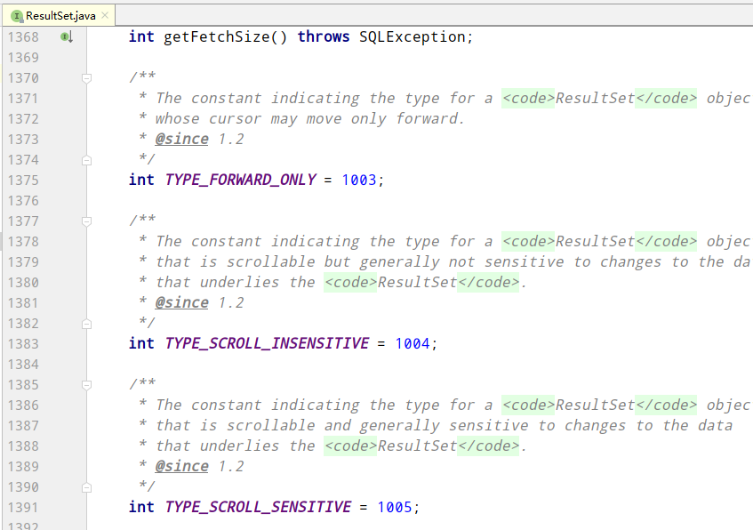
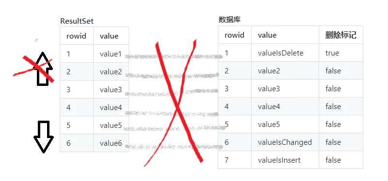
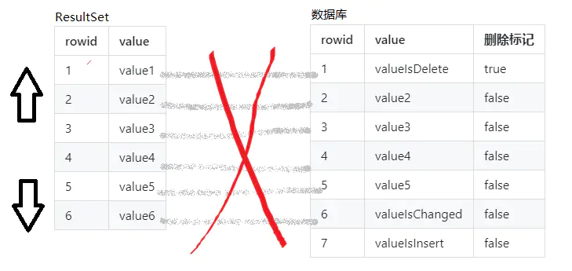
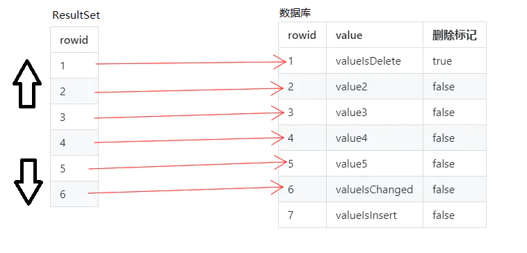

Mybatis resultSetType属性
==

## resultSetType属性作用
用于控制jdbc中ResultSet对象的行为,他的取值对应着ResultSetType枚举对象的实例

```java
package org.apache.ibatis.mapping;

public enum ResultSetType {
    DEFAULT(-1),
    // 仅允许结果集的游标向下移动
    FORWARD_ONLY(1003),
    // 游标可以上下移动，对数据库修改数据不敏感
    SCROLL_INSENSITIVE(1004),
    // 游标可以上下移动，对数据库修改数据敏感
    SCROLL_SENSITIVE(1005);

    private final int value;

    private ResultSetType(int value) {
        this.value = value;
    }

    public int getValue() {
        return this.value;
    }
}
```

```

根据JDBC规范,Connection对象创建Statement对象时允许传入一个int类型的resultSetType参数
来控制返回的ResultSet对象类型.


在mybatis中,除了默认值DEFAULT之外,resultSetType还有三个可选的值:
FORWARD_ONLY, SCROLL_SENSITIVE, SCROLL_INSENSITIVE.

它们分别对应着JDBC规范中的: TYPE_FORWARD_ONLY TYPE_SCROLL_SENSITIVE, TYPE_SCROLL_INSENSITIVE.
```




## 3中模式
### TYPE_FORWARD_ONLY模式
```
其中,TYPE_FORWARD_ONLY模式下的ResultSet对象只能前进不能后退,即,在处理结果集时,我们可以由第一行滚动到第二行,但是不能从第二行滚动到第一行.
TYPE_FORWARD_ONLY模式下的ResultSet对象阉割了部分数据访问功能.
```


### TYPE_SCROLL_INSENSITIVE模式
```
TYPE_SCROLL_INSENSITIVE模式下的ResultSet对象不仅可以前进,还可以后退,甚至还能通过相对坐标或者绝对坐标跳转到指定行.
但是TYPE_SCROLL_INSENSITIVE模式下的ResultSet对象会将数据库查询结果缓存起来,在下次操作时,直接读取缓存中的数据,所以,该模式下的ResultSet对象对底层数据的变化不敏感.
因此,如果在读取时,底层数据被其他线程修改,ResultSet对象依然会读取到之前获取到的数据.
```


### TYPE_SCROLL_SENSITIVE模式
```
TYPE_SCROLL_SENSITIVE模式下的ResultSet对象同样可以前进后退,可以跳转到任意行.
但是和TYPE_SCROLL_INSENSITIVE模式不同的是,TYPE_SCROLL_SENSITIVE模式缓存的是数据记录的rowid,在下次操作时ResultSet会根据缓存的rowid重新从数据库读取数据,所以TYPE_SCROLL_SENSITIVE模式能够实时感知底层数据的变化.
这里提到的底层的数据变化是指更新操作,不包含删除和新增操作.
因为绝大多数数据库的删除操作都是标记删除,而不是物理删除,因此当数据被删除时,我们依然可以通过被缓存的rowid来获取该条数据.
至于新增的数据,因为在查询时没有缓存对应的rowid,所以同样不能被感知.
```



