SpringBoot
==

## SpringBoot入门
### Spring Boot简介
* 一个简化Spring应用开发的框架
* 整个Spring技术栈的一个大整合
* J2EE开发的一站式解决方案
    * Spring Cloud分布式整体解决方案

### 微服务
25 March 2014, [martin fowler提出微服务](https://martinfowler.com/articles/microservices.html)
        
#### 单体应用
一个war包, 有着项目所有功能, 即ALL IN ONE.

* 优点
    1. 便于共享
        >单个归档文件包含所有功能, 便于在团队之间以及不同的部署阶段之间共享.
    
    2. 易于测试
        >单体应用一旦部署, 所有的服务或特性就都可以使用了, 这简化了测试过程, 因为没有额外的依赖, 每项测试都可以在部署完成后立刻开始.
    3. 易于部署
        >只需将单个归档文件复制到单个目录下.

* 缺点
    1. 复杂性高
        ```text
        由于是单个归档文件, 所以整个项目文件包含的模块非常多, 导致模块的边界模糊, 
        依赖关系不清晰, 代码的质量参差不齐, 混乱的堆在一起, 使得整个项目非常复杂. 
        以致每次修改代码, 都非常小心, 可能添加一个简单的功能, 或者修改一个Bug都会带来隐藏的缺陷.
        ```
    2. 技术债务
        >随着时间的推移, 需求的变更和技术人员的更替, 会逐渐形成应用程序的技术债务, 并且越积越多.
    
    3. 扩展能力受限
        >单体应用只能作为一个整体进行扩展, 无法根据业务模块的需要进行伸缩.
    
    4. 阻碍技术创新
        >对于单体应用来说, 技术是在开发之前经过慎重评估后选定的, 每个团队成员都必须使用相同的开发语言, 持久化存储及消息系统.

#### 单体应用与微服务的比较
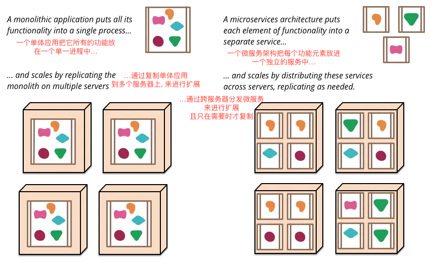

#### 微服务如何工作


* 微服务特点
    1. 架构风格（服务微化）
    2. 每个功能单元都独立出来，可独立替换和独立升级的软件单元
    3. 单元间互连互调, 通过HTTP方式.
    4. 最终形成连接网.


### SpringBoot环境
```text
- jdk1.8及以上
– maven3.x：maven 3.3以上版本；Apache Maven 3.3.9 
– IntelliJ IDEA 2019 x64、或STS 
– SpringBoot RELEASE：2.4.3
```

* maven设置

    maven的settings.xml配置文件的profiles标签添加，指定jdk版本、设置maven镜像仓库为阿里云maven仓库(在中国下载依赖包更快)

    位于 用户家目录\.m2\settings.xml

    ```xml
    <?xml version="1.0" encoding="UTF-8"?>
    <settings xmlns="http://maven.apache.org/SETTINGS/1.0.0"
              xmlns:xsi="http://www.w3.org/2001/XMLSchema-instance"
              xsi:schemaLocation="http://maven.apache.org/SETTINGS/1.0.0 http://maven.apache.org/xsd/settings-1.0.0.xsd">
        <mirrors>
            <mirror>
                <id>aliyunmaven</id>
                <mirrorOf>*</mirrorOf>
                <name>阿里云公共仓库</name>
                <url>https://maven.aliyun.com/repository/public</url>
            </mirror>
            <!--
            <mirror>
                <id>nexus</id>
                <name>internal nexus repository</name>
                <url>https://repo1.maven.org/maven2/</url>
                <mirrorOf>central</mirrorOf>
            </mirror>
            -->
        </mirrors>
        <profiles>
            <profile>
                <id>jdk‐12</id>
                <activation>
                    <activeByDefault>true</activeByDefault>
                    <jdk>12</jdk>
                </activation>
                <properties>
                    <maven.compiler.source>12</maven.compiler.source>
                    <maven.compiler.target>12</maven.compiler.target>
                    <maven.compiler.compilerVersion>12</maven.compiler.compilerVersion>
                </properties>
            </profile>
        </profiles>
    </settings>
    ```

* IDEA设置

    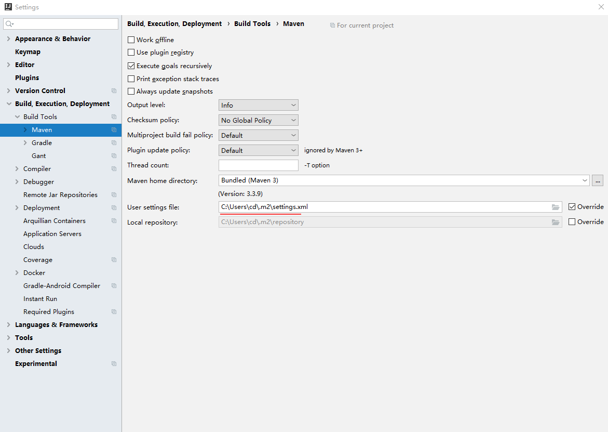
    Override框可选可不选，因为默认就是使用这个配置文件

### 创建SpringBoot HelloWorld工程
一个功能： 浏览器发送hello请求，服务器接受请求并处理，响应Hello World字符串；

1. [环境准备](#SpringBoot环境)

2. 创建一个maven工程
    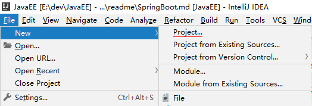
    
    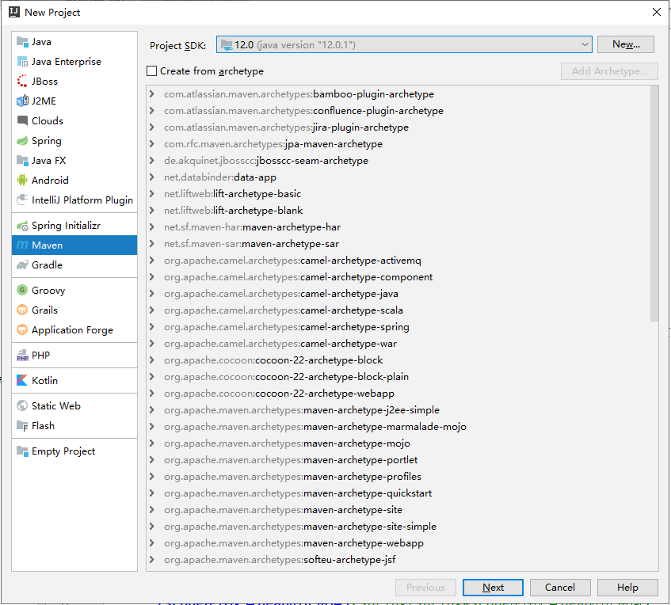
    
    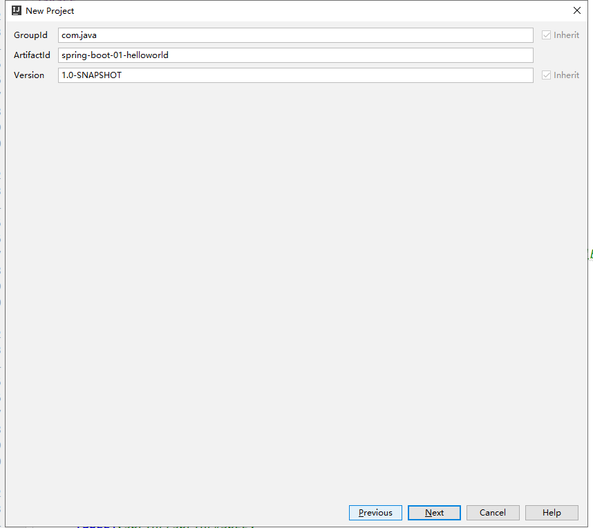
    
    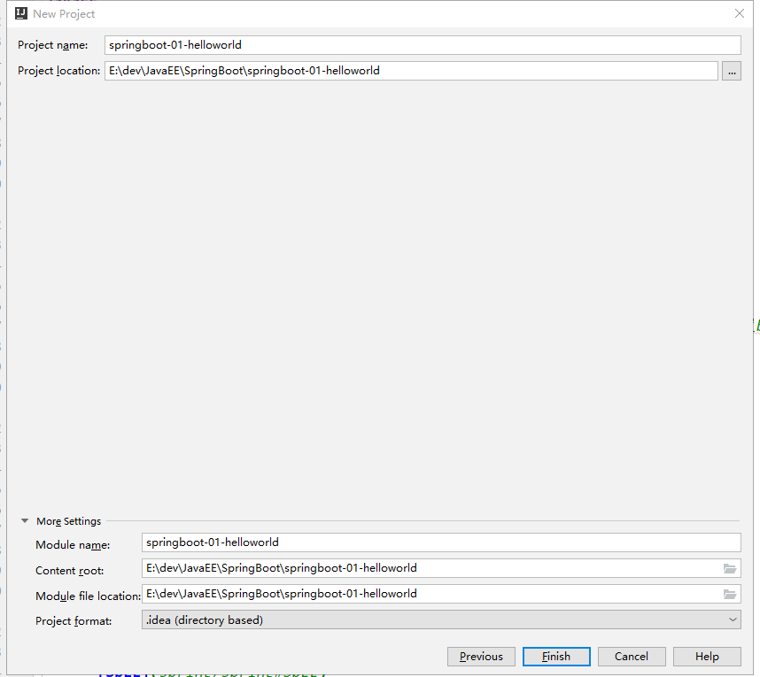

3. 导入spring boot相关的依赖  
    [pom.xml](../SpringBoot/springboot-01-helloworld/pom.xml)
    ```xml
    <project>
        <properties>
            <java.version>12</java.version>
        </properties>
    
        <parent>
            <groupId>org.springframework.boot</groupId>
            <artifactId>spring-boot-starter-parent</artifactId>
            <version>2.4.3</version>
            <relativePath/>
        </parent>
    
        <dependencies>
            <dependency>
                <groupId>org.springframework.boot</groupId>
                <artifactId>spring-boot-starter-web</artifactId>
            </dependency>
    
            <dependency>
                <groupId>org.springframework.boot</groupId>
                <artifactId>spring-boot-starter-test</artifactId>
                <scope>test</scope>
            </dependency>
        </dependencies>
    </project>
    ```
    
4. 编写一个启动Spring Boot应用的主程序  
    [HelloWorldMainApplication](../SpringBoot/springboot-01-helloworld/src/main/java/com/java/HelloWorldMainApplication.java)

5. 编写相关的Controller、Service
    
    [HelloController](../SpringBoot/springboot-01-helloworld/src/main/java/com/java/controller/HelloController.java)
    
6. 运行主程序测试
    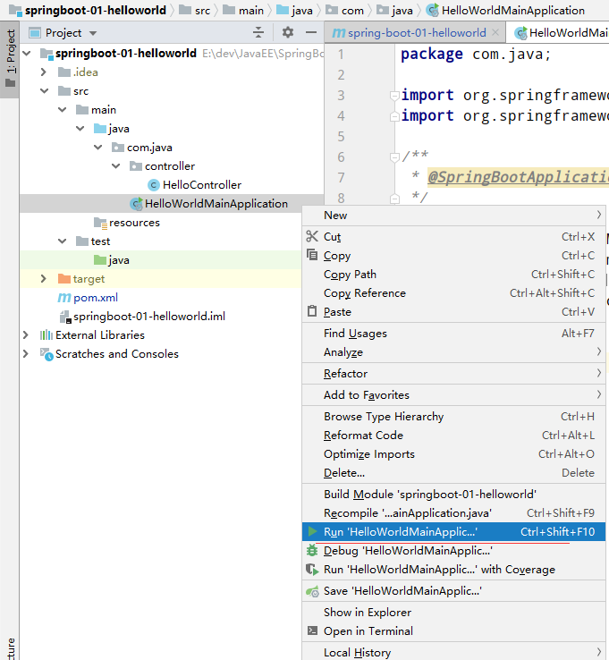
    
    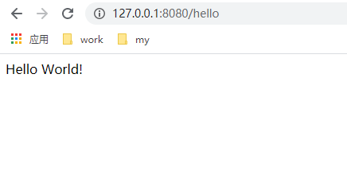
    
7. 简化部署
    
    * 在pom.xml中添加打包插件
        ```xml
        <project>
        
            <build>
                <plugins>
                    <!-- 此插件可以将应用打包成一个可执行的jar包 -->
                    <plugin>
                        <groupId>org.springframework.boot</groupId>
                        <artifactId>spring-boot-maven-plugin</artifactId>
                    </plugin>
                </plugins>
            </build>
        
        </project>
        ```
    
    * 打包操作
        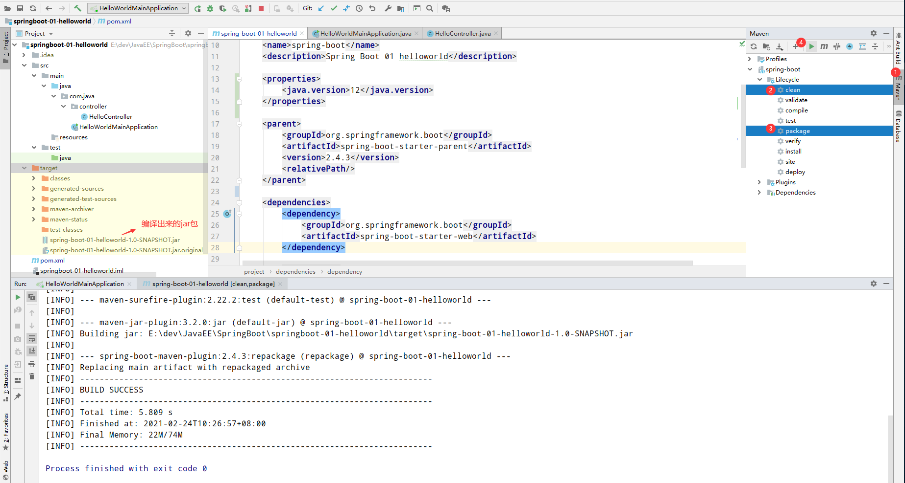
    
    * 应用jar包的运行
        ```bash
        java -jar jar包路径
        ```

### Hello World探究
#### pom.xml配置
##### parent配置
父项目[spring-boot-starter-parent](../readme/spring-boot-starter-parent-2.4.3.pom)

在pom.xml文件按住Ctrl，光标移动到 spring-boot-starter-parent 上，可跳转到对应的父依赖配置
```xml
<project>
    <parent>
        <groupId>org.springframework.boot</groupId>
        <artifactId>spring-boot-starter-parent</artifactId>
        <version>2.4.3</version>
        <relativePath/>
    </parent>
  
</project>
```
* spring-boot-starter-parent中有又指定了parent配置[spring-boot-dependencies](../readme/spring-boot-dependencies-2.4.3.pom)
    ```xml
      <parent>
        <groupId>org.springframework.boot</groupId>
        <artifactId>spring-boot-dependencies</artifactId>
        <version>2.4.3</version>
      </parent>
    ```
    spring-boot-dependencies管理Spring Boot应用里面的所有依赖版本，指定了依赖组件的版本  
    以后我们导入依赖默认是不需要写版本；（没有在dependencies里面管理的依赖自然需要声明版本号）
    ```xml
      <properties>
        <activemq.version>5.16.1</activemq.version>
        <antlr2.version>2.7.7</antlr2.version>
        <appengine-sdk.version>1.9.86</appengine-sdk.version>
        <artemis.version>2.15.0</artemis.version>
        <aspectj.version>1.9.6</aspectj.version>
        <assertj.version>3.18.1</assertj.version>
        <atomikos.version>4.0.6</atomikos.version>
        ...
        <tomcat.version>9.0.43</tomcat.version>
      </properties>
    ```
    依赖管理
    ```xml
    <dependencyManagement>
      <dependencies>
        <dependency>
          <groupId>org.apache.activemq</groupId>
          <artifactId>activemq-amqp</artifactId>
          <version>${activemq.version}</version>
        </dependency>
        <dependency>
          <groupId>org.apache.tomcat</groupId>
          <artifactId>tomcat-jdbc</artifactId>
          <version>${tomcat.version}</version>
        </dependency>
        <dependency>
          <groupId>org.apache.tomcat.embed</groupId>
          <artifactId>tomcat-embed-core</artifactId>
          <version>${tomcat.version}</version>
        </dependency>
        <dependency>
          <groupId>org.apache.tomcat.embed</groupId>
          <artifactId>tomcat-embed-websocket</artifactId>
          <version>${tomcat.version}</version>
        </dependency>
        ...
      </dependencies>
    </dependencyManagement>
    ```
##### 启动器
[Starters](https://docs.spring.io/spring-boot/docs/2.4.3/reference/html/using-spring-boot.html#using-boot-starter)
```xml
    <dependencies>
        <dependency>
            <groupId>org.springframework.boot</groupId>
            <artifactId>spring-boot-starter-web</artifactId>
        </dependency>
    </dependencies>
```
* [spring-boot-starter-web](../readme/spring-boot-starter-web-2.4.3.pom)
    ```text
    spring-boot场景启动器；帮我们导入了web模块正常运行所依赖的组件；  
    
    Spring Boot将所有的功能场景都抽取出来，做成一个个的starters（启动器），
    只需要在项目里面引入这些starter相关场景的所有依赖都会导入进来。
    要用什么功能就导入什么场景的启动器
    ```
#### 主入口类
* [HelloWorldMainApplication](../SpringBoot/springboot-01-helloworld/src/main/java/com/java/HelloWorldMainApplication.java) 
    ```java
    package com.java;
    
    import org.springframework.boot.SpringApplication;
    import org.springframework.boot.autoconfigure.SpringBootApplication;
    
    /**
     * @SpringBootApplication 标注一个主程序类，说明这是一个Spring Boot应用
     */
    @SpringBootApplication
    public class HelloWorldMainApplication {
        public static void main(String[] args) {
            // 启动Spring应用
            SpringApplication.run(HelloWorldMainApplication.class, args);
        }
    }
    ```
* @SpringBootApplication [对应的java文件](../readme/SpringBootApplication.java)
    ```java
    @Target({ElementType.TYPE})
    @Retention(RetentionPolicy.RUNTIME)
    @Documented
    @Inherited
    @SpringBootConfiguration
    @EnableAutoConfiguration
    @ComponentScan(
        excludeFilters = {@Filter(
        type = FilterType.CUSTOM,
        classes = {TypeExcludeFilter.class}
    ), @Filter(
        type = FilterType.CUSTOM,
        classes = {AutoConfigurationExcludeFilter.class}
    )}
    )
    public @interface SpringBootApplication {
        // ...
    }
    ```
* **@[SpringBootConfiguration](../readme/SpringBootConfiguration.java)**

    Spring Boot的配置类
    ```java
    @Target({ElementType.TYPE})
    @Retention(RetentionPolicy.RUNTIME)
    @Documented
    @Configuration
    public @interface SpringBootConfiguration {
        // ...
    }
    ```
    * @[Configuration](../readme/Configuration.java)
    
        配置类 -----  配置文件；配置类也是容器中的一个组件；@Component
* @[EnableAutoConfiguration](../readme/EnableAutoConfiguration.java)
    ```text
    开启自动配置功能。
    以前我们需要配置的东西，Spring Boot帮我们自动配置；
    @EnableAutoConfiguration告诉SpringBoot开启自动配置功能；这样自动配置才能生效
    ```
    * **@AutoConfigurationPackage**  
        自动配置包
    * **@Import(AutoConfigurationPackages.Registrar.class)**
    ```text
    Spring的底层注解@Import，给容器中导入一个组件；
    导入的组件由AutoConfigurationPackages.Registrar.class；
    
    将主配置类（@SpringBootApplication标注的类）的所在包及下面所有子包里面的所有组件扫描到Spring容器
    ```
* @**Import**(EnableAutoConfigurationImportSelector.class)  
    给容器中导入组件
    
    * AutoConfigurationImportSelector
        ```text
        导入哪些组件的选择器
        
        将所有需要导入的组件以全类名的方式返回；这些组件就会被添加到容器中；
        ​		会给容器中导入非常多的自动配置类（xxxAutoConfiguration）；
        就是给容器中导入这个场景需要的所有组件，并配置好这些组件
        ```
        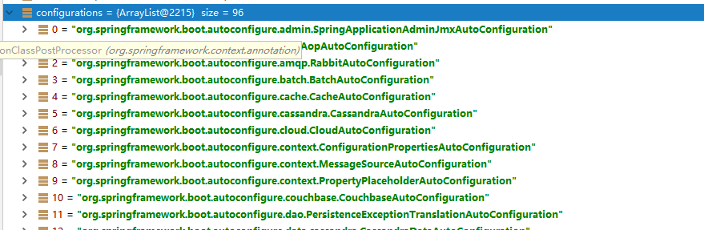
        ```text
        有了自动配置类，免去了我们手动编写配置注入功能组件等的工作；
        ​		SpringFactoriesLoader.loadFactoryNames(EnableAutoConfiguration.class,classLoader)；
 
        ==Spring Boot在启动的时候从类路径下的 spring-boot-autoconfigure-2.4.3.jar/META-INF/spring.factories中获取EnableAutoConfiguration指定的值，将这些值作为自动配置类导入到容器中，自动配置类就生效，帮我们进行自动配置工作；==以前我们需要自己配置的东西，自动配置类都帮我们；
        
        J2EE的整体整合解决方案和自动配置都在 spring-boot-autoconfigure-2.4.3.jar
        ```

### Spring Initializr快速创建SpringBoot项目
1. 新建Project

    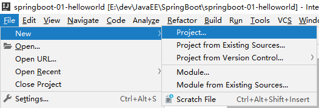

2. 创建Spring Initializr类型的项目

    选择SDK（即JDK）
    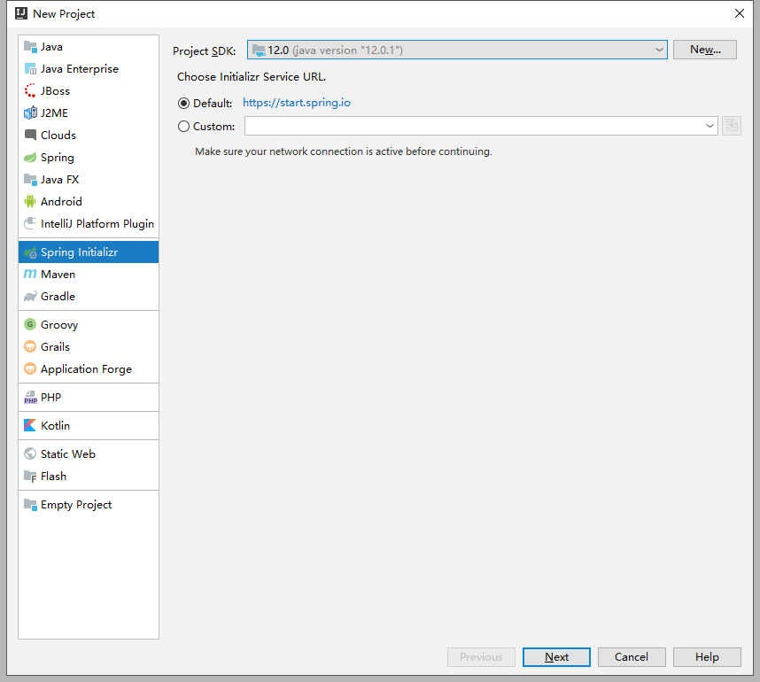

3. 设置Project Metadata

    选择java版本
    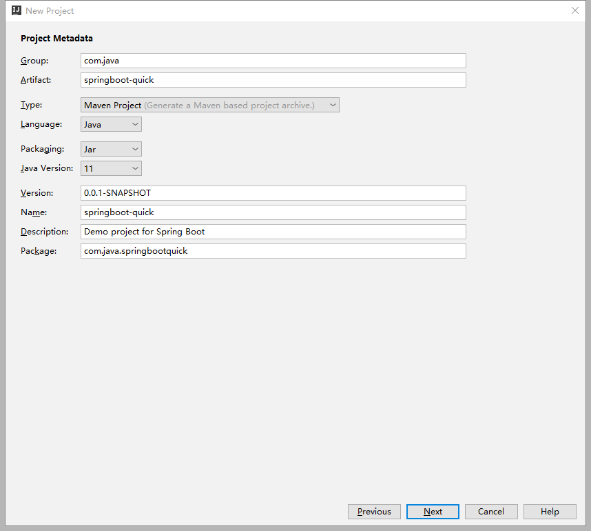

4. 选择依赖模块

    Dependencies中选择需要的模块即可
    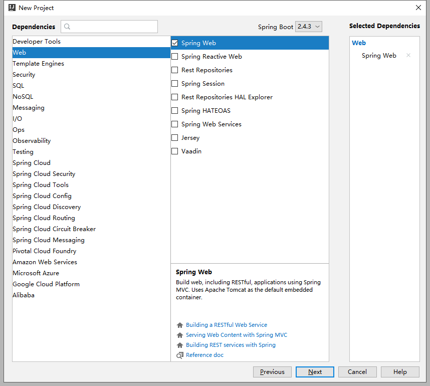

5. 设置项目名、保存位置、Module名等

    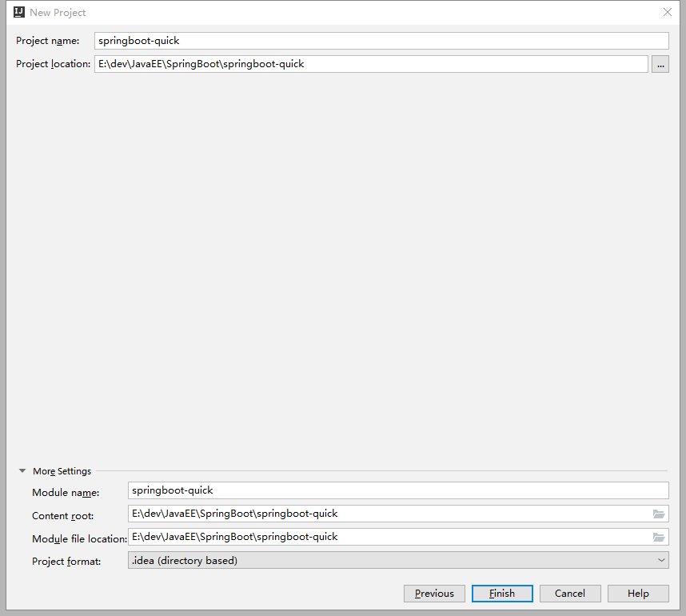

6. 项目结构

    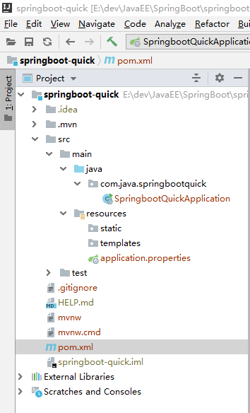


* 主程序已经生成好，只需要写的逻辑
* resources
    ```text
    src/main/resources
        static  // 静态资源目录，可放css、js、images等
        templates  // 模板页面目录，不支持JSP页面。可以使用模板引擎：thymeleaf、freemarker
        application.properties  // Spring Boot应用的配置文件，可以修改一些默认配置
    ```

## SpringBoot配置
配置文件作用：修改Spring Boot自动配置的默认值

全局配置配置文件，文件名是固定的，为下面两个中的任意一个
* application.properties
* application.yml

### YAML
YAML: YAML Ain't Markup Language

YAML强调以数据为中心

YAML is a human friendly data serialization
  standard for all programming languages.

* [YAML官网](https://yaml.org/)

* [YAML的书写规范](../readme/YAML书写规范.md)

#### 语法
以 空格 的缩颈来控制层级关系；只要是左对齐的一列数据，都是同一个层级的
```yaml
#表示一对键值对, :冒号后必须有空格
k: v
```

#### 值的写法
* 字面量
    
    普通值，数据、字符串，布尔类型
    * k: v  
        字面值直接写
    * k: "v"  
        不转义值中的特殊字符
    * k: 'v'  
        对值中的特殊字符进行转义
* 对象、Map
    ```yaml
    employee:
      name: Karry
      age: 20
    ```
    行内写法
    ```yaml
    employee: {name: Karry, age: 20}    
    ```
* 数组、List、Set
    ```yaml
    persons:
      -
        name: 张三
        age: 24
      -
        name: 王五
        age: 26
    ```
    ```yaml
    pets:
      - cat
      - dog
      - parrot
    ```
    行内写法
    ```yaml
    pets: [cat, dog, parrot]
    ```

### 从配置文件中获取值并注入到指定对象
配置文件：application.properties 或 application.yml

#### application.properties中文乱码问题
在idea的 Settings /Editor /File Encodings 中

3个Encoding都设置为 UTF-8， 勾上 Transparent native-toascii conversion

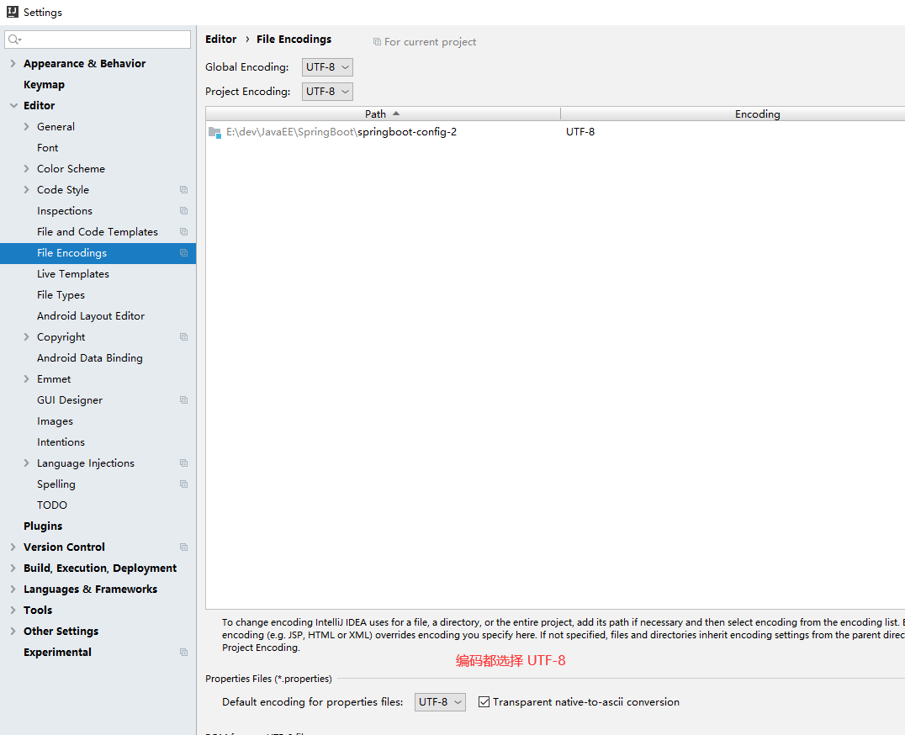

#### @ConfigurationProperties与@Value注入值比较

比较项/项 |@ConfigurationProperties |@Value |备注
:--- |:--- |:--- |:--- 
功能 |从配置文件中获取值，<br>再批量注入到Bean对象中 |单个值注入 | 
松散语法 |支持 |不支持 |如Bean属性名为lastName，<br>松散语法: lastName、last-name都可获取此值<br>严格语法: 只有last-name能获取值 
SpEL |不支持 |支持 | 
JSR303数据校验 |支持 |不支持 | 
获取复杂类型 <br>值为Map、List等非基本类型时 |支持 |不支持 | 

* [@ConfigurationProperties示例](../SpringBoot/springboot-config/)
    * pom.xml导入配置文件处理器
        ```xml
                <!--导入配置文件处理器，配置文件进行绑定就会有提示-->
                <dependency>
                    <groupId>org.springframework.boot</groupId>
                    <artifactId>spring-boot-configuration-processor</artifactId>
                    <optional>true</optional>
                </dependency>
        ```
    * [Person JavaBean](../SpringBoot/springboot-config/src/main/java/com/java/springbootconfig/bean/Person.java)
        ```java
        @Component
        @ConfigurationProperties(prefix = "person")
        public class Person {
        
        }
        ```
* [@Value示例](../SpringBoot/springboot-config-2/src/main/java/com/java/springbootconfig2/bean/Employee.java)
* 如只需要获取一个值，使用@Value
* 编写专门的JavaBean与配置文件进行映射，使用@ConfigurationProperties

#### @RunWith(SpringRunner.class)的作用
* 问题
    ```text
    查了好多文章说@RunWith(SpringRunner.class)注解是一个测试启动器，
    可以加载Springboot测试注解。
    
    本人好奇@RunWith(SpringRunner.class)的作用，
    于是在IDEA中把这个注解去掉后发现Bean也可以通过@Autowired注解进行注入。
    于是比较怀疑@RunWith注解的作用
    ```

* 解释
    ```text
    在正常情况下测试类是需要@RunWith的，作用是告诉java你这个类通过用什么运行环境运行，
    例如启动和创建spring的应用上下文。否则你需要为此在启动时写一堆的环境配置代码。
    你在IDEA里去掉@RunWith仍然能跑是因为在IDEA里识别为一个JUNIT的运行环境，相当于就是一个自识别的RUNWITH环境配置。
    但在其他IDE里并没有。
    ```
#### @PropertySource加载指定的properties配置文件
默认是加载application.properties或application.yml

示例: 从 company.properties中获取数据注入到 Company JavaBean中
* src/main/resources下添加 [company.properties](../SpringBoot/springboot-config-2/src/main/resources/company.properties)
* [Company 类](../SpringBoot/springboot-config-2/src/main/java/com/java/springbootconfig2/bean/Company.java)
    ```java
    @Component
    @PropertySource(value = {"classpath:company.properties"})
    @ConfigurationProperties(prefix = "company")
    public class Company {
        private String name;
        private String location;
        private String url;
    }
    ```
* 测试[testCompany()](../SpringBoot/springboot-config-2/src/test/java/com/java/springbootconfig2/SpringbootConfig2ApplicationTests.java)

#### @ImportResource导入Spring配置
* src/main/resources添加[spring-config.xml](../SpringBoot/springboot-config3/src/main/resources/spring-config.xml)配置文件
    
    添加组件，目的：把HelloService组件添加到IOC容器中
    ```xml
        <bean id="helloService" class="com.java.springbootconfig3.service.HelloService"/>
    ```
* 在主程序类中指定要导入的Spring配置文件，[SpringbootConfig3Application](../SpringBoot/springboot-config3/src/main/java/com/java/springbootconfig3/SpringbootConfig3Application.java)
    ```java
    @ImportResource(locations = {"classpath:spring-config.xml"})
    @SpringBootApplication
    public class SpringbootConfig3Application {
    
        public static void main(String[] args) {
            SpringApplication.run(SpringbootConfig3Application.class, args);
        }
    
    }
    ```
* 测试[testHelloService()](../SpringBoot/springboot-config3/src/test/java/com/java/springbootconfig3/SpringbootConfig3ApplicationTests.java)

#### 通过配置类的注解导入Spring配置
* 添加配置类[MyAppConfig](../SpringBoot/springboot-config4/src/main/java/com/java/springbootconfig4/config/MyAppConfig.java)
    ```java
    @Configuration
    public class MyAppConfig {
        // 将方法的返回值添加到 IOC容器中，对应组件的id为方法名
        // 相当于Spring配置文件中的<bean>标签
        @Bean
        public HelloService helloService() {
            return new HelloService();
        }
    }
    ```
* 测试[testHelloService()](../SpringBoot/springboot-config4/src/test/java/com/java/springbootconfig4/SpringbootConfig4ApplicationTests.java)

#### 配置文件中的内置变量和引用变量
application.properties、application.yml都适用

* 随机数
    ```text
    ${random.value}
    ${random.int}
    ${random.long}
    ${random.int(10)}
    ${random.int[1024,65536]}
    ```
* 引用变量
    ```text
    ${key}
    ```
* 示例
    ```properties
    person.last-name=张三${random.uuid}
    person.age=${random.int}
    person.birth=2017/12/15
    person.boss=false
    person.maps.k1=v1
    person.maps.k2=14
    person.lists=a,b,c
    #如果person.hello为空，则使用默认值hello
    person.dog.name=${person.hello:hello}_dog
    person.dog.age=15
    ```

### profile
#### 多profile文件
```text
配置文件名，可以是
application-{profile}.properties
application-{profile}.yml

默认使用 application.properties 或 application.yml
如果application.properties、application.yml同时存在，优先使用application.properties，
即application.properties的配置覆盖application.yml的配置，最后为两者的合成结果
```

* [示例](../SpringBoot/springboot-profiles)
    * [application.yml](../SpringBoot/springboot-profiles/src/main/resources/application.yml)
        在application.yml指定要激活的配置文件
        ```yaml
        spring:
          profiles:
            #这里可以指定激活哪个配置文件
            active: prod
        ```
    * [application-dev.yml](../SpringBoot/springboot-profiles/src/main/resources/application-dev.yml)
    * [application-prod.yml](../SpringBoot/springboot-profiles/src/main/resources/application-prod.yml)

#### yml多文档块方式配置多个profile
* [application.yml](../SpringBoot/springboot-profiles2/src/main/resources/application.yml)


#### 激活指定的profile
主要有以下几种方式来激活profile

* 命令启动时通过参数指定profile
    >java -jar springboot-profiles2-0.0.1-SNAPSHOT.jar --spring.profiles.active=dev
    
    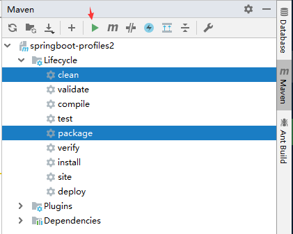
    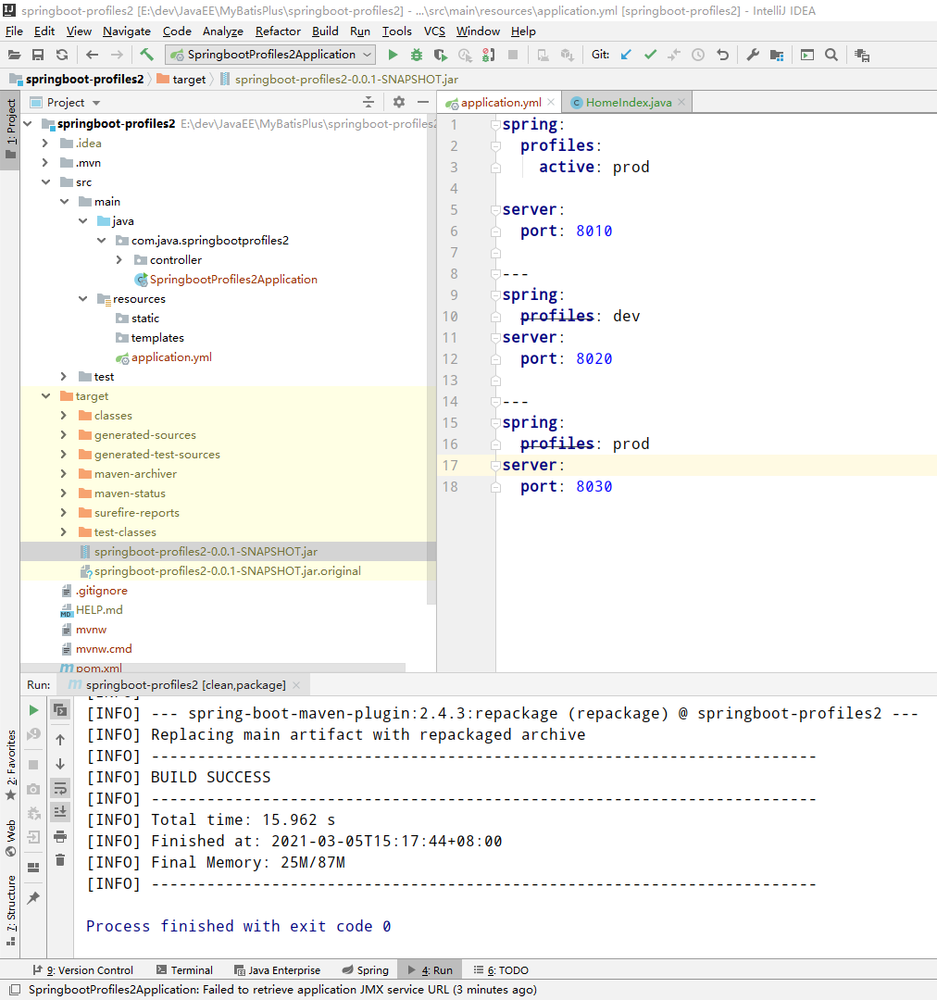
    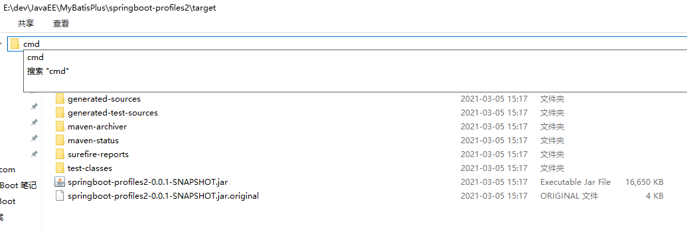
    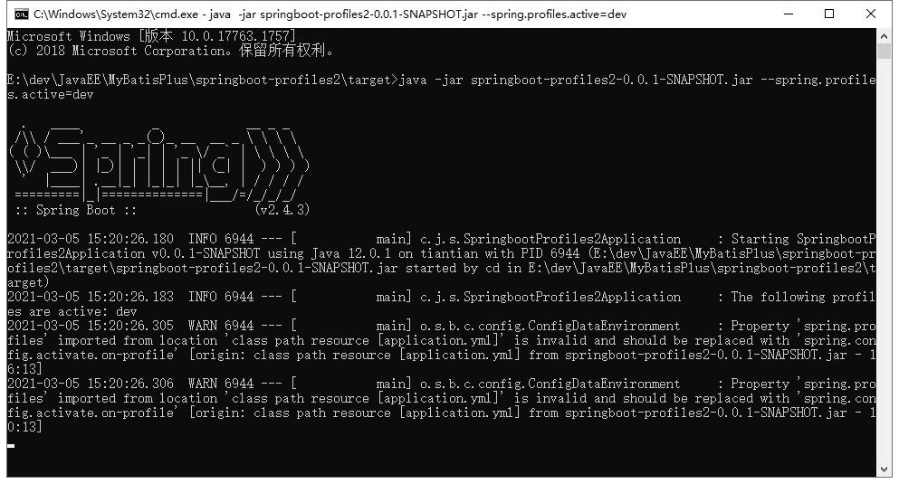

* idea设置启动参数，与上面的情况是类似，都是设置启动参数

    --spring.profiles.active=dev
    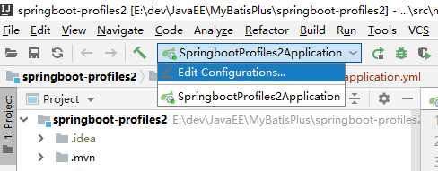
    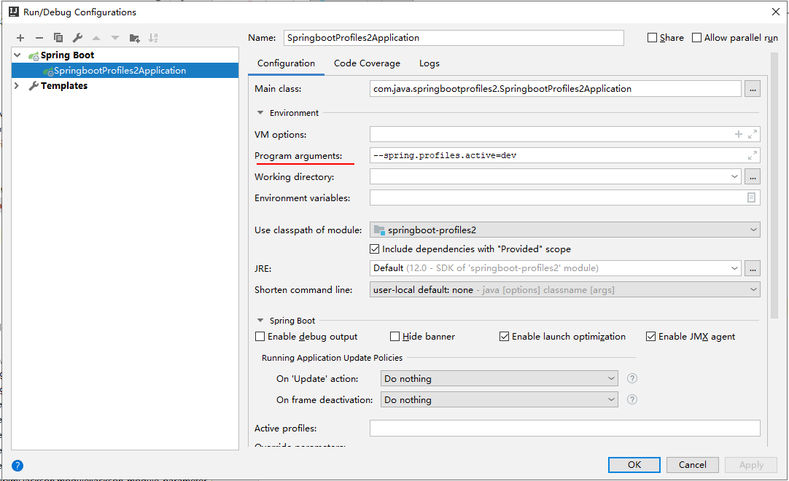

* 设置VM参数
    >-Dspring.profiles.active=dev
    
    


### 配置文件加载位置
spring boot会扫描以下位置的 application.properties或application.yml配置文件，并加载

[External Application Properties外部应用配置](https://docs.spring.io/spring-boot/docs/2.4.3/reference/htmlsingle/#boot-features-external-config-files)
```text
启动参数 --spring.config.location=application.properties的绝对路径

file:./config/
// jar包所在目录下的子目录 ./config

file:./
// jar包所在目录

classpath:/config/

classpath:/
// 即src/main/resources/ 目录下
```
* 从上到下的作用优先级为由高到低
* 优先级高的配置会覆盖优先级的配置
* 以上几个位置的主配置文件Spring Boot都会加载，优先级高的配置会覆盖优先级的配置，最终为互补后的配置结果总和

在启动参数指定指定配置文件示例
```bash
java -jar springboot-profiles2-0.0.1-SNAPSHOT.jar --spring.config.location=optional:G:/application.properties
```
--spring.config.location指定位置的配置文件作用优先级比上面4个位置的都高，同样与其他位置的配置文件互补后的配置结果总和共同作用

Spring Boot 2.4.3调整

Locations configured by using `spring.config.location` replace the default locations

If you prefer to add addition locations, rather than replacing them, you can use `spring.config.additional-location`

1. `optional:classpath:/`

2. `optional:classpath:/config/`

3. `optional:file:./`

4. `optional:file:./config/`

5. `optional:file:./config/*/`

6. `optional:classpath:custom-config/`

7. `optional:file:./custom-config/`

optional的作用允许配置文件不存在，也不会报错

如果配置文件名不是像 application 这样的，
可以在启动jar包时指定前缀名
```bash
java -jar myproject.jar --spring.config.name=myproject
```

指定两个位置的配置文件
```bash
java -jar myproject.jar --spring.config.location=optional:classpath:/default.properties,optional:classpath:/override.properties
```

### 外部配置加载顺序及作用优先级
[外部配置加载顺序Externalized Configuration 官方文档](https://docs.spring.io/spring-boot/docs/2.4.3/reference/html/spring-boot-features.html#boot-features-external-config)

1. Default properties (specified by setting SpringApplication.setDefaultProperties).

2. @PropertySource annotations on your @Configuration classes. Please note that such property sources are not added to the Environment until the application context is being refreshed. This is too late to configure certain properties such as logging.* and spring.main.* which are read before refresh begins.

3. **Config data (such as application.properties files)，jar包外的左右优先级高，含-{profile}配置文件比没有的作用优先级高**
    1. Application properties packaged **inside** your jar (**application.properties** and YAML variants变体).
        1. The classpath root
        2. The classpath /config package
    2. Profile-specific application properties packaged **inside** your jar (**application-{profile}.properties** and YAML variants).
    
    3. Application properties **outside** of your packaged jar (**application.properties** and YAML variants).
        1. The /config subdirectory in the current directory
        2. The current directory
    4. Profile-specific application properties **outside** of your packaged jar (**application-{profile}.properties** and YAML variants).

4. A RandomValuePropertySource that has properties only in random.*.

5. OS environment variables.

6. Java System properties (System.getProperties()).

7. JNDI attributes from java:comp/env.

8. ServletContext init parameters.

9. ServletConfig init parameters.

10. Properties from SPRING_APPLICATION_JSON (inline JSON embedded in an environment variable or system property).

11. **Command line arguments.命令行参数**
    ```text
    java -jar spring-boot-config-02-0.0.1-SNAPSHOT.jar --server.port=8087 --server.servlet.context-path=/location
    java -jar spring-boot-config-02-0.0.1-SNAPSHOT.jar --spring.profiles.active=prod
    多个配置用空格分开； --配置项=值
    // server.context-path 在spring 2.x.x 改为了 server.servlet.context-path
    ```
    
12. properties attribute on your tests. Available on @SpringBootTest and the test annotations for testing a particular slice of your application.

13. @TestPropertySource annotations on your tests.

14. Devtools global settings properties in the $HOME/.config/spring-boot directory when devtools is active.

#### 原则
* **序号越大，它的配置作用优先级越高，即序号大的会覆盖序号小的配置，以上位置的配置覆盖互补组合后的配置结果为最终的配置**
* 同一层级下同时存在application.properties和application.yml，则application.properties作用优先级高

### 自动配置原理

自动配置类必须在一定的条件下才能生效

1. SpringBoot入口程序类，有@SpringBootApplication注解
    ```java
    @SpringBootApplication
    public class SpringbootAutoconfigApplication {
    
        public static void main(String[] args) {
            SpringApplication.run(SpringbootAutoconfigApplication.class, args);
        }
    
    }
    ```
2. 注解的 SpringBootApplication接口，有@EnableAutoConfiguration注解
    ```java
    @EnableAutoConfiguration
    public @interface SpringBootApplication {
    
    }
    ```

3. EnableAutoConfiguration接口中导入了 AutoConfigurationImportSelector
    ```java
    @Import({AutoConfigurationImportSelector.class})
    public @interface EnableAutoConfiguration {
    }
    ```

    * [AutoConfigurationImportSelector](../readme/AutoConfigurationImportSelector.java)
        * selectImports()方法
        * protected List<String> getCandidateConfigurations(AnnotationMetadata metadata, AnnotationAttributes attributes)
    
    * 加载指定的组件
        ```text
        将 spring-boot-autoconfigure-2.4.3.jar 类路径下的META-INF/spring.factories配置中的 
        org.springframework.boot.autoconfigure.EnableAutoConfiguration=指定的组件 加载到IOC容器中
        ```
        [spring.factories](../readme/spring.factories)
        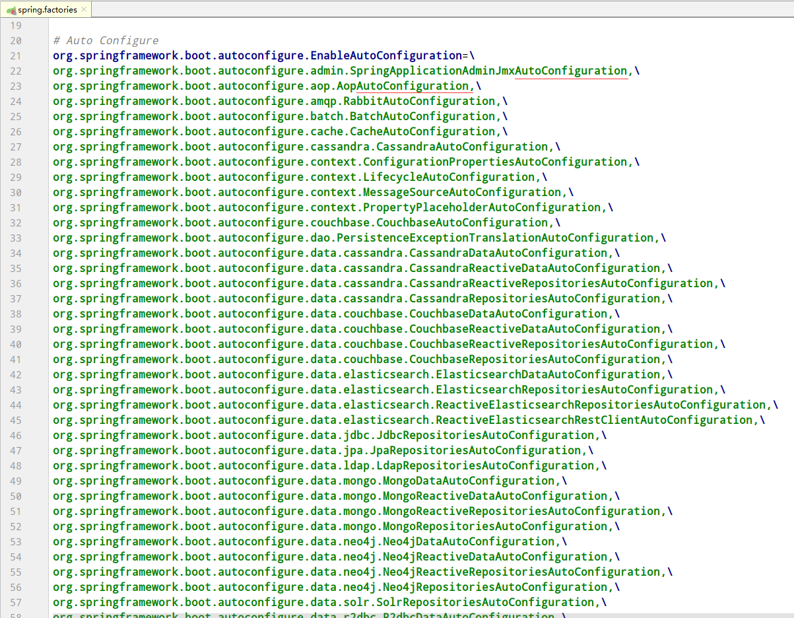

4. @Conditional派生注解
作用：必须是@Conditional指定的条件成立，才给容器中添加组件，配置配里面的所有内容才生效；

| @Conditional扩展注解            | 作用（判断是否满足当前指定条件）                 |
| ------------------------------- | ------------------------------------------------ |
| @ConditionalOnJava              | 系统的java版本是否符合要求                       |
| @ConditionalOnBean              | 容器中存在指定Bean；                             |
| @ConditionalOnMissingBean       | 容器中不存在指定Bean；                           |
| @ConditionalOnExpression        | 满足SpEL表达式指定                               |
| @ConditionalOnClass             | 系统中有指定的类                                 |
| @ConditionalOnMissingClass      | 系统中没有指定的类                               |
| @ConditionalOnSingleCandidate   | 容器中只有一个指定的Bean，或者这个Bean是首选Bean |
| @ConditionalOnProperty          | 系统中指定的属性是否有指定的值                   |
| @ConditionalOnResource          | 类路径下是否存在指定资源文件                     |
| @ConditionalOnWebApplication    | 当前是web环境                                    |
| @ConditionalOnNotWebApplication | 当前不是web环境                                  |
| @ConditionalOnJndi              | JNDI存在指定项                                   |

#### 查看自动配置的结果报告
在application.properties配置中添加如下配置
```text
debug=true
```
在控制台中可以看到 CONDITIONS EVALUATION REPORT

Positive matches为已经加载的
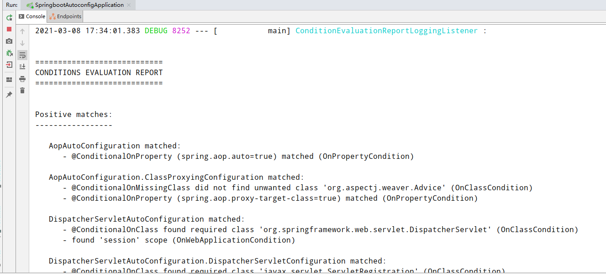

## SpringBoot日志
日志框架、日志配置

### 日志框架
* 常见的日志框架
    ```text
    JUL (Java Util Logging)
    JCL (Jakarta Commons Logging，即Apache Commons Logging)
    jboss-logging
    log4j (作者：Ceki Gülcü，他把log4j捐献给了Apache软件基金会)
    logback (与log4j为同一个开发者所写，取代log4j的一个日志框架，是slf4j的原生实现)
    log4j2 (apache小组开发，是log4j 1.x和logback的改进版)
    slf4j (Simple Logging Facade for Java，目的为替代commons-logging)
    ```
    * slf4j工作原理
        ```text
        slf4j只是一个日志标准(interface)，
        它只做两件事：1.LoggerFactory类用来获取Logger 2.Logger类用来打印日志
        ```
* 日志接口抽象层框架
    * slf4j
    * JCL
    * jboss-loggin

* 日志实现层框架
    * log4j
    * logback
    * log4j2
    * JUL

Spring框架默认使用的日志框架是JCL

SpringBoot默认使用的日志框架是slf4j + logback


### slf4j的使用
[slf4j官网](http://www.slf4j.org/)

* HelloWorld
    ```text
    import org.slf4j.Logger;
    import org.slf4j.LoggerFactory;
    
    public class HelloWorld {
      public static void main(String[] args) {
        Logger logger = LoggerFactory.getLogger(HelloWorld.class);
        logger.info("Hello World");
      }
    }
    ```

* [示例](../SpringBoot/springboot-log/src/test/java/com/java/springbootlog/SpringbootLogApplicationTests.java)
    ```java
    package com.java.springbootlog;
    
    import org.junit.jupiter.api.Test;
    import org.junit.runner.RunWith;
    import org.slf4j.Logger;
    import org.slf4j.LoggerFactory;
    import org.springframework.boot.test.context.SpringBootTest;
    import org.springframework.test.context.junit4.SpringRunner;
    
    
    @RunWith(SpringRunner.class)
    @SpringBootTest
    class SpringbootLogApplicationTests {
        // 生成日志记录器
        private final Logger logger = LoggerFactory.getLogger(getClass());
    
        @Test
        void contextLoads() {
            logger.trace("trace日志：===");
            logger.debug("debug日志：===");
            logger.info("info日志：===");
            logger.warn("warn日志：===");
            logger.error("error：===");
        }
    
    }
    ```
    
* 参数占位符模式
    ```text
    import org.slf4j.Logger;
    import org.slf4j.LoggerFactory;
    
    public class Wombat {
        final Logger logger = LoggerFactory.getLogger(Wombat.class);
        Integer t;
        Integer oldT;
    
        public void setTemperature(Integer temperature) {
            oldT = t;        
            t = temperature;
    
            logger.debug("Temperature set to {}. Old temperature was {}.", t, oldT);
    
            if(temperature.intValue() > 50) {
                logger.info("Temperature has risen above 50 degrees.");
            }
        }
    } 
    ```

* 流式API模式
    ```text
    // 示例1
    logger.atInfo().log("Hello world");
    // <==>
    logger.info("Hello world.");
    
    
    // 示例2
    int newT = 15;
    int oldT = 16;
    // using traditional API
    logger.debug("Temperature set to {}. Old temperature was {}.", newT, oldT);
    
    // 示例3
    // using fluent API, log message with arguments
    logger.atDebug().log("Temperature set to {}. Old temperature was {}.", newT, oldT);
    
    
    // 示例4
    // using fluent API, add arguments one by one and then log message
    logger.atDebug().addArgument(newT).addArgument(oldT).log("Temperature set to {}. Old temperature was {}.");
    
    // 示例5
    // using fluent API, add one argument and then log message providing one more argument
    logger.atDebug().addArgument(newT).log("Temperature set to {}. Old temperature was {}.", oldT);
    
    // 示例6
    // using classical API
    logger.debug("oldT={} newT={} Temperature changed.", newT, oldT);
    // using fluent API, 与上面等效
    logger.atDebug().addKeyValue("oldT", oldT).addKeyValue("newT", newT).log("Temperature changed.");
    
    ```

#### 绑定日志框架
```text
slf4j-log4j12-1.7.28.jar
Binding for log4j version 1.2, a widely used logging framework. You also need to place log4j.jar on your class path.

slf4j-jdk14-1.7.28.jar
Binding for java.util.logging, also referred to as JDK 1.4 logging

slf4j-nop-1.7.28.jar
Binding for NOP, silently discarding all logging.

slf4j-simple-1.7.28.jar
Binding for Simple implementation, which outputs all events to System.err. Only messages of level INFO and higher are printed. This binding may be useful in the context of small applications.

slf4j-jcl-1.7.28.jar
Binding for Jakarta Commons Logging. This binding will delegate all SLF4J logging to JCL.

logback-classic-1.2.3.jar (requires logback-core-1.2.3.jar)
slf4j本地实现
```

slf4j日志框架总体思路图


#### 自定义日志配置
SpringBoot将自动加载以下日志配置

Logging System |Customization |备注
:--- |:--- |:--- 
Logback |logback-spring.xml, <br>logback-spring.groovy, <br>logback.xml, <br>logback.groovy |logback.xml只能被slf4j日志架构所识别，绕过了SpringBooot框架。<br>logback-spring.xml能被SpringBoot解析
Log4j2 |log4j2-spring.xml, <br>log4j2.xml 
JDK (Java Util Logging) |logging.properties

* 注意
    * 每一个日志的实现框架都有自己的配置文件。
    * 接口层使用slf4j日志框架后，**配置文件还是做成日志实现框架自己本身的配置文件**

xxx-spring.xml或logging.config才能支持 <springProfile>的特殊profile配置，否则报错
```xml
<springProfile name="staging">
    <!-- configuration to be enabled when the "staging" profile is active -->
</springProfile>

<!-- 对dev或staging环境生效 -->
<springProfile name="dev | staging">
    <!-- configuration to be enabled when the "dev" or "staging" profiles are active -->
</springProfile>

<springProfile name="!production">
    <!-- configuration to be enabled when the "production" profile is not active -->
</springProfile>
```

#### 桥接历史遗留日志API


#### SpringBoot的日志关系
Spring Boot默认的日志框架是slf4j + logback 

组件依赖关系如下

显示pom.xml组件依赖关系
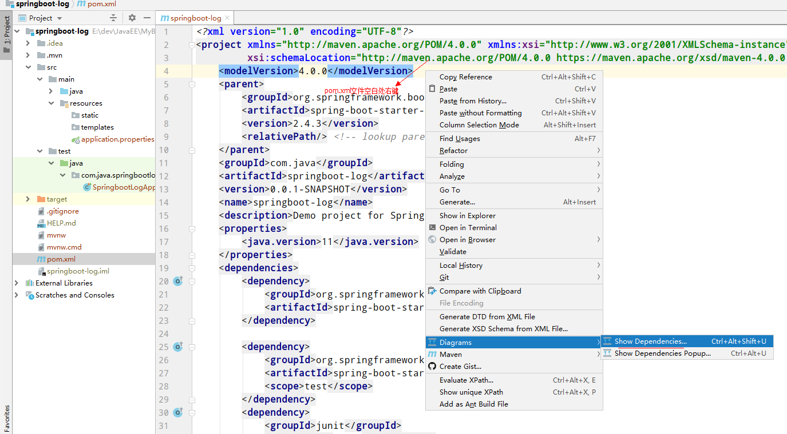

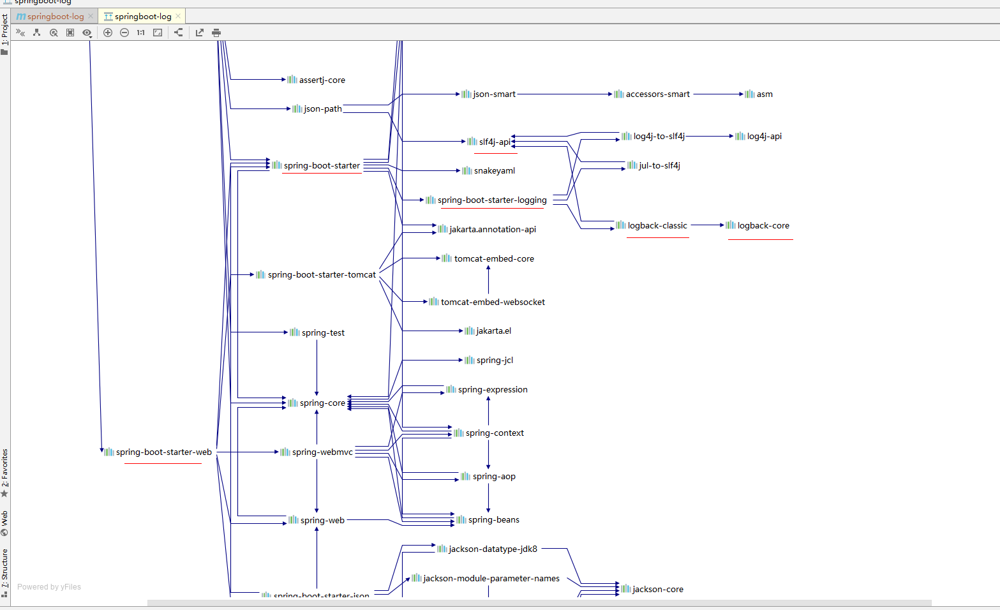

* pom.xml
    ```xml
        <dependencies>
            <dependency>
                <groupId>org.springframework.boot</groupId>
                <artifactId>spring-boot-starter-web</artifactId>
            </dependency>
        </dependencies>
    ```

    * spring-boot-starter-web-2.4.3.pom
        ```xml
          <dependencies>
            <dependency>
              <groupId>org.springframework.boot</groupId>
              <artifactId>spring-boot-starter</artifactId>
              <version>2.4.3</version>
              <scope>compile</scope>
              </dependency>
          </dependencies>
        ```

        * spring-boot-starter-2.4.3.pom
            ```xml
              <dependencies>
                <dependency>
                  <groupId>org.springframework.boot</groupId>
                  <artifactId>spring-boot-starter-logging</artifactId>
                  <version>2.4.3</version>
                  <scope>compile</scope>
                </dependency>
              </dependencies>
            ```

            * spring-boot-starter-logging-2.4.3.pom
                ```xml
                  <dependencies>
                    <dependency>
                      <groupId>ch.qos.logback</groupId>
                      <artifactId>logback-classic</artifactId>
                      <version>1.2.3</version>
                      <scope>compile</scope>
                    </dependency>
                  </dependencies>
                ```

                * logback-classic-1.2.3.pom
                    ```xml
                      <dependencies>
                        <dependency>
                          <groupId>ch.qos.logback</groupId>
                          <artifactId>logback-core</artifactId>
                          <scope>compile</scope>
                        </dependency>
                      </dependencies>
                    ```

* SpringBoot底层使用slf4j(日志抽象层框架) + logback(日志实现框架)记录日志
* SpringBoot把其他的日志替换成了slf4j
* 其他日志转slf4j包
    ```text
    jcl-over-slf4j.jar
    log4j-over-slf4j.jar
    jul-to-slf4j.jar
    ```
* 如果要引入其他的日志框架，必须把当前框架中默认的日志依赖排除掉

SpringBoot能自动适配所有的日志，而且底层使用slf4j+logback的方式记录日志，
引入其他框架的时候，只需要把这个框架依赖的日志框架排除掉即可

##### 设置保存日志的路径
相关参数：logging.file.name、logging.file.path

* logging.file.name
    ```text
    指定文件名
    
    相对路径，是相对于jar包所在的目录。只写文件名
    绝对路径
    ```
    示例
    ```properties
    logging.file.name=app.log
    #或
    logging.file.name=E:\\dev\\JavaEE\\SpringBoot\\springboot-log\\log\\app.log
    ```
* logging.file.path
    ```text
    指定保存日志的目录，保存日志的文件名自动默认为设置为spring.log
    ```
    示例
    ```properties
    #最后保存日志的文件为 /var/log/spring.log
    logging.file.path=/var/log
    ```

**当logging.file.name和logging.file.path都未设置时，只在控制台打印日志**

**当同时指定了logging.file.name和logging.file.path时，只有logging.file.name的设置生效**

##### 设置日志输出格式
```text
%d  日期时间
%thread  线程名
%-5level  级别从左显示5个字符宽度
%logger{50}  表示logger名字最长50个字符，否则按照句点分割
%msg  日志消息
%n  换行符
```

* logging.pattern.console
    ```text
    设置控制台日志的输出格式

    示例：
    logging.pattern.console=%d{yyyy-MM-dd HH:mm:ss,SSS} ## [%thread] %-5level %logger{50} - %msg%n
    ```

* logging.pattern.file
    ```text
    设置文件日志的输出格式

    示例：
    logging.pattern.file=%d{yyyy-MM-dd HH:mm:ss.SSS} == [%thread] %-5level %logger{50} - %msg%n
    ```

[SpringBoot日志官网文档](https://docs.spring.io/spring-boot/docs/2.4.3/reference/html/spring-boot-features.html#boot-features-logging)

### 切换日志框架
抽象层统一使用slf4j框架的解决方案

**统一多个系统的日志抽象层框架slf4j**
1. 将系统中其他日志框架先排除
2. 用中间包来替换原有的日志框架
3. 导入slf4j的实现日志框架

#### SpringBoot日志框架切换为slf4j+log4j
不建议这么做，slf4j+logback，本来logback就是log4j的升级版

思路：如下图，需要把图一的组件依赖关系 变成 图二的组件依赖关系
1. 排除log4j-over-slf4j，（如果有的话）
2. 排除logback组件
3. 添加slf4j-log4j12组件
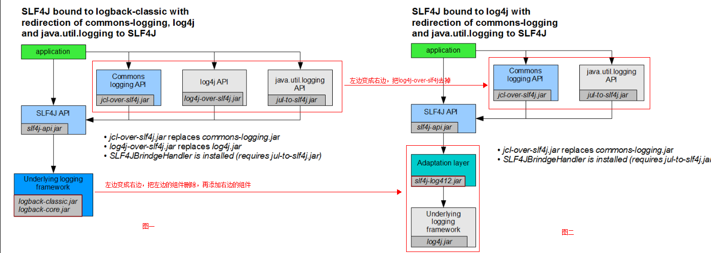

**操作步骤**
* SpringBoot初始化的POM组件依赖关系，(只选择了WEB模块)
* 排除logback组件
    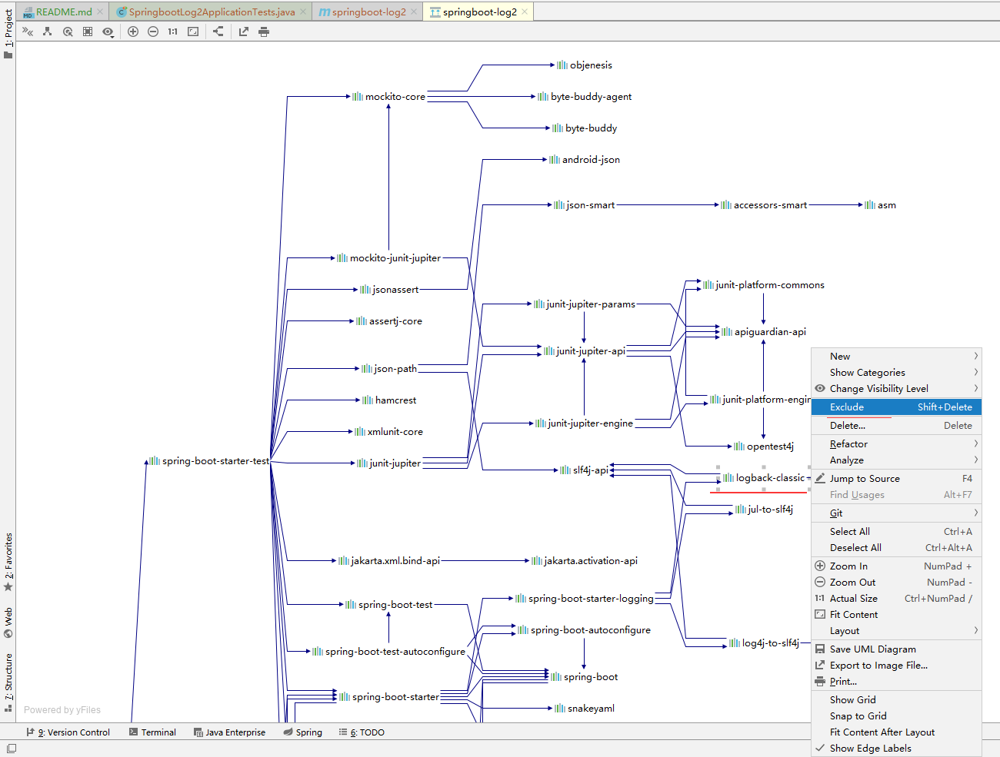
    ```xml
            <dependency>
                <groupId>org.springframework.boot</groupId>
                <artifactId>spring-boot-starter-web</artifactId>
                <exclusions>
                    <exclusion>
                        <artifactId>logback-classic</artifactId>
                        <groupId>ch.qos.logback</groupId>
                    </exclusion>
                </exclusions>
            </dependency>
    ```
* 添加slf4j-log4j12组件
    ```xml
            <dependency>
                <groupId>org.slf4j</groupId>
                <artifactId>slf4j-log4j12</artifactId>
            </dependency>
    ```
    最终的配置[pom.xml](../SpringBoot/springboot-log2/pom.xml)
    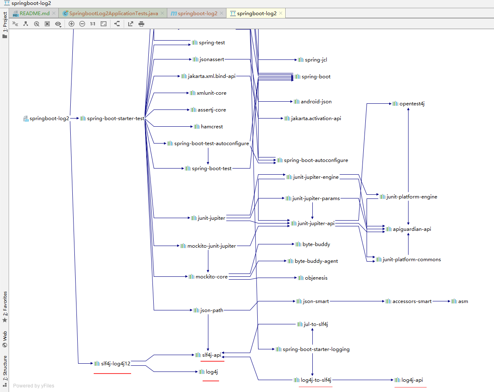
* [log4j日志配置](../SpringBoot/springboot-log2/src/main/resources/log4j.properties)

#### SpringBoot日志框架切换为slf4j+log4j2
思路：使用spring-boot-starter-log4j2 starter替换spring-boot-starter-logging starter

**操作步骤：**
1. 排除SpringBoot默认的logback组件，即logback-classic
2. 添加spring-boot-starter-log4j2依赖

starter说明：
[using-boot-starter](https://docs.spring.io/spring-boot/docs/2.4.3/reference/htmlsingle/#using-boot-starter)
、
[using-spring-boot#using-boot-starter](https://docs.spring.io/spring-boot/docs/2.4.3/reference/html/using-spring-boot.html#using-boot-starter)

* SpringBoot初始化的POM组件依赖关系，(只选择了WEB模块)
    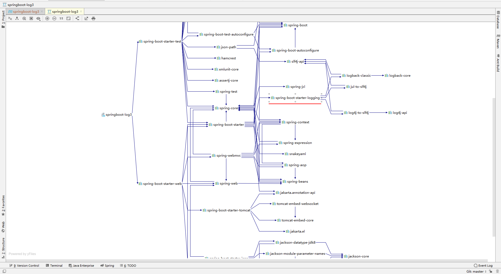

* 排除spring-boot-starter-logging
    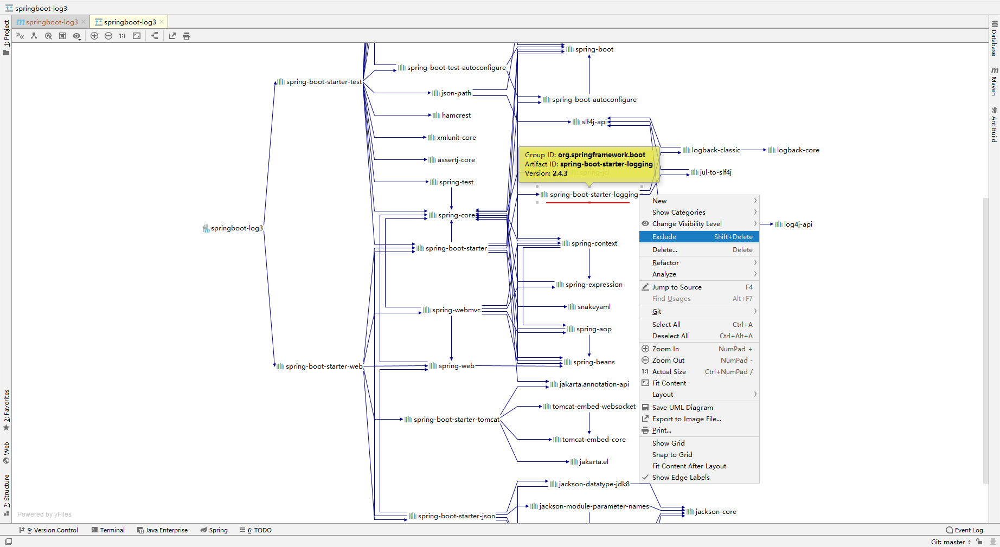
    ```xml
    <project>
        <dependencies>
            <dependency>
                <groupId>org.springframework.boot</groupId>
                <artifactId>spring-boot-starter-web</artifactId>
                <exclusions>
                    <!-- 这是上面这操作,idea自动添加的排除项 -->
                    <exclusion>
                        <artifactId>spring-boot-starter-logging</artifactId>
                        <groupId>org.springframework.boot</groupId>
                    </exclusion>
                </exclusions>
            </dependency>
        </dependencies>
    </project>
    ```

* 添加spring-boot-starter-log4j2依赖
    [pom.xml](../SpringBoot/springboot-log3/pom.xml)
    ```xml
    <project>
        <dependencies>
            <dependency>
                <groupId>org.springframework.boot</groupId>
                <artifactId>spring-boot-starter-web</artifactId>
                <exclusions>
                    <exclusion>
                        <artifactId>spring-boot-starter-logging</artifactId>
                        <groupId>org.springframework.boot</groupId>
                    </exclusion>
                </exclusions>
            </dependency>
            <dependency>
                <groupId>org.springframework.boot</groupId>
                <artifactId>spring-boot-starter-log4j2</artifactId>
            </dependency>
        </dependencies>
    </project>
    ```
    slf4j组件依赖关系
    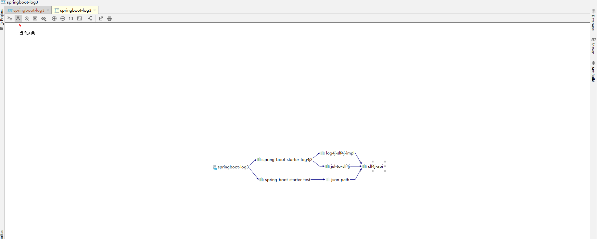
    
* [log4j2配置](../SpringBoot/springboot-log3/src/main/resources/log4j2-spring.xml)

## SpringBoot WEB开发
SpringBoot web项目的创建参考 [创建SpringBoot HelloWorld工程](#创建SpringBoot-HelloWorld工程)

### 静态资源的映射规则
* /webjars/** 到classpath:/META-INF/resources/webjars/ 查找资源
    * [maven引入webjars资源方法](https://www.webjars.org/)

* "/**" 未被显示映射时，都到以下静态资源映射路径中找
    ```text
    [
    "classpath:/META-INF/resources/", 
    "classpath:/resources/",
    "classpath:/static/", 
    "classpath:/public/" 
    "/":当前项目的根路径
    ]
    ```
* 欢迎页，到上面的静态资源路径下查找index.html，被映射为
    >/index.html
* favicon.ico在所有静态资路径中找favicon.ico文件，即**/favicon.ico
    >/favicon.ico
    * favicon.ico在Spring Boot 2.2.X后被删除了


[ResourceProperties](../readme/ResourceProperties.java)

[WebMvcAutoConfiguration](../readme/WebMvcAutoConfiguration.java)
```java
@Configuration(
    proxyBeanMethods = false
)
@ConditionalOnWebApplication(
    type = Type.SERVLET
)
@ConditionalOnClass({Servlet.class, DispatcherServlet.class, WebMvcConfigurer.class})
@ConditionalOnMissingBean({WebMvcConfigurationSupport.class})
@AutoConfigureOrder(-2147483638)
@AutoConfigureAfter({DispatcherServletAutoConfiguration.class, TaskExecutionAutoConfiguration.class, ValidationAutoConfiguration.class})
public class WebMvcAutoConfiguration {
    // /webjars/** 静态资源映射
    @Configuration(
        proxyBeanMethods = false
    )
    @EnableConfigurationProperties({WebProperties.class})
    public static class EnableWebMvcConfiguration extends DelegatingWebMvcConfiguration implements ResourceLoaderAware {
        protected void addResourceHandlers(ResourceHandlerRegistry registry) {
            super.addResourceHandlers(registry);
            if (!this.resourceProperties.isAddMappings()) {
                logger.debug("Default resource handling disabled");
            } else {
                ServletContext servletContext = this.getServletContext();
                this.addResourceHandler(registry, "/webjars/**", "classpath:/META-INF/resources/webjars/");
                this.addResourceHandler(registry, this.mvcProperties.getStaticPathPattern(), (registration) -> {
                    registration.addResourceLocations(this.resourceProperties.getStaticLocations());
                    if (servletContext != null) {
                        registration.addResourceLocations(new Resource[]{new ServletContextResource(servletContext, "/")});
                    }

                });
            }
        }
        
        // 欢迎页，/index.html
        @Bean
        public WelcomePageHandlerMapping welcomePageHandlerMapping(ApplicationContext applicationContext, FormattingConversionService mvcConversionService, ResourceUrlProvider mvcResourceUrlProvider) {
            WelcomePageHandlerMapping welcomePageHandlerMapping = new WelcomePageHandlerMapping(new TemplateAvailabilityProviders(applicationContext), applicationContext, this.getWelcomePage(), this.mvcProperties.getStaticPathPattern());
            welcomePageHandlerMapping.setInterceptors(this.getInterceptors(mvcConversionService, mvcResourceUrlProvider));
            welcomePageHandlerMapping.setCorsConfigurations(this.getCorsConfigurations());
            return welcomePageHandlerMapping;
        }
        
    }
}
```

* webjars
    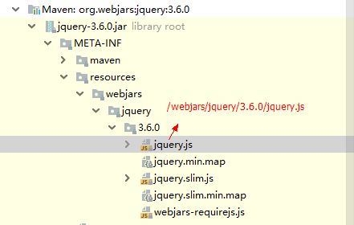
    
    http://127.0.0.1:8080/webjars/jquery/3.6.0/jquery.js


### Thymeleaf模板引擎
[thymeleaf官网](https://www.thymeleaf.org/)

常见的模板引擎有JSP、Velocity、Freemarker、Thymeleaf

Spring Boot推荐使用Thymeleaf

#### 引入thymeleaf
pom.xml中添加如下配置，一般为最新稳定版
```xml
        <dependency>
            <groupId>org.springframework.boot</groupId>
            <artifactId>spring-boot-starter-thymeleaf</artifactId>
        </dependency>
```

#### 使用thymeleaf
* 模板文件存放位置
    ```text
    // 路径前缀
    classpath:/templates/
    
    // 文件后缀
    .html
    ```
    
    ThymeleafProperties类
    ```java
    @ConfigurationProperties(
        prefix = "spring.thymeleaf"
    )
    public class ThymeleafProperties {
        private static final Charset DEFAULT_ENCODING;
        public static final String DEFAULT_PREFIX = "classpath:/templates/";
        public static final String DEFAULT_SUFFIX = ".html";
        private boolean checkTemplate = true;
        private boolean checkTemplateLocation = true;
        private String prefix = "classpath:/templates/";
        private String suffix = ".html";
        private String mode = "HTML";
        ... ...
    }
    ```
* html文件中导入thymeleaf命名空间，在编写html文件时方便弹出thymeleaf的语法提示

    不添加也不会影响thymeleaf的模板渲染
    
    ```html
    <!DOCTYPE html>
    <html xmlns:th="http://www.thymeleaf.org">
    ```
* 使用thymeleaf语法
    ```html
    <!DOCTYPE html>
    <html xmlns:th="http://www.thymeleaf.org">
    
      <head>
        <title>Good Thymes Virtual Grocery</title>
        <meta http-equiv="Content-Type" content="text/html; charset=UTF-8" />
        <link rel="stylesheet" type="text/css" media="all" 
              href="../../css/gtvg.css" th:href="@{/css/gtvg.css}" />
      </head>
    
      <body>
      
        <p th:text="#{home.welcome}">Welcome to our grocery store!</p>
      
      </body>
    
    </html>
    ```

#### thymeleaf使用手册
[thymeleaf使用手册](../readme/thymeleaf_manual.md)


### Spring MVC自动配置
[Spring MVC Auto-configuration](https://docs.spring.io/spring-boot/docs/2.4.4/reference/html/spring-boot-features.html#boot-features-spring-mvc-auto-configuration)


SpringBoot自动配置好了SpringMVC，WebMvcAutoConfiguration默认添加了以下功能:

* Inclusion of `ContentNegotiatingViewResolver` and `BeanNameViewResolver` beans.
    * BeanNameViewResolver: 根据方法返回的值得到视图对象，视图对象决定如何渲染（forward或redirect）
    * ContentNegotiatingViewResolver
    * 如何定制：可以给IOC容器中添加一个视图解析器；SpringBoot会自动将其组合进来  
    [MyViewResolver](../SpringBoot/springmvc-autoconfig/src/main/java/com/java/springmvcautoconfig/config/MyViewResolver.java)
    [注册自定义ViewResolver](../SpringBoot/springmvc-autoconfig/src/main/java/com/java/springmvcautoconfig/SpringmvcAutoconfigApplication.java)
* Support for serving static resources, including support for `WebJars`

* Automatic registration of `Converter`, `GenericConverter`, and `Formatter` beans.
    * Converter：转换器
    * GenericConverter：泛型转换器
    * Formatter:格式化器
* Support for `HttpMessageConverters`.
    * HttpMessageConverters:从IOC容器中获取所有的HttpMessageConverter
    * HttpMessageConverter:SpringMVC用来转换转换HTTP请求和响应的消息；如User对象--->JSON
    * 添加自定义的HttpMessageConverter：将自定义的组件注册到容器（@Bean，@Component）
* Automatic registration of `MessageCodesResolver`.
    >定义错误代码生成规则
* Static `index.html` support.

* Automatic use of a `ConfigurableWebBindingInitializer` bean.

#### 扩展SringMVC配置
作用：既保留所有的自动配置，又能用我们扩展的MVC配置

If you want to keep those Spring Boot MVC customizations and make more MVC customizations 

(interceptors, formatters, view controllers, and other features), 

you can add your own `@Configuration` class of type `WebMvcConfigurer` but without `@EnableWebMvc`.


**SpringMVC一般的情况下可有SrpingMVC.xml来配置它，但不Spring Boot没有了xml的配置文件，如何来配置SpringMVC呢**
假设源SpringMVC.xml配置如下
```xml
<beans xmlns="http://www.springframework.org/schema/beans"
       xmlns:xsi="http://www.w3.org/2001/XMLSchema-instance"
       xmlns:context="http://www.springframework.org/schema/context"
       xmlns:mvc="http://www.springframework.org/schema/mvc"
       xsi:schemaLocation="http://www.springframework.org/schema/beans http://www.springframework.org/schema/beans/spring-beans.xsd http://www.springframework.org/schema/context https://www.springframework.org/schema/context/spring-context.xsd http://www.springframework.org/schema/mvc https://www.springframework.org/schema/mvc/spring-mvc.xsd">

    <mvc:view-controller path="/hello" view-name="success"/>
    <mvc:interceptors>
        <!-- 自定义拦截器 -->
        <mvc:interceptor>
            <!-- <mvc:mapping> 指定需要拦截的路径 -->
            <mvc:mapping path="/login"/>
            <!-- <mvc:exclude-mapping> 排除不拦截的路径 -->
            <!-- <mvc:exclude-mapping path="/i18n"/> -->
            <bean class="com.java.springmvcautoconfig.config.AdminInterceptor"/>
        </mvc:interceptor>
    </mvc:interceptors>
</beans>
```

* 方法
```text
编写一个配置类，并在类上加上@Configuration注解，实现WebMvcConfigurer接口，重写相应的方法即可
注意不能加 @EnableWebMvc注解，如果加了则是完全接管Spring MVC配置了，就不是扩展Spring MVC配置了
```

* [扩展Spring MVC配置示例](../SpringBoot/springmvc-autoconfig/src/main/java/com/java/springmvcautoconfig/config/MyMvcConfig.java)
    ```java    
    @Configuration
    public class MyMvcConfig implements WebMvcConfigurer {
        // 重写WebMvcConfigurer接口中相应的方法即可
    
        // 添加View控制器
        @Override
        public void addViewControllers(ViewControllerRegistry registry) {
            registry.addViewController("/hello").setViewName("success");
        }
    
        // 添加拦截器
        @Override
        public void addInterceptors(InterceptorRegistry registry) {
            registry.addInterceptor(new AdminInterceptor()).addPathPatterns("/login");
        }
    }
    ```

#### 全面接管SpringMVC的自动配置
当不需要Spring Boot中的SpringMVC自动配置时，由自己来配置SpringMVC。

* 示例

    在上面[扩展SringMVC配置](#扩展SringMVC配置)的基础上添加 @EnableWebMvc 注解即可
    ```java
    @EnableWebMvc
    @Configuration
    public class MyMvcConfig implements WebMvcConfigurer {
        // 重写WebMvcConfigurer接口中相应的方法即可
    
        // 添加View控制器
        @Override
        public void addViewControllers(ViewControllerRegistry registry) {
            registry.addViewController("/hello").setViewName("success");
        }
    
        // 添加拦截器
        @Override
        public void addInterceptors(InterceptorRegistry registry) {
            registry.addInterceptor(new AdminInterceptor()).addPathPatterns("/login");
        }
    }
    ``` 

### 修改SpringBoot的默认配置
机制
1. 检查application.properties(或yaml格式)的配置
2. Spring Boot在自动配置组件的时候，先看IOC容器中是否有用户自己配置的组件(有@Bean、@Component注解的)，
    * 一类组件中只允许有一个组件的，在用户没有配置此类组件时，将自动配置
    * 一类组件中允许有多个组件的，将用户配置的和自动配置的组件组合起来
3. Spring Boot中有很多的xxxConfigure进行自动配置
4. Spring Boot中有很多的xxxCustomize进行定制配置

## SpringBoot与Docker

## SpringBoot与数据访问

## SpringBoot启动配置原理

## SpringBoot自定义starts

## SpringBoot缓存

## SpringBoot消息

## SpringBoot检索

## SpringBoot任务

## SpringBoot安全

## SpringBoot分布式

## SpringBoot开发热部署

## SpringBoot监控原理

