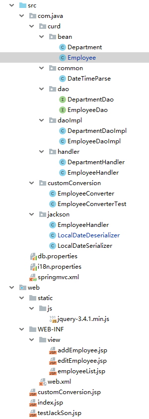
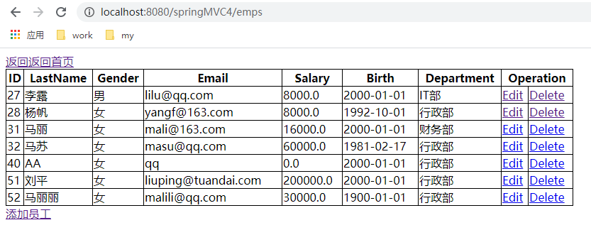
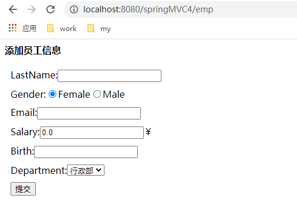
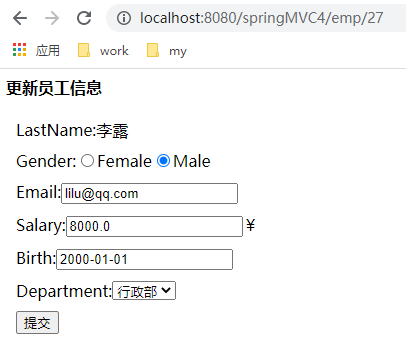
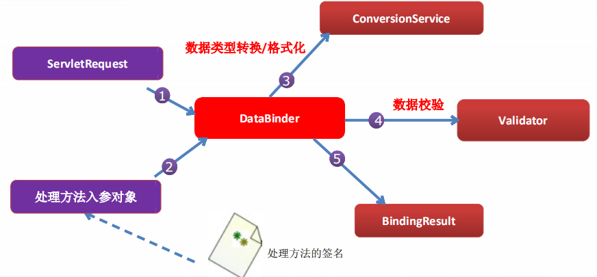
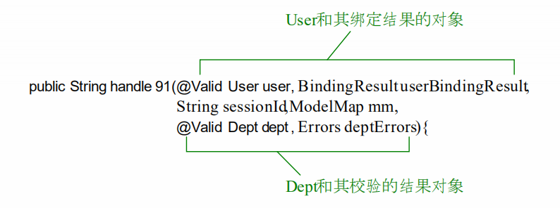
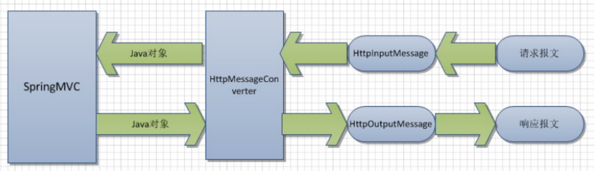
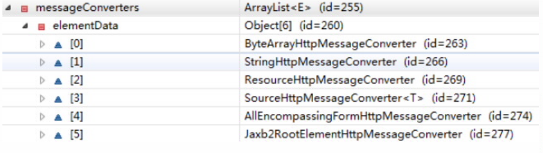
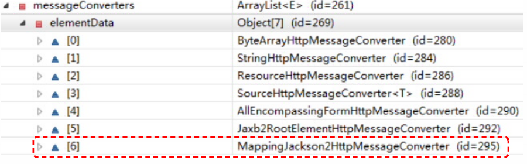
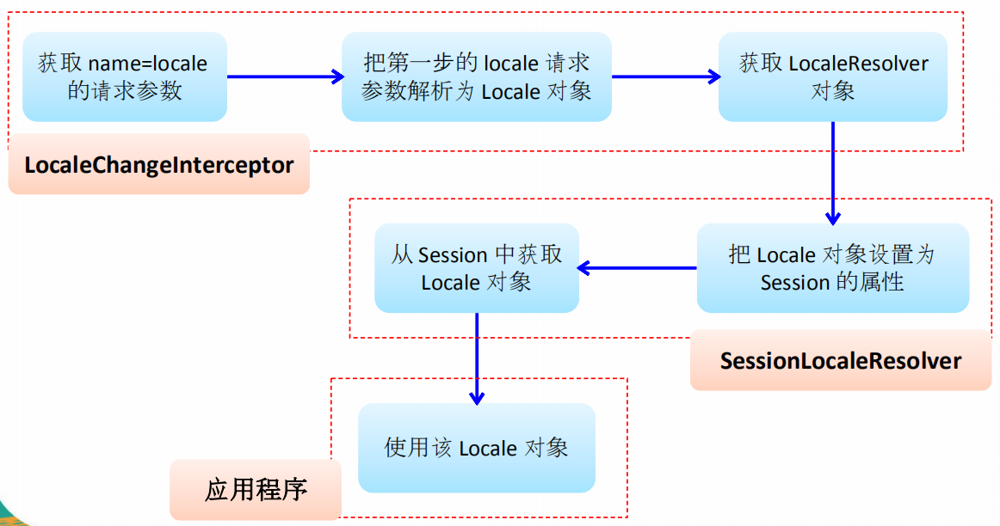

SpringMVC
==


## SpringMVC概述
```text
SpringMVC是一个优秀的web框架
SpringMVC通过一套注解，让POJO成为处理请求的控制器，无须实例任何接口
支持RESTf风格的URL语法
低耦合、可插拔组件结构，有更好的扩展性和灵活性
```

## SpringMVC的HelloWorld
* 加入Srping的jar包，包含spring-webmvc jar包
* /WEB-INF/[web.xml](../SpringMVC/springMVC1/web/WEB-INF/web.xml)中配置DispatcherServlet，以及指定Spring的配置文件
*  添加Spring的配置文件：/WEB-INF/[applicationContext.xml](../SpringMVC/springMVC1/web/WEB-INF/applicationContext.xml)
*  添加SpringMVC的配置文件：/WEB-INF/[dispatcher-servlet.xml](../SpringMVC/springMVC1/web/WEB-INF/dispatcher-servlet.xml)，注意文件名与web.xml配置的中配置DispatcherServlet名对应
    * 配置自动扫描的包
    * 配置视图解析器
* [编写处理请求的处理器，使用@Controller注解handler类，@RequestMapping注解方法(设置URL)](../SpringMVC/springMVC1/src/com/java/springmvc/controller/HelloWorld.java)
* [编写视图，即一个jsp资源文件](../SpringMVC/springMVC1/web/WEB-INF/view/success.jsp)


## 使用@RequestMapping映射请求路径
```text
SpringMVC使用@RequestMapping注解为控制器指定可以处理哪些URL请求

在控制器的类定义及方法上都可以标注

DispatcherServlet 截获请求后，就通过控制器上
@RequestMapping 提供的映射信息确定请求所对应的处理方法。
```
* @RequestMapping标注在类定义处
    >提供初步的请求映射路径，相对于WEB应用的根目录
* @RequestMapping标注在方法处
    ```text
    提供进一步的细分映射信息，相对于类定义处的URL。

    当@RequestMapping 注解同时使用在类名和方法上，则需要具体的控制器方法的URL为 工程URL + 类URL + 方法URL
    当@RequestMapping 注解只使用在方法名上，则需要具体的控制器方法的URL为 工程URL + 方法URL
    以上两种情况，都会自动补齐/

    @RequestMapping("path") path是否以/开头都可以，效果是一样的
    ```
    **示例**  
    [SpringMvcTest](../SpringMVC/springMVC2/src/com/java/springmvc/handler/SpringMvcTest.java)


### @RequestMapping属性params和headers支持简单的表达式
* param1
    >请求必须包含名为 param1 的请求参数
* !param1
    >请求不能包含名为 param1 的请求参数
* param1 != value1
    >请求包含名为 param1 的请求参数，但其值不能为 value1
* {"param1=value1", "param2"} 
    >请求必须包含名为 param1 和param2 的两个请求参数，且 param1 参数的值必须为 value1

    **示例**  
    [SpringMvcTest testParams、testHeaders方法](../SpringMVC/springMVC2/src/com/java/springmvc/handler/SpringMvcTest.java)

### @RequestMapping可映射请求参数、请求方法或请求头
```text
@RequestMapping 除了可以使用请求 URL 映射请求外，还可以使用请求方法、请求参数及请求头映射请求

@RequestMapping 的属性 value、method、params 及 heads 
    分别表示请求 URL、请求方法、请求参数及请求头的映射条件，
    它们之间是与的关系，联合使用多个条件可让请求映射更加精确化。
```
示例  
```java

RequestMapping(value = "/delete", method = RequestMethod.POST, params = "userId")
public String deleteUser() {
    // ... ...
    return "success";
}
```

### @RequestMapping的path支持ant风格的匹配符
```text
?：匹配文件名中的一个字符

*：匹配文件名中的任意字符

**：匹配多层路径
```
举例
```text
@RequestMapping("/user/*/createUser")
    匹配 /user/aaa/createUser、/user/bbb/createUser 等 URL

@RequestMapping(value = "/user/**/createUser")
    匹配 /user/createUser、/user/aaa/bbb/createUser 等 URL

@RequestMapping("/user/createUser??")
    匹配 /user/createUseraa、/user/createUserbb 等 UR
```

### @PathVariable获取路径变量(映射URL绑定的占位符)
```text
获取路径变量

通过 @PathVariable 可以将 URL 中占位符参数绑定到控
制器处理方法的入参中：URL 中的 {xxx} 占位符可以通过 @PathVariable("xxx") 绑定到操作方法的入参中
```

**示例**  
[SpringMvcTest testPathVariable方法](../SpringMVC/springMVC2/src/com/java/springmvc/handler/SpringMvcTest.java)


## 映射请求参数、请求头、Cookie
### @RequestParam映射请求参数 
```text
@RequestParam的属性
    value  请求的参数名
    required  该参数是否必传，默认为true
    defaultValue  该参数的默认值
```
**示例**  
testRequestParam
[SpringMvcTest testRequestParam方法](../SpringMVC/springMVC2/src/com/java/springmvc/handler/SpringMvcTest.java)

### @RequestHeader映射请求头
```text
@RequestHeader的属性
    value  请求头名
    required  该参数是否必传，默认为true
    defaultValue  该参数的默认值
```

[SpringMvcTest testRequestHeader方法](../SpringMVC/springMVC2/src/com/java/springmvc/handler/SpringMvcTest.java)


### @CookieValue映射Cookie
```text
@CookieValue的属性
    value  cookie名
    required  该参数是否必传，默认为true
    defaultValue  该参数的默认值
    
.jsp页面默认有一个cookie，名为：JSESSIONID
```
[SpringMvcTest testCookieValue方法](../SpringMVC/springMVC2/src/com/java/springmvc/handler/SpringMvcTest.java)

## 使用POJO(bean)对象绑定请求参数值
```text
POJO（Plain Ordinary Java Object）简单的Java对象，即JavaBean对象

Spring MVC 会按请求参数名和 POJO 属性名进行自动匹配，
自动为该对象填充属性值。支持级联属性。

如：address.province， address.city等
```
**示例**  
[SpringMvcTest testPojo方法](../SpringMVC/springMVC2/src/com/java/springmvc/handler/SpringMvcTest.java)

## 使用Servlet API作为入参
SpringMVC的handler方法中可以接受的Servlet API的参数类型
* HttpServletRequest
* HttpServletResponse
* HttpSession
* java.security.Principal
* Locale
* InputStream
* OutputStream
* Reader
* Writer

**示例**  
[SpringMvcTest testServletApi方法](../SpringMVC/springMVC2/src/com/java/springmvc/handler/SpringMvcTest.java)

## 处理模型数据
SpringMVC提供了下面几种处理模型数据的方式
* ModelAndView
    ```text
    处理方法返回值类型为ModelAndView时，方法体即可通过该对象添加模型数据

    控制器处理方法的返回值如果为 ModelAndView, 则其既包含视图信息，也包含模型数据信息。 
    ```
    * 添加模型数据
        >MoelAndView addObject(String attributeName, Object attributeValue)  
        ModelAndView addAllObject(Map<String, ?> modelMap)
    * 设置视图
        >void setView(View view)  
        void setViewName(String viewName)
* Map及Model
    ```text
    入参为
    org.springframework.ui.Model、
    org.springframework.ui.ModelMap、
    java.uti.Map
    时，处理方法返回时，Map中的数据会自动添加模型中

    SpringMVC 在内部使用了一个
    org.springframework.ui.Model 接口存储模型数据  
    
    Spring MVC 在调用方法前会创建一个隐
    含的模型对象作为模型数据的存储容器。 – 如果方法的入参为 Map 或 Model 类 型，Spring MVC 会将隐含模型的引用传
    递给这些入参。
    ```
* @SessionAttributes
    ```text
    标注在handler类定义处
    
    将模型中的某个属性暂存到HttpSession中，方便多个请求可共享该属性
    
    @SessionAttributes
        将Map、Model数据添加到session属性上
        只能注解在类上，不能注解方法，
        当handler类定义处无@SessionAttributes标注时，默认只在request域对象中添加模型数据
        * 通过指定属性名(键名)指定要添加到session域对象中，即value = {}，可以指定多个
        * 通过指定模型属性的对象类型指定哪些模型属性需要添加到session域对象中，即types = {}，可以指定多个类型
  
    ```
    
    **示例**  
    [SessionAttributes](../SpringMVC/springMVC2/src/com/java/springmvc/handler/SpringMvcTest2.java)
* @ModelAttribute
    ```text
    标注在请求处理的方法定义处。有标记@ModelAttribute的方法，会在当前handler类中的每个目标方法执行之前被SpringMVC调用

    入参的对象就会自动存放到数据模型中   
    ```
    * 在方法定义上使用@ModelAttribute注解
        >Spring MVC 在调用目标处理方法前，会先逐个调用在方法级上标注了@ModelAttribute 的方法 
    * 在方法的入参前使用 @ModelAttribute 注解
        1. 可以从隐含的模型数据中获取对象，再将请求参数绑定到对象中，再传入入参
        2. 将方法入参对象添加到模型中
          
    **使用@ModelAttribute更新数据库中的bean记录，避免未传的属性出现null**  
      
    
运行过程
```text
  1. 执行@ModelAttribute注解的方法：从数据库中取出对象，把对象放入了map中，键为：user
  2. SpringMVC从map中取出User对象，并把表单的请求参赋给该User对象的对应属性。
  3. SpringMVC把上述对象传入目标方法的参数
  注意：在@ModelAttribute修饰的方法中，放入到Map时的键需要与目标方法入参类名的第一个字母小写的字条串一致
源码分析
  1. 调用@ModelAttribute注解的方法，实际上把@ModelAttribute方法中Map中的数据放在了implicitModel 中
  2. 解析请求处理器的目标参数，实际上该目标参数来自于WebDataBinder对象的tagert属性
      1). 创建WebDataBinder对象
          ①确定objectName属性：若传入的attrName属性值为""，则 objectName 为类名第一个字母小写的字符串
          *注意: attrName. 若目标方法的 POJO 属性使用了 @ModelAttribute 来修饰, 则 attrName 值即为 @ModelAttribute的 value 属性值
          ②确定target属性
              在 implicitModel 中查找 attrName 对应的属性值. 若存在, ok
              *若不存在: 则验证当前 Handler 是否使用了 @SessionAttributes 进行修饰, 若使用了, 则尝试从 Session 中获取 attrName 所对应的属性值.
              若 session 中没有对应的属性值, 则抛出了异常.
              若 Handler 没有使用 @SessionAttributes 进行修饰, 或 @SessionAttributes 中没有使用 value 值指定的 key
              和 attrName 相匹配, 则通过反射创建了 POJO 对象
      2). SpringMVC把表单的请求参数赋给了WebDataBinder的target对应的属性
      3). * SpringMVC会把WebDataBinder的attrName和target传给implicateModel，从而传到reqeust域对象中
      4). 把WebDataBinder的target作为参数传递给目标方法的入参

SpringMVC 确定目标方法 POJO 类型入参的过程
      1. 确定一个key
          ①若目标方法的 POJO 类型的参数木有使用 @ModelAttribute 作为修饰, 则 key 为 POJO 类名第一个字母的小写
          ②若使用了  @ModelAttribute 来修饰, 则 key 为 @ModelAttribute 注解的 value 属性值.
          ③implicitModel 中查找 key 对应的对象, 若存在, 则作为入参传入
      2. 在 implicitModel 中查找 key 对应的对象, 若存在, 则作为入参传入
          ①若在 @ModelAttribute 标记的方法中在 Map 中保存过, 且 key 和 1 确定的 key 一致, 则会获取到.
      3. 若 implicitModel 中不存在 key 对应的对象, 则检查当前的 Handler 是否使用 @SessionAttributes 注解修饰,
          若使用了该注解, 且 @SessionAttributes 注解的 value 属性值中包含了 key, 则会从 HttpSession 中来获取 key 所
          对应的 value 值, 若存在则直接传入到目标方法的入参中. 若不存在则将抛出异常.
      4. 若Handler没有标识@SessionAttributes注解或@SessionAttribute 注解的value值中不包含key，
          则会通过反射来创建 POJO 类型的参数, 传入为目标方法的参数
      5. SpringMVC会把key和POJO类型的对象保存到implicateModel中，进而会保存到request域对象中
```

**示例**  
[SpringMvcTest testModelAndView、testMap、getUser、testModelAttribute、testView 方法](../SpringMVC/springMVC2/src/com/java/springmvc/handler/SpringMvcTest.java)

* 由@SessionAttributes引发的异常
```text
如果在处理类定义处标注了@SessionAttributes(“xxx”)，则尝试从session中获取该属性，
并将其赋给该入参，然后再用请求消息填充该入参对象。如果在会话中找不到对应的属性，
则抛出 HttpSessionRequiredException 异常

解决方法：
@ModelAttribute标注的方法，在map添加键值时，键名不与Bean类名相同(类名第一个字母小写)，取其他的名xx

入参使用该属性时，使用@ModelAttribute(value = "xx") User user
```
    
## 视图和视图解析器
```text
* 请求处理方法执行完成后，最终返回一个 ModelAndView对象。
    对于那些返回 String，View 或 ModeMap 等类型的处理方法，
    Spring MVC 也会在内部将它们装配成一个ModelAndView 对象，
    它包含了逻辑名和模型对象的视图

* Spring MVC 借助视图解析器（ViewResolver）得到最终的视图对象（View），
    最终的视图可以是 JSP ，也可能是Excel、JFreeChart 等各种表现形式的视图

* 对于最终究竟采取何种视图对象对模型数据进行渲染，
    处理器并不关心，处理器工作重点聚焦在生产模型数据的工作上，
    从而实现 MVC 的充分解耦

* 视图的作用是渲染模型数据，将模型里的数据以某种形式呈现给用户

* 为了实现视图模型和具体实现技术的解耦，Spring在org.springframework.web.servlet包定义了一个高度抽象的View接口

* 视图对象由视图解析器负责实例化。由于视图是无状态的，所以没有线程安全问题

* SpringMVC 为逻辑视图名的解析提供了不同的策略，
    可以在 SpringWEB 上下文中配置一种或多种解析策略，
    并指定他们之间的先后顺序。每一种映射策略对应一个具体的视图解析器实现类
    
* 视图解析器的作用比较单一：将逻辑视图解析为一个具体的视图对象。

* 所有的视图解析器都必须实现 ViewResolver 接口
```

**常见的视图实现类**  

大类 |视图类型 |说明
:--- |:--- |:---
URL资源视图 |InternalResourceView <br> JstlView |将JSP或其它资源封装成一个视图，是InternalResourceViewResolver默认的视图实现类 
文档视图 |AbstractExcelView <br> AbstractPdfView|Excel文档视图的抽象类，基于POI构造Excel文档 <br>PDF文档视图的抽象类，基于IText构造PDF文档 
报表视图 |ConfigurableJsperReportsView <br> JasperReportsCsvView <br> JasperReportsMultiFormatView <br> JasperReportsHtmlView <br> JasperReportsPdfView <br> JasperReportsXlsView |几个使用JasperReports报表技术的视图 
JSON视图 |MappingJacksonJsonView |将模型数据通过Jackson框架的ObjectMapper以JSON方式输出  


**长江的视图解析器实现类**  

大类 |视图类型 |说明
:--- |:--- |:---
解析为Bean的名字 |BeanNameViewResolver |将逻辑视图解析为一个Bean，Bean的ID等于逻辑视图名 
解析为URL文件 |InternalResourceViewResolver <br> JasperReportsViewResolver |将视图名解析为一个URL文件，一般使用该视图解析器将视图名映射为 /WEB-INF/下的jsp文件 <br> JasperReports将视图名解析为报表文件对应的URL
模板文件视图 |FreeMarkerViewResolver <br> VelocityViewResolver <br>VelocityLayoutViewResolver |解析为基于FreeMarker的模板技术的模板文件 <br> 解析为基于Velocity模板技术的模板文件 <br>

```text
* 程序员可以选择一种视图解析器或混用多种视图解析器

* 每个视图解析器都实现了 Ordered 接口并开放出一个 order 属性，
    可以通过 order 属性指定解析器的优先顺序，order 越小优先级越高。 

* SpringMVC 会按视图解析器顺序的优先顺序对逻辑视图名进行解析，
    直到解析成功并返回视图对象，否则将抛出 ServletException 异 常
```

**SpringMVC如何解析视图**  
  

  


**配置InternalResourceViewResolver视图解析器**  
jsp是最常用的视图解析技术，在SpringMVC配置文件中配置视图解析器，如配置文件：dispatcher-servlet.xml
```xml
<beans>

    <!-- 配置视图解析器
     把controller方法返回值解析为实际的视图
     主要目的就是：告诉控制器处理完，应该将请求转发到哪，这里指定了资源路径的前缀与后缀，
     controller方法里返回的是一个资源名字符串，最后由此定义的 前缀+返回的资源名+后缀，就能确定视图资源的具体路径了
     -->
    <bean class="org.springframework.web.servlet.view.InternalResourceViewResolver">
        <property name="prefix" value="/WEB-INF/view/"/>
        <property name="suffix" value=".jsp"/>
    </bean>
</beans>
```

```text
若项目中使用JSTL，则SpringMVC会自动把视图由InternalResourceViewResolver转为JstlView
```


### 直接转发的页面
```text
可以直接相应转发的页面, 而无需再经过 Handler 的方法. 要求同时配置 <mvc:annotation-driven/> 否则报404异常
```
SpringMVC配置文件配置：
```xml
<beans>
    <!-- 配置直接转发的页面 -->
    <!-- 可以直接相应转发的页面, 而无需再经过 Handler 的方法. 要求同时配置 <mvc:annotation-driven/> 否则报404异常 -->
    <mvc:view-controller path="/mylogin" view-name="login"/>
    <mvc:annotation-driven/>
    
</beans>
```

### Excel视图
```text
* 若希望使用 Excel 展示数据列表，仅需要扩展SpringMVC 提供的 AbstractExcelView 或
    AbstractJExcel View 即可。实现 buildExcelDocument() 方法，
    在方法中使用模型数据对象构建 Excel 文档就可以了。

* AbstractExcelView 基于 POI API，
    而AbstractJExcelView 是基于 JExcelAPI 的。

* 视图对象需要配置 IOC 容器中的一个 Bean，使用
BeanNameViewResolver 作为视图解析器即可

* 若希望直接在浏览器中直接下载 Excel 文档，
    则可以设置响应头 
    Content-Disposition 的值为 attachment;filename=xxx.xls
```


### redirect302重定向和forward转发
```text
Controller方法返回的字符串类型的值，被当成逻辑视图名处理
```

* 前缀为 "forward:", 表示转发操作
    >return "redirect:https://www.baidu.com";  //302重定向到https://www.baidu.com

* 前缀为 "redirect:", 表示302重定向操作，
    >return "forward:/product-list.jsp";  //转发到/product-list.jsp 页面

**示例**  
[testRdirect、testForward方法](../SpringMVC/springMVC2/src/com/java/springmvc/handler/SpringMvcTest.java)  

## REST
```text
REST: Representational State Transfer,代表性状态转移
```

### REST特点
* 每一个URI代表1种资源；
* 客户端使用GET、POST、PUT、DELETE4个表示操作方式的动词对服务端资源进行操作
    * GET用来获取资源
    * POST用来新建资源（也可以用于更新资源）
    * PUT用来更新资源
    * DELETE用来删除资源
* 通过操作资源的表现形式来操作资源
* 资源的表现形式是XML、HTML、JSON
* 客户端与服务端之间的交互在请求之间是无状态的，从客户端到服务端的每个请求都必须包含理解请求所必需的信息。

**REST风格的CRUD**
```text
动作  REST                普通的
-----+-------------------+-----
新增  /order  POST        同左
删除  /order/1  DELETE    delete?id=1
修改  /order/1  PUT       update?id=1
获取  /order/1  GET       get?id=1
```

**示例**  
[SpringMvcTest  REST GET、POST、PUT、DELETE](../SpringMVC/springMVC2/src/com/java/springmvc/handler/SpringMvcTest.java)

* REST PUT访问时报异常HTTP Status 405
    ```text
    REST PUT
    tomcat 8及以上，访问时报异常 HTTP Status 405 – 方法不允许，
      JSP 只允许 GET、POST 或 HEAD。Jasper 还允许 OPTIONS
    处理方法：在转发的view文件里添加 isErrorPage="true" ，如：
    <%@ page contentType="text/html;charset=UTF-8" language="java" isErrorPage="true" %>
    ```

## RESTful的CRUD
```text
这是RESTful风格的 员工信息的CRUD操作
```

[RESTful CRUD项目](../SpringMVC/springMVC4)  
[相关的sql](../SpringMVC/springMVC4/sql/restful.sql)  

包结构

  
* Bean
    * [Employee](../SpringMVC/springMVC4/src/com/java/curd/bean/Employee.java)
    * [Department](../SpringMVC/springMVC4/src/com/java/curd/bean/Department.java)
* dao
    * [JdbcTemplate查询级联属性，queryAllEmployees方法](../SpringMVC/springMVC4/src/com/java/curd/daoImpl/EmployeeDaoImpl.java)
* handler
    * [入参为LocalDateTime、LocalDate、LocalTime的参数进行转换](../SpringMVC/springMVC4/src/com/java/curd/common/LocalDateTimeParse.java)
        >EmployeeHandler中saveEmployee方法

### 客户端如何用POST请求来转为PUT、DELETE请求
```text
思路：在Tomcat端，通过http request传过来的特定参数_method值，来修改成响应的请求方法，DELETE、PUT这两种
```

* Tomcat端 /WEB-INF/web.xml配置HiddenHttpMethodFilter过滤器
    ```xml
    <web-app>
    
        <!-- 配置HiddenHttpMethodFilter 过滤器，在服务端可以把 POST 请求转为 DELETE、PUT 请求 -->
        <filter>
            <filter-name>hiddenHttpMethodFilter</filter-name>
            <filter-class>org.springframework.web.filter.HiddenHttpMethodFilter</filter-class>
        </filter>
        <filter-mapping>
            <filter-name>hiddenHttpMethodFilter</filter-name>
            <url-pattern>/*</url-pattern>
        </filter-mapping>
    </web-app>
    ```
* html前端页面
    ```html
        <form action="" method="POST">
            <input type="hidden" name="_method" value="DELETE"/>
            <!-- 转为PUT请求 -->
    <!--        <input type="hidden" name="_method" value="PUT"/>-->
        </form>
    ```
* jQeury发PUT、DELTE请求
```js
// tomcat不支持jqeury的XMLHttpRequest(ajax)发送的请求，虽然后台能接收到请求，且能正常处理请求，但会报405
$.ajax({
    // 提交数据的类型 POST、GET、PUT、DELETE
    type: "POST",
    // 提交的网址
    url: url,
    // 提交的数据
    data: {'_method': 'DELETE'},
    // 返回数据的格式
    datatype: "html",//"xml", "html", "script", "json", "jsonp", "text".
    // 在请求之前调用的函数
    // beforeSend: function(){
    //
    // },
    // 成功返回之后调用的函数
    success: function(data){
        location.reload();
    }   ,
    // // 调用执行后调用的函数
    // complete: function(XMLHttpRequest, textStatus){
    //     //HideLoading();
    // },
    // 调用出错执行的函数
    error: function(){
        // 请求出错处理
        location.reload();
    }
});
```


相关操作界面

* 员工列表
    ```text
    URI：emps
    请求方式：GET
    ```  
  

* 添加员工
    * 显示添加页面
        ```text
        URI：emp
        请求方式：GET
        ```
    * 后端添加员工信息接口
        ```text
        URI：emp
        请求方式：POST
    
        添加成功后在重定向到员工列表页
        ```

  

* 更新员工信息
    * 显示员工信息 
        ```text
        URI：emp/{id}
        请求方式：GET
        ```
    * 更新员工信息
        ```text
        URI：emp
        请求方式：PUT
        修改完后，重定向到员工列表页
        ```
    
  

```text
更新员工信息时，是根据客户提交的用户信息中的员工id，
先到数据库中查询该员工并封装成bean，在更新该bean的相应字段，
最后更新到数据库
```

* 删除员工
    ```text
    URI：emp/{id}
    请求方式：DELETE
    删除后效果：对应的记录从数据库表中删除

    * Tomcat 8及以上版默认只支持客户端使用OPTIONS, GET, HEAD, POST请求方法
    * tomcat不支持jqeury的XMLHttpRequest(ajax)发送的请求，虽然后台能接收到请求，且能正常处理请求，但会报405
    ```

## SpringMVC的form标签
```text
通过 SpringMVC 的表单标签，
可以实现将模型数据中的属性和 HTML 表单元素相绑定，
以实现表单数据更便捷编辑和表单值的回显

* 一般情况下，通过 GET 请求获取表单页面，而通过POST 请求提交表单页面，
    因此获取表单页面和提交表单 页面的 URL 是相同的。
    只要满足该最佳条件的契约，
    <form:form> 标签就无需通过 action 属性指定表单提交的 URL

* 可以通过 modelAttribute 属性指定绑定的模型属性，
    若没有指定该属性，则默认从 request 域对象中读取command 的表单 bean，
    如果该属性值也不存在，则会 发生错误。
```

SpringMVC的form标签的组件标签
```text
<form:input/>、<form:select/> 等，
    用以绑定表单字段的属性值，它们的共有属性如下
    * path：表单字段，对应 html 元素的 name 属性，支持级联属性
    * htmlEscape：是否对表单值的 HTML 特殊字符进行转换，默认值为 true
    * cssClass：表单组件对应的 CSS 样式类名 
    * cssErrorClass：表单组件的数据存在错误时，采取的 CSS 样式

form:input、
form:password、
form:hidden、
form:textarea
对应 HTML 表单的 text、password、hidden、textarea标签

form:radiobutton：单选框组件标签，当表单 bean 对应的属性值和 value 值相等时，单选框被选中
form:radiobuttons：单选框组标签，用于构造多个单选框
    * items：可以是一个 List、String[] 或 Map
    * itemValue：指定 radio 的 value 值。可以是集合中 bean 的一个属性值 
    * itemLabel：指定 radio 的 label 值
    * delimiter：多个单选框可以通过 delimiter 指定分隔符

form:checkbox：复选框组件。用于构造单个复选框 
form:checkboxs：用于构造多个复选框。使用方式同
form:radiobuttons 标签
form:select：用于构造下拉框组件。使用方式同
form:radiobuttons 标签
form:option：下拉框选项组件标签。使用方式同
form:radiobuttons 标签
form:errors：显示表单组件或数据校验所对应的错误
    <form:errors path= “ *” /> ：显示表单所有的错误
    <form:errors path= “ user*” /> ：显示所有以 user 为前缀的属性对应的错误
    <form:errors path= “ username” /> ：显示特定表单对象属性的错误
```

## 处理静态资源
```text
若将 DispatcherServlet 请求映射配置为 /，
则 Spring MVC 将捕获WEB 容器的所有请求，包括静态资源的请求， 
SpringMVC 会将他们当成一个普通请求处理，因找不到对应处理器将导致错误

* <mvc:default-servlet-handler/>
    将在 SpringMVC 上下文中定义一个DefaultServletHttpRequestHandler，
    它会对进入 DispatcherServlet 的 请求进行筛查，如果发现是没有经过映射的请求，
    就将该请求交由 WEB 应用服务器默认的 Servlet 处理，
    如果不是静态资源的请求，才由DispatcherServlet 继续处理 

* 一般 WEB 应用服务器默认的 Servlet 的名称都是 default。
    若所使用的WEB 服务器的默认 Servlet 名称不是 default，
    则需要通过 defaultservlet-name 属性显式指定
```

解决方法，springMVC配置文件中配置默认的default-servlet-handler
```xml
<beans>

    <!-- 开启默认的servlet handler -->
    <mvc:default-servlet-handler/>
    <!-- 开启注解驱动 -->
    <mvc:annotation-driven conversion-service="conversionService"/>
</beans>
```

## 数据转换、数据格式化、数据校验
### 数据绑定流程
```text
1. SpringMVC主框架将ServletRequest对象及目标方
    法的入参实例传递给 WebDataBinderFactory 实例，
    以创建 DataBinder 实例对象 

2. DataBinder 调用装配在 Spring MVC 上下文中的
    ConversionService 组件进行数据类型转换、数据格式化工作。
    将 Servlet 中的请求信息填充到入参对象中

3. 调用 Validator 组件对已经绑定了请求消息的入参对象 进行数据合法性校验，
    并最终生成数据绑定结果BindingData 对象 

4. SpringMVC抽取BindingResult中的入参对象和校验错误对象，
    将它们赋给处理方法的响应入参
```
* 数据绑定的核心部件是DataBinder
      

### 自定义数据类型转换
```text
* ConversionService 是 Spring 类型转换体系的核心接口。

* 可以利用 ConversionServiceFactoryBean 在 Spring 的 IOC 容器中
    定义一个 ConversionService. Spring 将自动识别出
    IOC 容器中的 ConversionService，并在 Bean 属性配置及
    SpringMVC 处理方法入参绑定等场合使用它进行数据的转换
* 可通过 ConversionServiceFactoryBean 的 converters 属性注册自定义的类型转换器

Spring 定义了 3 种类型的转换器接口，实现任意一个转换器接口都可以作为自定义转换器注册到
ConversionServiceFactroyBean 中：
    - Converter<S,T>：将 S 类型对象转为 T 类型对象 
    - ConverterFactory：将相同系列多个 “同质” Converter 封装在一起。
        如果希望将一种类型的对象转换为另一种类型及其子类的对象
        （例如将 String 转换为 Number 及 Number 子类 （Integer、Long、Double 等）对象）可使用该转换器工厂类 
    - GenericConverter：会根据源类对象及目标类对象所在的宿主类 中的上下文信息进行类型转换
```

**自定义数据转换器示例**  
* [自定类型转换器：EmployeeConverter](../SpringMVC/springMVC4/src/com/java/customConversion/EmployeeConverter.java)  
* [自定类型转换器：EmployeeConverter测试](../SpringMVC/springMVC4/src/com/java/customConversion/EmployeeConverterTest.java)  
* SpringMVC配置文件添加自定义数据转换器
    ```xml
    <beans>
    
        <!-- 自定义数据转换器 -->
        <bean id="conversionService" class="org.springframework.context.support.ConversionServiceFactoryBean">
            <property name="converters">
                <set>
                    <ref bean="employeeConverter"/>
                </set>
            </property>
        </bean>
    
        <!-- 开启注解驱动 -->
        <mvc:annotation-driven conversion-service="conversionService"/>  
    </beans>
    ```
### 关于\<mvc:annotation-driven />
```text
* <mvc:annotation-driven /> 会自动注册
    RequestMappingHandlerMapping、
    RequestMappingHandlerAdapter、
    ExceptionHandlerExceptionResolver 三个bean。 

* 还将提供以下支持
    – 支持使用 ConversionService 实例对表单参数进行类型转换
    – 支持使用 @NumberFormat annotation、@DateTimeFormat
        注解完成数据类型的格式化
    – 支持使用 @Valid 注解对 JavaBean 实例进行 JSR 303 验证
    – 支持使用 @RequestBody 和 @ResponseBody 注解
```

### @InitBinder
```text
* 由 @InitBinder 标识的方法，可以对 WebDataBinder 对 象进行初始化。
    WebDataBinder 是 DataBinder 的子类，
    用于完成由表单字段到 JavaBean 属性的绑定 
    
* @InitBinder方法不能有返回值，它必须声明为void。 

* @InitBinder方法的参数通常是是 WebDataBinder
```


### 数据格式化
```text
* 对属性对象的输入/输出进行格式化，从其本质上讲依然属于 “类型转换” 的范畴。

* Spring 在格式化模块中定义了一个实现ConversionService 接口的
    FormattingConversionService 实现类，
    该实现类扩展 了 GenericConversionService，
    因此它既具有类型转换的功能，又具有格式化的功能

* FormattingConversionService 拥有一个
    FormattingConversionServiceFactroyBean 工厂类，
    后者用于在 Spring 上下文中构造前者

* FormattingConversionServiceFactroyBean 内部已经注册了: 
    - NumberFormatAnnotationFormatterFactroy：支持对数字类型的属性
        使用 @NumberFormat 注解
    - JodaDateTimeFormatAnnotationFormatterFactroy：支持对日期类型的属性使用 
        @DateTimeFormat 注解
        
* 装配了 FormattingConversionServiceFactroyBean 后，
    就可以在 Spring MVC 入参绑定及模型数据输出时使用注解驱动了。
    <mvc:annotation-driven/> 默认创建的
        ConversionService 实例即为FormattingConversionServiceFactroyBean
```

#### 日期格式化
```text
@DateTimeFormat 注解可对
    java.util.Date、java.util.Calendar、java.long.Long 时间类型进行标注： 
    - pattern 属性：类型为字符串。指定解析/格式化字段数据的模式，
        如：”yyyy-MM-dd hh:mm:ss” 
    - iso 属性：类型为 DateTimeFormat.ISO。
        指定解析/格式化字段数据的ISO模式，
        包括四种：ISO.NONE（不使用） 
        -- 默认、ISO.DATE(yyyy-MM-dd)、
            ISO.TIME(hh:mm:ss.SSSZ)、
            ISO.DATE_TIME(yyyy-MM-dd hh:mm:ss.SSSZ) 
    - style 属性：字符串类型。通过样式指定日期时间的格式，
        由两位字符组成，
        第一位表示日期的格式，第二位表示时间的格式：
            S：短日期/时间格式、
            M：中日期/时间格式、
            L：长日期/时间格式、
            F：完整日期/时间格式、
            -：忽略日期或时间格式
```

### 数值格式化
```text
@NumberFormat 可对类似数字类型的属性进行标注，
    它拥有两个互斥的属性：
    - style：类型为 NumberFormat.Style。
        用于指定样式类型，包括三种：
        Style.NUMBER（正常数字类型）、
        Style.CURRENCY（货币类型）、 
        Style.PERCENT（百分数类型）
    - pattern：类型为 String，自定义样式，
        如patter="#,###"；
```
**示例**
* bean  
    ```java
    public class User {
        @DateTimeFormat(parrten = "yyyy-MM-dd")
        private Date birthday;
        
    }
    ```
* handler
```java
@Controller
public class MyHandler {
    @RequestMapping("/addUser")
    public String addUser(@ModelAttibute("user") User user) {
        // ...
    }
    
}
```

### 数据校验
```text
* JSR 303 是 Java 为 Bean 数据合法性校验提供的标准框架，它已经包含在 JavaEE 6.0 中

* JSR 303 通过在 Bean 属性上标注类似于 @NotNull、@Max 等标准的注解指定校验规则，
    并通过标准的验证接口对 Bean 进行验证
```

JSR 303注解

注解 |功能说明
:--- |:---
@Null |被注解的元素必须为null 
@NotNull |元素必须不为null 
@AssertTrue |元素必须为true 
@AssertFalse |元素必须为false 
@Min(value) |元素必须是一个数字，最小值为指定的value值 
@Max(value) |元素必须是一个数字，最大值为指定的value值 
@DecimalMin(value) |元素必须是一个数字，最小值为指定的value值  
@DecimalMax(value) |元素必须是一个数字，最大值为指定的value值  
@Size(min = , max = ) |min <= 元素值 <= max 
@Digits(integer, fraction) |元素是数据，且类型为指定范围内的类型 
@Past |必须是一个过去的日期
@Future |必须是一个将来的日期 
@Pattern(regex, flag = ) |元素必须符合正指定的正则表达式regex 


* hibernate validator扩展注解
    ```text
    Hibernate validator是JSR 303的一个参考实现，支持所有的JSR 303标准注解，还有如下扩展注解
    ```
注解 |功能说明
:--- |:---
@Email(message = "错误时提示信息") |被注解的元素必须是一个电子邮箱地址 
@Length(min = , max = ) |min <= 字符串的长度 <= max
@NotEmpty |被注解的字符串必须非空，这里则不允许为多个空格 
@NotBlank(message = ) |验证字符串非null, 且长度必须大于0，这里则允许为多个空格 
@Range(min = , max = , message = "错误提示信息") |被注解的元素必须在指定的范围内 


### SpringMVC数据校验
```text
* Spring 4.0拥有自己独立的数据校验框架，同时也支持JSR 303标准的校验框架

* Spring在进行数据绑定时，可同时调用校验数据框架完成数据的校验工作。
    在SpringMVC中，可通过 注解驱动 的方式进行数据校验
    开启注解驱动方法，在SpringMVC配置中添加 <mvc:annotation-driven/>

* Spring 的 LocalValidatorFactroyBean 既实现了 Spring 的
    Validator 接口，也实现了 JSR 303 的 Validator 接口。只要
    在 Spring 容器中定义了一个LocalValidatorFactoryBean，即可将其注入到需要数据校
    验的 Bean 中。

* Spring 本身并没有提供 JSR303 的实现，所以必须将JSR303 的实现者的 jar 包放到类路径下。

* 在SpringMVC配置中添加 <mvc:annotation-driven/>， 开启开启注解驱动，
    会默认装配好一个LocalValidatorFactoryBean，
    通过在处理方法的入参上标注 @valid 注解
    即可让 Spring MVC 在完成数据绑定后执行数据校验的工作

* 在已经标注了 JSR303 注解的表单/命令对象前标注一个@Valid，
    Spring MVC 框架在将请求参数绑定到该入参对象后，
    就会调用校验框架根据注解声明的校验规则实施校验

* Spring MVC 是通过对处理方法签名的规约来保存校验结果的：
    前一个表单/命令对象的校验结果保存到随后的入参中，
    这个保存校验结果的入参必须是 BindingResult 或Errors 类型，
    这两个类都位于org.springframework.validation 包中

* 需校验的 Bean 对象和其绑定结果对象或错误对象时成对出现的，它们 之间不允许声明其他的入参

* Errors 接口提供了获取错误信息的方法，如 getErrorCount() 或getFieldErrors(String field) 

* BindingResult 扩展了 Errors 接口

BindingResult常用方法
    * FieldError getFieldError(String field)
    * List<FieldError> getFieldErrors()
    * Object getFieldValue(String field)
    * Int getErrorCount()

```

**示例**  
[saveEmployee方法](../SpringMVC/springMVC4/src/com/java/curd/handler/EmployeeHandler.java)

  

* 在页面上显示错误
```text
* Spring MVC 除了会将表单/命令对象的校验结果保存到对 应的 BindingResult 或 Errors 对象中外，还会将所有校验 结果保存到 "隐含模型"

* 在 JSP 页面上可通过
    <form:errors path="userName"> 
    显示错误消息，path表示字段
    
    <%-- 显示所有的错误消息 --%>
    <form:errors path="*"></form:errors>
```

### 提示消息国际化
1. SpringMVC配置文件中配置国际化资源文件
   ```xml
       <!-- 配置国际化资源文件 -->
       <bean id="messageSource"
             class="org.springframework.context.support.ResourceBundleMessageSource">
           <property name="basename" value="i18n"/>
           <!-- 指定编码字符集 -->
           <property name="defaultEncoding" value="utf-8"/>
       </bean>
   ```
2. 添加多语言ResourceBundle文件
    ```text
    * 若数据类型转换或数据格式转换时发生错误，或该有的参数不存在，
        或调用处理方法时发生错误，都会在隐含模型中创建错误消息。其错误代码前缀说明如下：
        * required：必要的参数不存在。
            如 @RequiredParam("param1")  标注了一个入参，但是该参数不存在
        * typeMismatch：在数据绑定时，发生数据类型不匹配的问题
        * methodInvocation：Spring MVC 在调用处理方法时发生了错误
    ```
    [i18n.properties](../SpringMVC/springMVC4/src/i18n.properties)
3. jsp页面显示显示错误
    [addEmployee.jsp](../SpringMVC/springMVC4/web/WEB-INF/view/addEmployee.jsp)


## HttpMessageConverter处理JSON
```text
HttpMessageConverter<T>
是一个接口，负责将请求信息转换为一个对象（类型为 T），将对象（类型为 T）输出为响应信息

HttpMessageConverter<T>接口定义的方法
    - Boolean canRead(Class<?> clazz,MediaType mediaType)
        指定转换器可以读取的对象类型，即转换器是否可将请求信息转换为 clazz 类型的对象，
        同时指定支持 MIME 类型(text/html,applaiction/json等) 
    
    - Boolean canWrite(Class<?> clazz,MediaType mediaType)
        指定转换器是否可将 clazz 类型的对象写到响应流中，响应流支持的媒体类型 在MediaType 中定义。
    
    - LIst<MediaType> getSupportMediaTypes()
        该转换器支持的媒体类型。
    
    - T read(Class<? extends T> clazz,HttpInputMessage inputMessage)
        将请求信息流转换为 T 类型的对象。
    
    - void write(T t,MediaType contnetType,HttpOutputMessgae outputMessage)
        将T类型的对象写到响应流中，同时指定相应的媒体类 型为 contentType。

* 使用 HttpMessageConverter<T> 将请求信息转化并绑定到处理方法的入
    参中或将响应结果转为对应类型的响应信息，Spring 提供了两种途径： 
    – 使用 @RequestBody / @ResponseBody 对处理方法进行标注 
    – 使用 HttpEntity<T> / ResponseEntity<T> 作为处理方法的入参或返回值 

* 当控制器处理方法使用到 
    @RequestBody/@ResponseBody 或
    HttpEntity<T>/ResponseEntity<T> 时, 
    Spring 首先根据请求头或响应头的
    Accept 属性选择匹配的 HttpMessageConverter,
     进而根据参数类型或泛型类型的过滤得到匹配的 HttpMessageConverter,
      若找不到可用的HttpMessageConverter 将报错
      
* @RequestBody 和 @ResponseBody 不需要成对出现
```
* HttpMessageConverter<T>工作流程
      

```text
DispatcherServlet 默认装配 RequestMappingHandlerAdapter，
而RequestMappingHandlerAdapter 默认装配如下HttpMessageConverter：
```


加入jackson jar包后， RequestMappingHandlerAdapter装配的 HttpMessageConverter 如下


* [testHttpMessageConverter方法](../SpringMVC/springMVC3/src/com/java/handler/MyHandler.java)
* [testHttpEntity](../SpringMVC/springMVC3/src/com/java/handler/MyHandler.java)
* [testResponseEntiry 下载文件](../SpringMVC/springMVC3/src/com/java/handler/MyHandler.java)


### JackSon处理JSON
* 加入jar包
    ```text
    jar包下载地址 https://repo1.maven.org/maven2/com/fasterxml/jackson/core
    
    必须的包：
    jackson-annotations
    jackson-core
    jackson-databind	
    ```

* 在handler类上编写目标方法，使其返回JSON对应的对象或集合
* 在目标方法上添加@ResponseBody注解
    [EmployeeHandler](../SpringMVC/springMVC4/src/com/java/jackson/EmployeeHandler.java)

* JackSon自定义LocalDate的格式
    * JackSon默认的LocalDate。LocalDate可以很方便的对日期进行处理，但是在返回给前端时，展示为如下的JSON结构
        ```json
        {
            "dayOfWeek": "FRIDAY",
            "month": "JANUARY",
            "year": 2020,
            "dayOfMonth": 3,
            "era": "CE",
            "dayOfYear": 3,
            "monthValue": 1,
            "chronology": {
                "calendarType": "iso8601",
                "id": "ISO"
            }
        }
        ```
    * 解决方法：使用@JsonDeserialize和@JsonSerialize来注释该类的LocalDate属性，使其成为前端组件需要的String格式
        * [LocalDateDeserializer类](src/com/java/jackson/LocalDateDeserializer.java)
        * [LocalDateSerializer类](src/com/java/jackson/LocalDateSerializer.java)
    * 实体类添加注解
        ```java
            @JsonDeserialize(using = LocalDateDeserializer.class)
            @JsonSerialize(using = LocalDateSerializer.class)
            @Past(message = "生日不能早于现在的时间")
            private LocalDate birth;
        ```
        [Employee bean](../SpringMVC/springMVC4/src/com/java/curd/bean/Employee.java)

## i18n国际化
```text
关于国际化:
1. 在页面上能够根据浏览器语言设置的情况对文本(不是内容), 时间, 数值进行本地化处理
2. 可以在 bean 中获取国际化资源文件 Locale 对应的消息
3. 可以通过超链接切换 Locale, 而不再依赖于浏览器的语言设置情况
    解决:
    1. 使用 JSTL 的 fmt 标签
    2. 在 bean 中注入 ResourceBundleMessageSource 的示例, 使用其对应的 getMessage 方法即可
    3. 配置 LocalResolver 和 LocaleChangeInterceptor
```
* 添加多语言ResourceBundle文件
* SpringMVC配置文件中配置国际化资源文件
```xml
    <!-- 配置国际化资源文件 -->
    <bean id="messageSource"
          class="org.springframework.context.support.ResourceBundleMessageSource">
        <property name="basename" value="i18n"/>
        <!-- 指定编码字符集 -->
        <property name="defaultEncoding" value="utf-8"/>
    </bean>
```
* [html页面](../SpringMVC/springMVC3/web/WEB-INF/view/i18n_page.jsp)

**SessionLocaleResolver & LocaleChangeInterceptor 工作原理**  
  


## 文件的上传

## 使用拦截器

## 异常处理

## SpringMVC的运行流程

## Spring与SpringMVC整合

## SpringMVC与Struts2对比