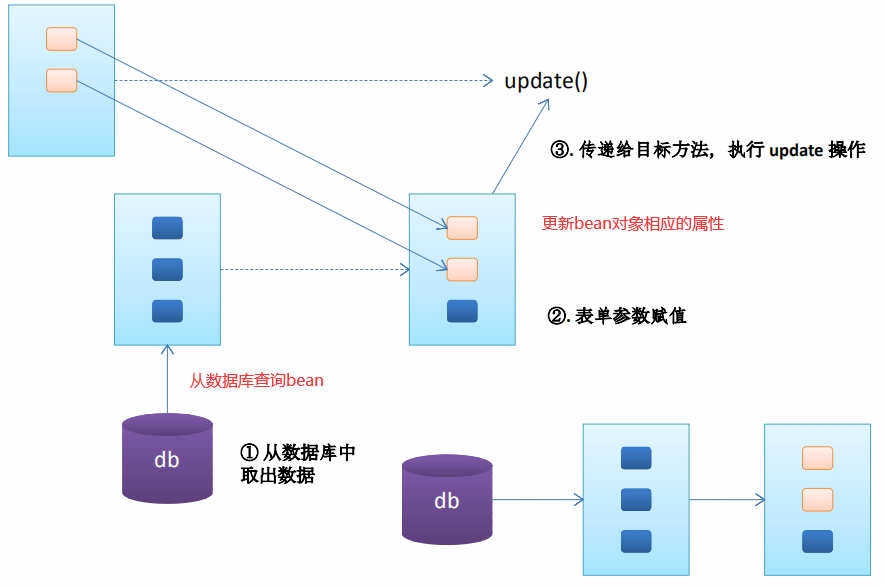
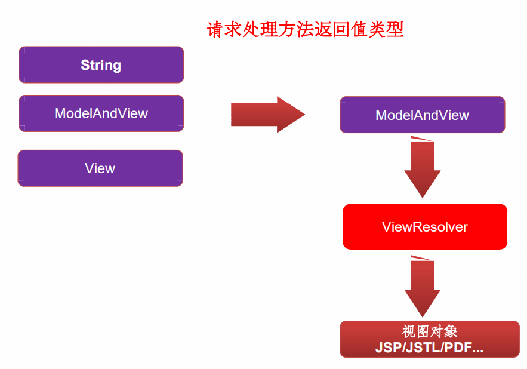
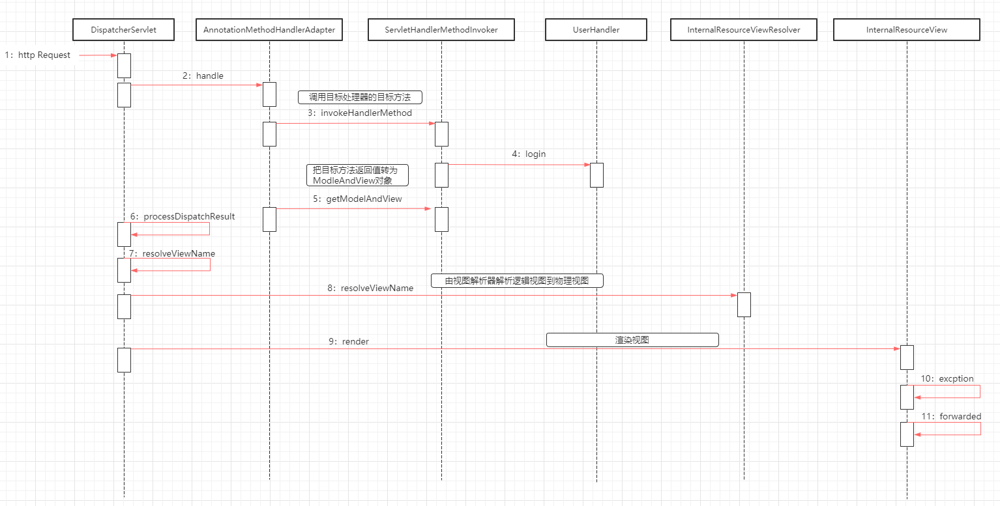

SpringMVC
==


## SpringMVC概述
```text
SpringMVC是一个优秀的web框架
SpringMVC通过一套注解，让POJO成为处理请求的控制器，无须实例任何接口
支持RESTf风格的URL语法
低耦合、可插拔组件结构，有更好的扩展性和灵活性
```

## SpringMVC的HelloWorld
* 加入Srping的jar包，包含spring-webmvc jar包
* /WEB-INF/[web.xml](../SpringMVC/springMVC1/web/WEB-INF/web.xml)中配置DispatcherServlet，以及指定Spring的配置文件
*  添加Spring的配置文件：/WEB-INF/[applicationContext.xml](../SpringMVC/springMVC1/web/WEB-INF/applicationContext.xml)
*  添加SpringMVC的配置文件：/WEB-INF/[dispatcher-servlet.xml](../SpringMVC/springMVC1/web/WEB-INF/dispatcher-servlet.xml)，注意文件名与web.xml配置的中配置DispatcherServlet名对应
    * 配置自动扫描的包
    * 配置视图解析器
* [编写处理请求的处理器，使用@Controller注解handler类，@RequestMapping注解方法(设置URL)](../SpringMVC/springMVC1/src/com/java/springmvc/controller/HelloWorld.java)
* [编写视图，即一个jsp资源文件](../SpringMVC/springMVC1/web/WEB-INF/view/success.jsp)


## 使用@RequestMapping映射请求路径
```text
SpringMVC使用@RequestMapping注解为控制器指定可以处理哪些URL请求

在控制器的类定义及方法上都可以标注

DispatcherServlet 截获请求后，就通过控制器上
@RequestMapping 提供的映射信息确定请求所对应的处理方法。
```
* @RequestMapping标注在类定义处
    >提供初步的请求映射路径，相对于WEB应用的根目录
* @RequestMapping标注在方法处
    ```text
    提供进一步的细分映射信息，相对于类定义处的URL。

    当@RequestMapping 注解同时使用在类名和方法上，则需要具体的控制器方法的URL为 工程URL + 类URL + 方法URL
    当@RequestMapping 注解只使用在方法名上，则需要具体的控制器方法的URL为 工程URL + 方法URL
    以上两种情况，都会自动补齐/

    @RequestMapping("path") path是否以/开头都可以，效果是一样的
    ```
    **示例**  
    [SpringMvcTest](../SpringMVC/springMVC2/src/com/java/springmvc/handler/SpringMvcTest.java)


### @RequestMapping属性params和headers支持简单的表达式
* param1
    >请求必须包含名为 param1 的请求参数
* !param1
    >请求不能包含名为 param1 的请求参数
* param1 != value1
    >请求包含名为 param1 的请求参数，但其值不能为 value1
* {"param1=value1", "param2"} 
    >请求必须包含名为 param1 和param2 的两个请求参数，且 param1 参数的值必须为 value1

    **示例**  
    [SpringMvcTest testParams、testHeaders方法](../SpringMVC/springMVC2/src/com/java/springmvc/handler/SpringMvcTest.java)

### @RequestMapping可映射请求参数、请求方法或请求头
```text
@RequestMapping 除了可以使用请求 URL 映射请求外，还可以使用请求方法、请求参数及请求头映射请求

@RequestMapping 的属性 value、method、params 及 heads 
    分别表示请求 URL、请求方法、请求参数及请求头的映射条件，
    它们之间是与的关系，联合使用多个条件可让请求映射更加精确化。
```
示例  
```java

RequestMapping(value = "/delete", method = RequestMethod.POST, params = "userId")
public String deleteUser() {
    // ... ...
    return "success";
}
```

### @RequestMapping的path支持ant风格的匹配符
```text
?：匹配文件名中的一个字符

*：匹配文件名中的任意字符

**：匹配多层路径
```
举例
```text
@RequestMapping("/user/*/createUser")
    匹配 /user/aaa/createUser、/user/bbb/createUser 等 URL

@RequestMapping(value = "/user/**/createUser")
    匹配 /user/createUser、/user/aaa/bbb/createUser 等 URL

@RequestMapping("/user/createUser??")
    匹配 /user/createUseraa、/user/createUserbb 等 UR
```

### @PathVariable获取路径变量(映射URL绑定的占位符)
```text
获取路径变量

通过 @PathVariable 可以将 URL 中占位符参数绑定到控
制器处理方法的入参中：URL 中的 {xxx} 占位符可以通过 @PathVariable("xxx") 绑定到操作方法的入参中
```

**示例**  
[SpringMvcTest testPathVariable方法](../SpringMVC/springMVC2/src/com/java/springmvc/handler/SpringMvcTest.java)


## 映射请求参数、请求头、Cookie
### @RequestParam映射请求参数 
```text
@RequestParam的属性
    value  请求的参数名
    required  该参数是否必传，默认为true
    defaultValue  该参数的默认值
```
**示例**  
testRequestParam
[SpringMvcTest testRequestParam方法](../SpringMVC/springMVC2/src/com/java/springmvc/handler/SpringMvcTest.java)

### @RequestHeader映射请求头
```text
@RequestHeader的属性
    value  请求头名
    required  该参数是否必传，默认为true
    defaultValue  该参数的默认值
```

[SpringMvcTest testRequestHeader方法](../SpringMVC/springMVC2/src/com/java/springmvc/handler/SpringMvcTest.java)


### @CookieValue映射Cookie
```text
@CookieValue的属性
    value  cookie名
    required  该参数是否必传，默认为true
    defaultValue  该参数的默认值
    
.jsp页面默认有一个cookie，名为：JSESSIONID
```
[SpringMvcTest testCookieValue方法](../SpringMVC/springMVC2/src/com/java/springmvc/handler/SpringMvcTest.java)

## 使用POJO(bean)对象绑定请求参数值
```text
POJO（Plain Ordinary Java Object）简单的Java对象，即JavaBean对象

Spring MVC 会按请求参数名和 POJO 属性名进行自动匹配，
自动为该对象填充属性值。支持级联属性。

如：address.province， address.city等
```
**示例**  
[SpringMvcTest testPojo方法](../SpringMVC/springMVC2/src/com/java/springmvc/handler/SpringMvcTest.java)

## 使用Servlet API作为入参
SpringMVC的handler方法中可以接受的Servlet API的参数类型
* HttpServletRequest
* HttpServletResponse
* HttpSession
* java.security.Principal
* Locale
* InputStream
* OutputStream
* Reader
* Writer

**示例**  
[SpringMvcTest testServletApi方法](../SpringMVC/springMVC2/src/com/java/springmvc/handler/SpringMvcTest.java)

## 处理模型数据
SpringMVC提供了下面几种处理模型数据的方式
* ModelAndView
    ```text
    处理方法返回值类型为ModelAndView时，方法体即可通过该对象添加模型数据

    控制器处理方法的返回值如果为 ModelAndView, 则其既包含视图信息，也包含模型数据信息。 
    ```
    * 添加模型数据
        >MoelAndView addObject(String attributeName, Object attributeValue)  
        ModelAndView addAllObject(Map<String, ?> modelMap)
    * 设置视图
        >void setView(View view)  
        void setViewName(String viewName)
* Map及Model
    ```text
    入参为
    org.springframework.ui.Model、
    org.springframework.ui.ModelMap、
    java.uti.Map
    时，处理方法返回时，Map中的数据会自动添加模型中

    SpringMVC 在内部使用了一个
    org.springframework.ui.Model 接口存储模型数据  
    
    Spring MVC 在调用方法前会创建一个隐
    含的模型对象作为模型数据的存储容器。 – 如果方法的入参为 Map 或 Model 类 型，Spring MVC 会将隐含模型的引用传
    递给这些入参。
    ```
* @SessionAttributes
    ```text
    标注在handler类定义处
    
    将模型中的某个属性暂存到HttpSession中，方便多个请求可共享该属性
    
    @SessionAttributes
        将Map、Model数据添加到session属性上
        只能注解在类上，不能注解方法，
        当handler类定义处无@SessionAttributes标注时，默认只在request域对象中添加模型数据
        * 通过指定属性名(键名)指定要添加到session域对象中，即value = {}，可以指定多个
        * 通过指定模型属性的对象类型指定哪些模型属性需要添加到session域对象中，即types = {}，可以指定多个类型
  
    ```
    
    **示例**  
    [SessionAttributes](../SpringMVC/springMVC2/src/com/java/springmvc/handler/SpringMvcTest2.java)
* @ModelAttribute
    ```text
    标注在请求处理的方法定义处。有标记@ModelAttribute的方法，会在当前handler类中的每个目标方法执行之前被SpringMVC调用

    入参的对象就会自动存放到数据模型中   
    ```
    * 在方法定义上使用@ModelAttribute注解
        >Spring MVC 在调用目标处理方法前，会先逐个调用在方法级上标注了@ModelAttribute 的方法 
    * 在方法的入参前使用 @ModelAttribute 注解
        1. 可以从隐含的模型数据中获取对象，再将请求参数绑定到对象中，再传入入参
        2. 将方法入参对象添加到模型中
          
    **使用@ModelAttribute更新数据库中的bean记录，避免未传的属性出现null**  
      
    
运行过程
```text
  1. 执行@ModelAttribute注解的方法：从数据库中取出对象，把对象放入了map中，键为：user
  2. SpringMVC从map中取出User对象，并把表单的请求参赋给该User对象的对应属性。
  3. SpringMVC把上述对象传入目标方法的参数
  注意：在@ModelAttribute修饰的方法中，放入到Map时的键需要与目标方法入参类名的第一个字母小写的字条串一致
源码分析
  1. 调用@ModelAttribute注解的方法，实际上把@ModelAttribute方法中Map中的数据放在了implicitModel 中
  2. 解析请求处理器的目标参数，实际上该目标参数来自于WebDataBinder对象的tagert属性
      1). 创建WebDataBinder对象
          ①确定objectName属性：若传入的attrName属性值为""，则 objectName 为类名第一个字母小写的字符串
          *注意: attrName. 若目标方法的 POJO 属性使用了 @ModelAttribute 来修饰, 则 attrName 值即为 @ModelAttribute的 value 属性值
          ②确定target属性
              在 implicitModel 中查找 attrName 对应的属性值. 若存在, ok
              *若不存在: 则验证当前 Handler 是否使用了 @SessionAttributes 进行修饰, 若使用了, 则尝试从 Session 中获取 attrName 所对应的属性值.
              若 session 中没有对应的属性值, 则抛出了异常.
              若 Handler 没有使用 @SessionAttributes 进行修饰, 或 @SessionAttributes 中没有使用 value 值指定的 key
              和 attrName 相匹配, 则通过反射创建了 POJO 对象
      2). SpringMVC把表单的请求参数赋给了WebDataBinder的target对应的属性
      3). * SpringMVC会把WebDataBinder的attrName和target传给implicateModel，从而传到reqeust域对象中
      4). 把WebDataBinder的target作为参数传递给目标方法的入参

SpringMVC 确定目标方法 POJO 类型入参的过程
      1. 确定一个key
          ①若目标方法的 POJO 类型的参数木有使用 @ModelAttribute 作为修饰, 则 key 为 POJO 类名第一个字母的小写
          ②若使用了  @ModelAttribute 来修饰, 则 key 为 @ModelAttribute 注解的 value 属性值.
          ③implicitModel 中查找 key 对应的对象, 若存在, 则作为入参传入
      2. 在 implicitModel 中查找 key 对应的对象, 若存在, 则作为入参传入
          ①若在 @ModelAttribute 标记的方法中在 Map 中保存过, 且 key 和 1 确定的 key 一致, 则会获取到.
      3. 若 implicitModel 中不存在 key 对应的对象, 则检查当前的 Handler 是否使用 @SessionAttributes 注解修饰,
          若使用了该注解, 且 @SessionAttributes 注解的 value 属性值中包含了 key, 则会从 HttpSession 中来获取 key 所
          对应的 value 值, 若存在则直接传入到目标方法的入参中. 若不存在则将抛出异常.
      4. 若Handler没有标识@SessionAttributes注解或@SessionAttribute 注解的value值中不包含key，
          则会通过反射来创建 POJO 类型的参数, 传入为目标方法的参数
      5. SpringMVC会把key和POJO类型的对象保存到implicateModel中，进而会保存到request域对象中
```

**示例**  
[SpringMvcTest testModelAndView、testMap、getUser、testModelAttribute、testView 方法](../SpringMVC/springMVC2/src/com/java/springmvc/handler/SpringMvcTest.java)

* 由@SessionAttributes引发的异常
```text
如果在处理类定义处标注了@SessionAttributes(“xxx”)，则尝试从session中获取该属性，
并将其赋给该入参，然后再用请求消息填充该入参对象。如果在会话中找不到对应的属性，
则抛出 HttpSessionRequiredException 异常

解决方法：
@ModelAttribute标注的方法，在map添加键值时，键名不与Bean类名相同(类名第一个字母小写)，取其他的名xx

入参使用该属性时，使用@ModelAttribute(value = "xx") User user
```
    
## 视图和视图解析器
```text
* 请求处理方法执行完成后，最终返回一个 ModelAndView对象。
    对于那些返回 String，View 或 ModeMap 等类型的处理方法，
    Spring MVC 也会在内部将它们装配成一个ModelAndView 对象，
    它包含了逻辑名和模型对象的视图

* Spring MVC 借助视图解析器（ViewResolver）得到最终的视图对象（View），
    最终的视图可以是 JSP ，也可能是Excel、JFreeChart 等各种表现形式的视图

* 对于最终究竟采取何种视图对象对模型数据进行渲染，
    处理器并不关心，处理器工作重点聚焦在生产模型数据的工作上，
    从而实现 MVC 的充分解耦

* 视图的作用是渲染模型数据，将模型里的数据以某种形式呈现给用户

* 为了实现视图模型和具体实现技术的解耦，Spring在org.springframework.web.servlet包定义了一个高度抽象的View接口

* 视图对象由视图解析器负责实例化。由于视图是无状态的，所以没有线程安全问题

* SpringMVC 为逻辑视图名的解析提供了不同的策略，
    可以在 SpringWEB 上下文中配置一种或多种解析策略，
    并指定他们之间的先后顺序。每一种映射策略对应一个具体的视图解析器实现类
    
* 视图解析器的作用比较单一：将逻辑视图解析为一个具体的视图对象。

* 所有的视图解析器都必须实现 ViewResolver 接口
```

**常见的视图实现类**  

大类 |视图类型 |说明
:--- |:--- |:---
URL资源视图 |InternalResourceView <br> JstlView |将JSP或其它资源封装成一个视图，是InternalResourceViewResolver默认的视图实现类 
文档视图 |AbstractExcelView <br> AbstractPdfView|Excel文档视图的抽象类，基于POI构造Excel文档 <br>PDF文档视图的抽象类，基于IText构造PDF文档 
报表视图 |ConfigurableJsperReportsView <br> JasperReportsCsvView <br> JasperReportsMultiFormatView <br> JasperReportsHtmlView <br> JasperReportsPdfView <br> JasperReportsXlsView |几个使用JasperReports报表技术的视图 
JSON视图 |MappingJacksonJsonView |将模型数据通过Jackson框架的ObjectMapper以JSON方式输出  


**长江的视图解析器实现类**  

大类 |视图类型 |说明
:--- |:--- |:---
解析为Bean的名字 |BeanNameViewResolver |将逻辑视图解析为一个Bean，Bean的ID等于逻辑视图名 
解析为URL文件 |InternalResourceViewResolver <br> JasperReportsViewResolver |将视图名解析为一个URL文件，一般使用该视图解析器将视图名映射为 /WEB-INF/下的jsp文件 <br> JasperReports将视图名解析为报表文件对应的URL
模板文件视图 |FreeMarkerViewResolver <br> VelocityViewResolver <br>VelocityLayoutViewResolver |解析为基于FreeMarker的模板技术的模板文件 <br> 解析为基于Velocity模板技术的模板文件 <br>

```text
* 程序员可以选择一种视图解析器或混用多种视图解析器

* 每个视图解析器都实现了 Ordered 接口并开放出一个 order 属性，
    可以通过 order 属性指定解析器的优先顺序，order 越小优先级越高。 

* SpringMVC 会按视图解析器顺序的优先顺序对逻辑视图名进行解析，
    直到解析成功并返回视图对象，否则将抛出 ServletException 异 常
```

**SpringMVC如何解析视图**  
  

  


**配置InternalResourceViewResolver视图解析器**  
jsp是最常用的视图解析技术，在SpringMVC配置文件中配置视图解析器，如配置文件：dispatcher-servlet.xml
```xml
<beans>

    <!-- 配置视图解析器
     把controller方法返回值解析为实际的视图
     主要目的就是：告诉控制器处理完，应该将请求转发到哪，这里指定了资源路径的前缀与后缀，
     controller方法里返回的是一个资源名字符串，最后由此定义的 前缀+返回的资源名+后缀，就能确定视图资源的具体路径了
     -->
    <bean class="org.springframework.web.servlet.view.InternalResourceViewResolver">
        <property name="prefix" value="/WEB-INF/view/"/>
        <property name="suffix" value=".jsp"/>
    </bean>
</beans>
```

```text
若项目中使用JSTL，则SpringMVC会自动把视图由InternalResourceViewResolver转为JstlView
```


### 直接转发的页面
```text
可以直接相应转发的页面, 而无需再经过 Handler 的方法. 要求同时配置 <mvc:annotation-driven/> 否则报404异常
```
SpringMVC配置文件配置：
```xml
<beans>
    <!-- 配置直接转发的页面 -->
    <!-- 可以直接相应转发的页面, 而无需再经过 Handler 的方法. 要求同时配置 <mvc:annotation-driven/> 否则报404异常 -->
    <mvc:view-controller path="/mylogin" view-name="login"/>
    <mvc:annotation-driven/>
    
</beans>
```

### Excel视图
```text
* 若希望使用 Excel 展示数据列表，仅需要扩展SpringMVC 提供的 AbstractExcelView 或
    AbstractJExcel View 即可。实现 buildExcelDocument() 方法，
    在方法中使用模型数据对象构建 Excel 文档就可以了。

* AbstractExcelView 基于 POI API，
    而AbstractJExcelView 是基于 JExcelAPI 的。

* 视图对象需要配置 IOC 容器中的一个 Bean，使用
BeanNameViewResolver 作为视图解析器即可

* 若希望直接在浏览器中直接下载 Excel 文档，
    则可以设置响应头 
    Content-Disposition 的值为 attachment;filename=xxx.xls
```


### redirect重定向或forward转发

## REST
```text
REST: Representational State Transfer,代表性状态转移
```

### REST特点
* 每一个URI代表1种资源；
* 客户端使用GET、POST、PUT、DELETE4个表示操作方式的动词对服务端资源进行操作
    * GET用来获取资源
    * POST用来新建资源（也可以用于更新资源）
    * PUT用来更新资源
    * DELETE用来删除资源
* 通过操作资源的表现形式来操作资源
* 资源的表现形式是XML、HTML、JSON
* 客户端与服务端之间的交互在请求之间是无状态的，从客户端到服务端的每个请求都必须包含理解请求所必需的信息。

**REST风格的CRUD**
```text
动作  REST                普通的
-----+-------------------+-----
新增  /order  POST        同左
删除  /order/1  DELETE    delete?id=1
修改  /order/1  PUT       update?id=1
获取  /order/1  GET       get?id=1
```

**示例**  
[SpringMvcTest  REST GET、POST、PUT、DELETE](../SpringMVC/springMVC2/src/com/java/springmvc/handler/SpringMvcTest.java)

* REST PUT访问时报异常HTTP Status 405
    ```text
    REST PUT
    tomcat 8及以上，访问时报异常 HTTP Status 405 – 方法不允许，
      JSP 只允许 GET、POST 或 HEAD。Jasper 还允许 OPTIONS
    处理方法：在转发的view文件里添加 isErrorPage="true" ，如：
    <%@ page contentType="text/html;charset=UTF-8" language="java" isErrorPage="true" %>
    ```

## RESTful的CRUD

## SpringMVC表单标签、处理静态资源

## 数据转换、数据格式化、数据校验

## 用HttpMessageConverter处理JSON

## 国际化

## 文件的上传

## 使用拦截器

## 异常处理

## SpringMVC的运行流程

## Spring与SpringMVC整合

## SpringMVC与Struts2对比