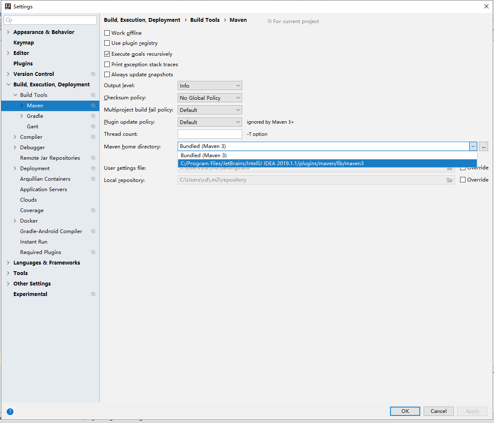
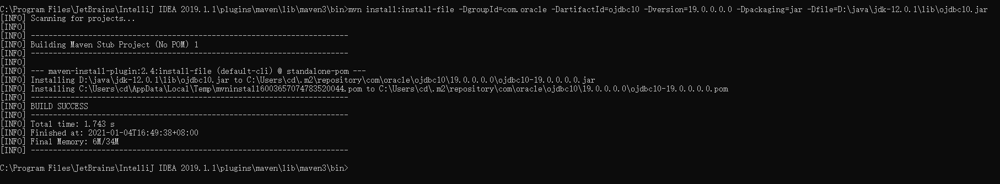

idea maven添加oracle依赖
==

## 操作步骤
1.  查看Oracle服务端的版本
    >SELECT * FROM V$VERSION;
    
    
    Edition Release 19.0.0.0.0
    
2. 下载oracle JDBC jar包
    
    如下载到 D:\java\jdk-12.0.1\lib  
    [ojdbc10.jar](https://download.oracle.com/otn/utilities_drivers/jdbc/193/ojdbc10.jar)
    
    Oracle JDBC各版本的下载地址，需要登录oracle官网
    ```text
    * Oracle Database 19c (19.3) JDBC Driver & UCP Downloads
    https://www.oracle.com/database/technologies/appdev/jdbc-ucp-19c-downloads.html
    
    * Oracle Database 18c (18.3) JDBC Driver and UCP Downloads
    https://www.oracle.com/database/technologies/appdev/jdbc-ucp-183-downloads.html

    * Oracle Database 12.2.0.1 JDBC Driver & UCP Downloads
    https://www.oracle.com/database/technologies/jdbc-ucp-122-downloads.html

    * Oracle Database 12.1.0.2 JDBC Driver & UCP Downloads
    https://www.oracle.com/database/technologies/jdbc-upc-downloads.html

    * Oracle Database 11.2.0.4 JDBC Driver & UCP Downloads
    https://www.oracle.com/database/technologies/jdbcdriver-ucp-downloads.html
    ```
3. 加载oracle JDBC jar包到maven中
    * 查看idea集成的maven的安装路径，也可以直接把下列的maven/bin目录添加到系统环境变量
    
    ```text
    cd C:\Program Files\JetBrains\IntelliJ IDEA 2019.1.1\plugins\maven\lib\maven3\bin
    mvn install:install-file -DgroupId=com.oracle -DartifactId=ojdbc10 -Dversion=19.0.0.0.0 -Dpackaging=jar -Dfile=D:\java\jdk-12.0.1\lib\ojdbc10.jar
    ```
    * 自动生成jar包对应的pom.xml配置
    
    >C:\Users\cd\.m2\repository\com\oracle\ojdbc10\19.0.0.0.0\ojdbc10-19.0.0.0.0.pom
    
4. 在项目的pom.xml文件添加oracle依赖配置

    根据步骤2中生成的ojdbc10-19.0.0.0.0.pom文件内容填写
    ```xml
    <project>
        <dependencies>
            <!-- Oracle JDBC -->
            <dependency>
                <groupId>com.oracle</groupId>
                <artifactId>ojdbc10</artifactId>
                <version>19.0.0.0.0</version>
            </dependency>
            ...
        </dependencies>
    
    </project>
    ```