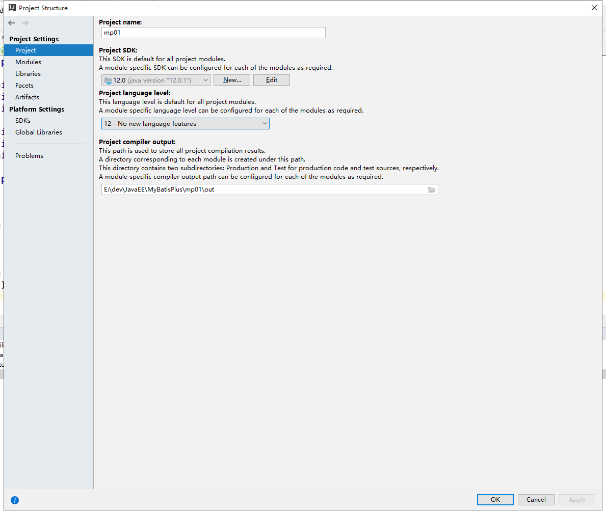
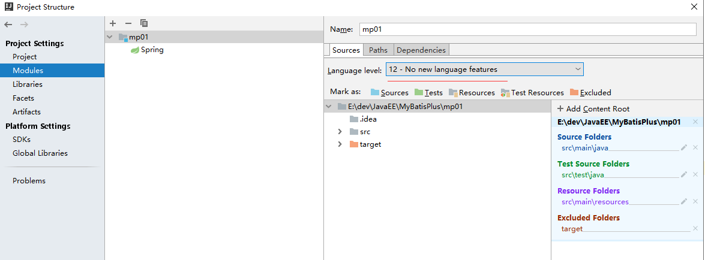
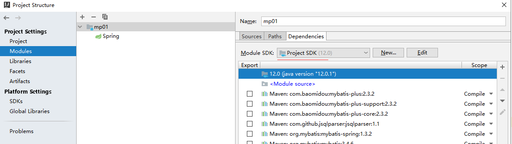
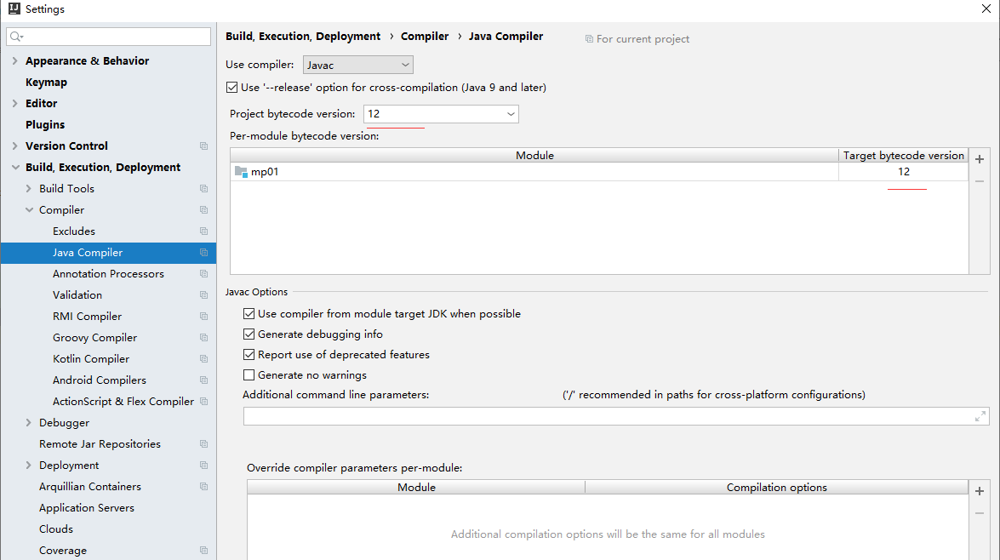

idea不支持发行版本5
==


## 问题
```
Error:java: 错误: 不支持发行版本 5

今天在maven项目里面运行的时候，出现error:java:不支持发行版本5报错，
原因是项目运行的时候，jdk版本与本地的版本不一致，我的本地jdk版本是12，
因此到IDEA--->File--->project structure，检查了一下project和moduels中jdk版本与本地对比，
发现不一致，于是修改为jdk12(你修改为与你本地的版本一致即可)
```

## 解决方法
* Project Structru指设置
    * 指定Project SDK版本
        
    * modules->Sources->Language level指定版本
        
    * modules->Dependencies->Module SDK指定版本
        
* Settings
    * Java Compiler指定版本
        