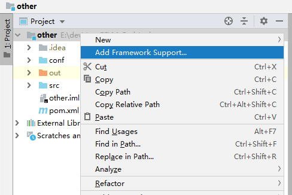
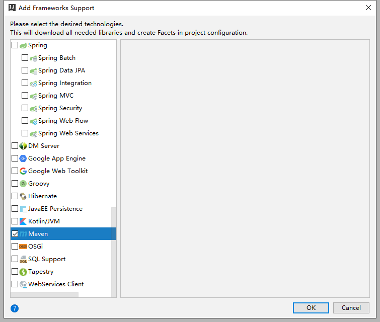
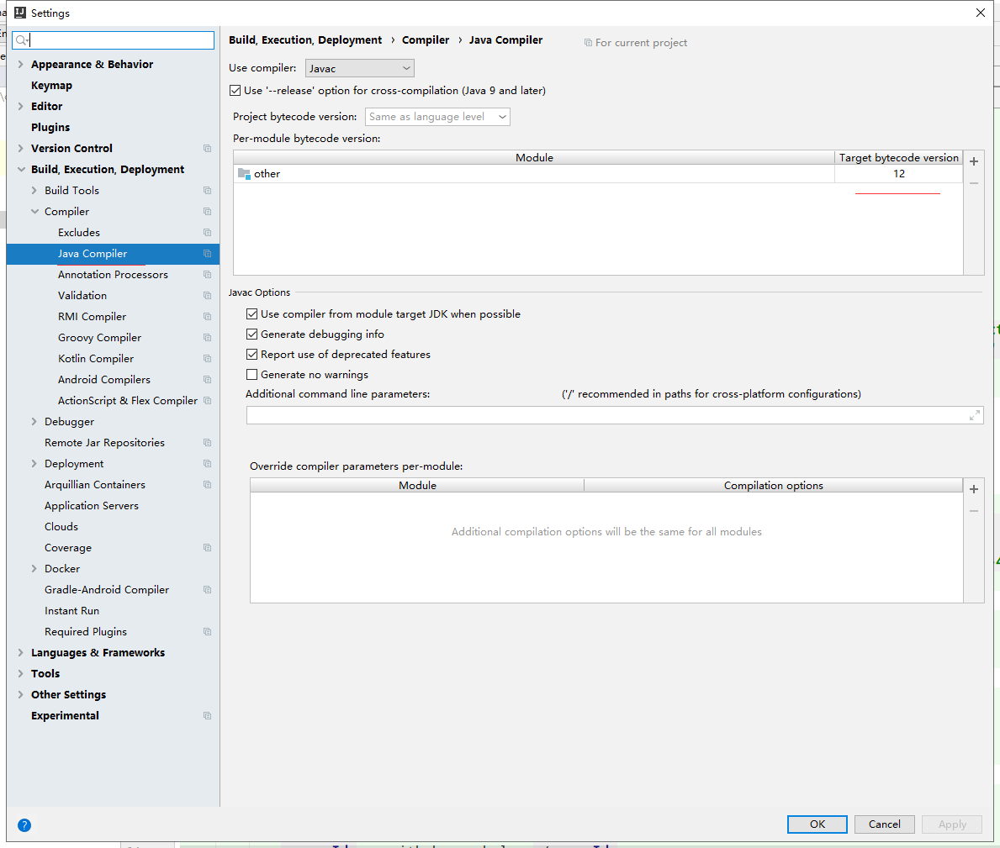
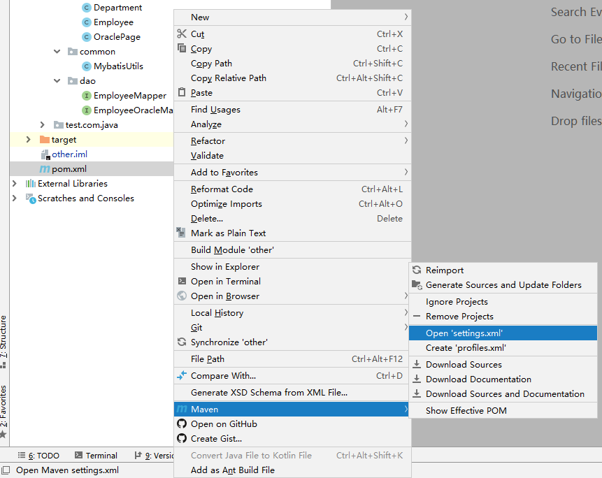

maven的使用
==

## 添加maven框架支持
* 右击项目名，Add Framework Support 


* 选择Maven类型


确定后，会在项目的根目录下添加pom.xml文件

## 保持项目默认的编译输出路径out
```text
添加了pom.xml后，普通的项目编译输出路径会改成 ./targert
包的结构可能会发生变化，首层包名加了main。

如果想继续保持包结构，和编译输出的默认路径,
修改项目的 iml文件：
可参考如下：
```
```xml
<?xml version="1.0" encoding="UTF-8"?>
<module org.jetbrains.idea.maven.project.MavenProjectsManager.isMavenModule="true" type="JAVA_MODULE" version="4">
  <component name="NewModuleRootManager" inherit-compiler-output="true">
    <exclude-output />
    <content url="file://$MODULE_DIR$">
      <sourceFolder url="file://$MODULE_DIR$/src" isTestSource="false" />
    </content>
    <orderEntry type="inheritedJdk" />
    ... ...
  </component>
</module>
```

## 设置Java编译器的版本
选择与你JDK相应的版本


## 配置pom.xml添加依赖组件
```xml
<?xml version="1.0" encoding="UTF-8"?>
<project xmlns="http://maven.apache.org/POM/4.0.0"
         xmlns:xsi="http://www.w3.org/2001/XMLSchema-instance"
         xsi:schemaLocation="http://maven.apache.org/POM/4.0.0 http://maven.apache.org/xsd/maven-4.0.0.xsd">
    <modelVersion>4.0.0</modelVersion>

    <groupId>com.java.www</groupId>
    <artifactId>other</artifactId>
    <version>1.0-SNAPSHOT</version>

    <!-- 组件版本 -->
    <properties>
        <pagehelper.version>5.2.0</pagehelper.version>
    </properties>

    <!-- 依赖组件 -->
    <dependencies>
        <dependency>
            <groupId>com.github.pagehelper</groupId>
            <artifactId>pagehelper</artifactId>
            <version>${pagehelper.version}</version>
        </dependency>
    </dependencies>
</project>
```

## 使用阿里云Maven镜像
使用说明 https://maven.aliyun.com/mvn/guide?spm=a2c4e.11153940.0.0.60ec7840HrZnTP

* maven 配置指南
```
打开 maven 的配置文件
    windows 机器一般在 maven 安装目录的 conf/settings.xml，
    linux主机一般在 /etc/maven/settings.xml，
    idead在 {用户目录}./m2/settings.xml
    在<mirrors></mirrors>标签中添加 mirror 子节点
```

idea打开 maven settings文件方法


```xml
<settings>
    <mirrors>
        <mirror>
            <id>aliyunmaven</id>
            <mirrorOf>*</mirrorOf>
            <name>阿里云公共仓库</name>
            <url>https://maven.aliyun.com/repository/public</url>
        </mirror>
    </mirrors>
</settings>
```

* 如果想使用其它代理仓库，可在<repositories></repositories>节点中加入对应的仓库使用地址。以使用 spring 代理仓为例
```xml
<repositories>
    <repository>
        <id>spring</id>
        <url>https://maven.aliyun.com/repository/spring</url>
        <releases>
            <enabled>true</enabled>
        </releases>
        <snapshots>
            <enabled>true</enabled>
        </snapshots>
    </repository>
</repositories>
```
