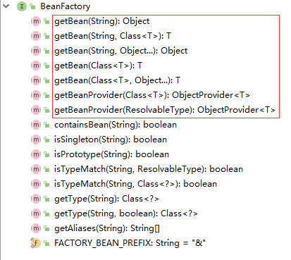

# Spring


## 什么是Spring
```text
Spring是一个开源的java框架。
Spring为简化企业级应用开发而生。
Spring是一个IOC(DI)和AOP容器框架。

特点：
* 轻量级
    Spring是非侵入性的，基于spring开发的应用，其对象可以不依赖spring的API
* 依赖注入
    DI：dependency injection，依赖注入、
    IOC：Inversion of Control，控制反转
* 面向切面编程
    AOP：aspect oriented programming
* 容器
    Spring 是一个容器, 因为它包含并且管理应用对象的生命周期
* 框架
    Spring 实现了使用简单的组件配置组合成一个复杂的应用. 在 Spring 中可以使用 XML 和 Java 注解组合这些对象
* 一站式
    在 IOC 和 AOP 的基础上可以整合各种企业应用的开源框架和优秀的第三方类库 
    （实际上 Spring 自身也提供了展现层的 SpringMVC 和 持久层的 Spring JDBC）
```

spring jar包下载
```text
https://repo.spring.io/webapp/#/artifacts/browse/tree/General/libs-release-local/org/springframework/spring/5.2.7.RELEASE/spring-5.2.7.RELEASE-dist.zip
```

* spring模块


## idea创建spring工程
* 新建工程
      
    
      

    spring jar包
    ```text
    aopalliance-1.0.jar
    commons-logging-1.2.jar
    spring-aop-5.2.3.RELEASE.jar
    spring-aspects-5.2.3.RELEASE.jar
    spring-beans-5.2.3.RELEASE.jar
    spring-context-5.2.3.RELEASE.jar
    spring-context-support-5.2.3.RELEASE.jar
    spring-core-5.2.3.RELEASE.jar
    spring-expression-5.2.3.RELEASE.jar
    spring-instrument-5.2.3.RELEASE.jar
    spring-jcl-5.2.3.RELEASE.jar
    spring-jdbc-5.2.3.RELEASE.jar
    spring-jms-5.2.3.RELEASE.jar
    spring-messaging-5.2.3.RELEASE.jar
    spring-orm-5.2.3.RELEASE.jar
    spring-oxm-5.2.3.RELEASE.jar
    spring-test-5.2.3.RELEASE.jar
    spring-tx-5.2.3.RELEASE.jar
    ```

* 创建bean类或其他类
    [User bean类](../spring/src/com/java/first/bean/User.java)

* 新建spring配置文件
      
    
    在spring配置文件[spring-config.xml](../spring/src/spring-config.xml)中配置bean
    ```text
    <!-- 配置bean -->
    <bean id="user" class="com.java.first.bean.User">
        <!-- 通过类中的setter方法设置属性值 -->
        <property name="name" value="赵敏"/>
        <property name="age" value="18"/>
        <property name="sex" value="0"/>
    </bean>
    ```

* 测试
    [测试用例 testUser()](../spring/src/com/java/first/www/Main.java)


## spring中的bean配置

### IOC容器(DI容器)
* IOC(Inversion of Control)
```text
反转控制

其思想是反转资源获取的方向. 
传统的资源查找方式要求组件向容器发起请求查找资源. 
作为回应, 容器适时的返回资源. 而应用了 IOC 之后, 
则是容器主动地将资源推送给它所管理的组件, 
组件所要做的仅是选择一种合适的方式来接受资源. 这种行为也被称为查找的被动形式
```

* DI(Dependency Injection)
```text
依赖注入

OC 的另一种表述方式：即组件以一些预先定义好的方式(例如: setter 方法)接受来自如容器的资源注入. 
相对于 IOC 而言，这种表述更直接
```

### 配置bean
* 配置形式
    * 基于xml文件
    * 基于注解

* bean配置方式
    * 通过全类型(反射)
    * 通过工厂方法(静态工厂方法 & 实例工厂方法)
    * FactoryBean
* IOC 容器 BeanFactory & ApplicationContext 概述
* 依赖注入的方法
    * 属性注入
    * 构造器注入
* 自动装配
* bean之间的关系
    * 继承
    * 依赖
* bean的作用域
    * singleton
    * prototype(每次调用时生成一个新的对象)
    * web环境作用域
* 使用外部属性文件
* spEL(spring表达式)
* IOC容器中bean实例的生命周期
* spring 5.x 型特性：泛型依赖注入


#### 基于xml文件配置bean，即spring配置文件配置bean
```text
    <!-- 配置bean -->
    <bean id="user" class="com.java.first.bean.User">
        <!-- 通过类中的setter方法设置属性值 -->
        <property name="name" value="赵敏"/>
        <property name="age" value="18"/>
        <property name="sex" value="0"/>
    </bean>
```

规则
```text
id：Bean 的名称

* 在 IOC 容器中必须是唯一的
* 若 id 没有指定，Spring 自动将权限定性类名作为 Bean 的名字，即首字符小写的类名
* id 可以指定多个名字，名字之间可用逗号、分号、或空格分隔
```

### spring IOC容器
```text
在 Spring IOC 容器读取 Bean 配置创建 Bean 实例之前, 必须对它进行实例化. 只有在容器实例化后, 才可以从 IOC 容器里获取 Bean 实例并使用.

Spring 提供了两种类型的 IOC 容器实现.
    * BeanFactory: IOC 容器的基本实现.
    * ApplicationContext: 提供了更多的高级特性. 是 BeanFactory 的子接口.

    * BeanFactory 是 Spring 框架的基础设施，面向 Spring 本身；ApplicationContext 面向使用 Spring 框架的开发者，
    几乎所有的应用场合都直接使用 ApplicationContext 而非底层的 BeanFactory
    * 无论使用何种方式, 配置文件时相同的
```

### ApplicationContext
```text
ApplicationContext 的主要实现类：
    * ClassPathXmlApplicationContext：从 类路径下加载配置文件
    * FileSystemXmlApplicationContext: 从文件系统中加载配置文件

ConfigurableApplicationContext 扩展于 ApplicationContext，
    新增加两个主要方法：refresh() 和 close()， 让 ApplicationContext 具有启动、刷新和关闭上下文的能力
    
ApplicationContext 在初始化上下文时就实例化所有单例的 Bean。

WebApplicationContext
    是专门为 WEB 应用而准备的，它允许从相对于 WEB 根目录的路径中完成初始化工作
```

### 从IOC容器中获取bean实例
调用ApplicationContext的getBean方法

BeanFactory方法


[IOC容器中获取bean testCar()](src/com/java/first/www/Main.java)


### 依赖注入的方式
* 属性注入
* 构造器注入
* 工厂方法注入（不推荐）

* 属性注入
    ```text
    属性注入即通过 setter 方法注入Bean 的属性值或依赖的对象
    
    属性注入使用 <property> 元素, 使用 name 属性指定 Bean 的属性名称，
    value 属性或 <value> 子节点指定属性值
    ```
    ```text
        <bean id="user" class="com.java.first.bean.User">
            <!-- 通过类中的setter方法设置属性值 -->
            <property name="name" value="赵敏"/>
            <property name="age" value="18"/>
            <property name="sex" value="0"/>
        </bean>
    ```

* 构造器注入
    ```text
    通过构造方法注入Bean 的属性值或依赖的对象，它保证了 Bean 实例在实例化后就可以使用。
    
    构造器注入在 <constructor-arg> 元素里声明属性, <constructor-arg> 中没有 name 属性
    
    字面值：可用字符串表示的值，可以通过 <value> 元素标签或 value 属性进行注入。
    基本数据类型及其封装类、String 等类型都可以采取字面值注入的方式
    若字面值中包含特殊字符，可以使用 <![CDATA[]]> 把字面值包裹起来。  
    ```
    ```text
    <!-- 通过构造器设置属性值 -->
    <bean id="car" class="com.java.first.bean.Car">
        <!-- 当不指定index、type等时，值顺序要与构造器的形参一致，值类型也要对应 -->
        <constructor-arg value="奥迪"/>
        <constructor-arg value="德国英戈尔施塔特"/>
        <constructor-arg value="220"/>
        <constructor-arg value="689800.00"/>
    </bean>
  
    <!-- 若bean类有多个构造器时，可以通过指定index、type等来更加精确的定位值与形参的对应关系 -->
    <bean id="car2" class="com.java.first.bean.Car">
        <constructor-arg value="200" index="2"/>
        <constructor-arg value="比亚迪" index="0"/>
        <constructor-arg value="中国深圳" index="1"/>
    </bean>
    <bean id="car3" class="com.java.first.bean.Car">
        <constructor-arg value="8" index="2" type="float"/>
        <constructor-arg value="比亚迪" index="0"/>
        <constructor-arg value="中国深圳" index="1"/>
    </bean>
    <bean id="car4" class="com.java.first.bean.Car">
        <!-- 属性值中包含特殊字符的设置方法 -->
        <!-- ![CDATA[属性值]] -->
        <constructor-arg value="30" index="2" type="float"/>
        <constructor-arg index="0">
            <value><![CDATA[红旗<$$>]]></value>
        </constructor-arg>
        <constructor-arg value="中国吉林" index="1"/>
    </bean>
    <bean id="car4" class="com.java.first.bean.Car">
        <!-- 属性值中包含特殊字符的设置方法 -->
        <!-- ![CDATA[属性值]] -->
        <constructor-arg value="30" index="2" type="float"/>
        <constructor-arg index="0">
            <value><![CDATA[红旗<$$>]]></value>
        </constructor-arg>
        <constructor-arg value="中国吉林" index="1"/>
    </bean>  
    ```
### 引用其他bean
```text
在 Bean 的配置文件中, 可以通过 <ref> 元素或 ref  属性为 Bean 的属性或构造器参数指定对 Bean 的引用. 
也可以在属性或构造器里包含 Bean 的声明, 这样的 Bean 称为内部 Bean

```
配置示例
```text
<bean id="dao2" class="com.java.ref.bean.Dao"></bean>
<bean id="service" class="com.java.ref.bean.Service">
    <!-- 引用已经存在的实例作为属性值 -->
    <property name="dao" ref="dao2">
    </property>
</bean>
```

### 内部bean
```text
当 Bean 实例仅仅给一个特定的属性使用时, 可以将其声明为内部 Bean. 
内部 Bean 声明直接包含在 <property> 或 <constructor-arg> 元素里, 
不需要设置任何 id 或 name 属性

内部 Bean 不能使用在任何其他地方
```
示例
```text
<bean id="service2" class="com.java.ref.bean.Service">
    <property name="dao">
        <!-- 内部bean实例对象，不能被外部的bean引用，也没必须设置id属性 -->
        <bean class="com.java.ref.bean.Dao">
            <property name="dataSource" value="c3p0"/>
        </bean>
    </property>
</bean>
```

### null值属性
可以使用专用的 <null/> 元素标签为 Bean 的字符串或其它对象类型的属性注入 null 值

示例
```text
<bean id="dao" class="com.java.ref.bean.Dao">
    <!-- 设置属性值为null -->
    <property name="dataSource">
        <null/>
    </property>
</bean>
```

### 级联属性
```text
<bean id="web" class="com.java.ref.bean.Web">
    <property name="service" ref="service2"/>
    <!-- 设置级联属性值 -->
    <property name="service.dao.dataSource" value="DBCP2"/>
</bean>
```

### 集合属性
```text
* 在 Spring中可以通过一组内置的 xml 标签(例如: <list>, <set> 或 <map>) 来配置集合属性.

* 配置 java.util.List 类型的属性, 需要指定 <list>  标签, 在标签里包含一些元素. 这些标签可以通过 <value> 指定简单的常量值, 通过 <ref> 指定对其他 Bean 的引用. 通过<bean> 指定内置 Bean 定义. 通过 <null/> 指定空元素. 甚至可以内嵌其他集合.
数组的定义和 List 一样, 都使用 <list>

* 配置 java.util.Set 需要使用 <set> 标签, 定义元素的方法与 List 一样.

* Java.util.Map 通过 <map> 标签定义, <map> 标签里可以使用多个 <entry> 作为子标签. 每个条目包含一个键和一个值. 

* 必须在 <key> 标签里定义键

* 因为键和值的类型没有限制, 所以可以自由地为它们指定 <value>, <ref>, <bean> 或 <null> 元素. 

* 可以将 Map 的键和值作为 <entry> 的属性定义: 简单常量使用 key 和 value 来定义; Bean 引用通过 key-ref 和 value-ref 属性定义

* 使用 <props> 定义 java.util.Properties, 该标签使用多个 <prop> 作为子标签. 每个 <prop> 标签必须定义 key 属性.

```

```text
<!-- 设置集合属性 -->
<bean id="user0" class="com.java.first.bean.User">
    <!-- 通过类中的setter方法设置属性值 -->
    <property name="name" value="赵敏"/>
    <property name="age" value="18"/>
    <property name="sex" value="0"/>
    <property name="cars">
        <!-- 使用list标签来设置集合属性值 -->
        <list>
            <ref bean="car11"/>
            <ref bean="car12"/>
        </list>
    </property>
</bean>

<!-- 声明集合类型的bean -->
<util:list id="cars">
    <ref bean="car11"/>
    <ref bean="car12"/>
    <bean class="com.java.first.bean.Car">
        <constructor-arg value="16" index="2" type="float"/>
        <constructor-arg value="丰田" index="0"/>
        <constructor-arg value="日本" index="1"/>
    </bean>
</util:list>
```

### 使用p命名空间
```text
Spring 从 2.5 版本开始引入了一个新的 p 命名空间，可以通过 <bean> 元素属性的方式配置 Bean 的属性。
使用 p 命名空间，是对property标签的简写
```

```text
<!-- 使用P命名空间 -->
<bean id="user3" class="com.java.first.bean.User"
      p:name="白眉鹰王"
      p:age="80"
      p:sex="1"
      p:cars-ref="cars">
</bean>
```

### 继承bean配置
```text
* Spring 允许继承 bean 的配置, 被继承的 bean 称为父 bean. 继承这个父 Bean 的 Bean 称为子 Bean
* 子 Bean 从父 Bean 中继承配置, 包括 Bean 的属性配置
* 子 Bean 也可以覆盖从父 Bean 继承过来的配置
* 父 Bean 可以作为配置模板, 也可以作为 Bean 实例. 若只想把父 Bean 作为模板, 可以设置 <bean> 的abstract 属性为 true, 这样 Spring 将不会实例化这个 Bean
* 并不是 <bean> 元素里的所有属性都会被继承. 比如: autowire, abstract 等.
* 也可以忽略父 Bean 的 class 属性, 让子 Bean 指定自己的类, 而共享相同的属性配置. 但此时 abstract 必须设为 true

```
示例
```text
<!-- 使用 parent属性 来完成实例之间的继续
    所有属性都会继承过来，如有指定其他的属性值，则会覆盖
-->
<bean id="user4"
      parent="user0"
      p:name="杨逍">
</bean>
```

### xml配置bean自动装配
```text
* Spring IOC 容器可以自动装配 Bean. 需要做的仅仅是在 <bean> 的 autowire 属性里指定自动装配的模式

* byType(根据类型自动装配): 若 IOC 容器中有多个与目标 Bean 类型一致的 Bean. 在这种情况下, Spring 将无法判定哪个 Bean 最合适该属性, 所以不能执行自动装配.

* byName(根据名称自动装配): 必须将目标 Bean 的名称和属性名设置的完全相同.

* constructor(通过构造器自动装配): 当 Bean 中存在多个构造器时, 此种自动装配方式将会很复杂. 不推荐使用

**缺点**
在 Bean 配置文件里设置 autowire 属性进行自动装配将会装配 Bean 的所有属性. 然而, 若只希望装配个别属性时, autowire 属性就不够灵活了. 
autowire 属性要么根据类型自动装配, 要么根据名称自动装配, 不能两者兼而有之.

```

### 继承bean配置
```text
* Spring 允许继承 bean 的配置, 被继承的 bean 称为父 bean. 继承这个父 Bean 的 Bean 称为子 Bean

* 子 Bean 从父 Bean 中继承配置, 包括 Bean 的属性配置

* 子 Bean 也可以覆盖从父 Bean 继承过来的配置

* 父 Bean 可以作为配置模板, 也可以作为 Bean 实例. 若只想把父 Bean 作为模板, 可以设置 <bean> 的abstract 属性为 true, 这样 Spring 将不会实例化这个 Bean

* 并不是 <bean> 元素里的所有属性都会被继承. 比如: autowire, abstract 等.

* 也可以忽略父 Bean 的 class 属性, 让子 Bean 指定自己的类, 而共享相同的属性配置. 但此时 abstract 必须设为 true
```
示例
```text
<!-- 使用 parent属性 来完成实例之间的继续
    所有属性都会继承过来，如有指定其他的属性值，则会覆盖
-->
<bean id="user4"
      parent="user0"
      p:name="杨逍">
</bean>
```

### 依赖bean配置
```text
* Spring 允许用户通过 depends-on 属性设定 Bean 前置依赖的Bean，前置依赖的 Bean 会在本 Bean 实例化之前创建好

* 如果前置依赖于多个 Bean，则可以通过逗号，空格或的方式配置 Bean 的名称
```
```text
<!-- depents-on属性 -->
<bean id="user5" depends-on="user00"
      parent="user0" p:name="石破天">
</bean>
```


### scope属性配置bean的作用域
```text
* 在 Spring 中, 可以在 <bean> 元素的 scope 属性里设置 Bean 的作用域. 

* 默认情况下, Spring 只为每个在 IOC 容器里声明的 Bean 创建唯一一个实例, 
    整个 IOC 容器范围内都能共享该实例：所有后续的 getBean() 调用和 Bean 引用都将返回这个唯一的 Bean 实例.
    该作用域被称为 singleton, 它是所有 Bean 的默认作用域.
```

**scope属性值可选值**

scope属性 | 说明
:--- |:---
singleton |默认值，不显式写scope属性值时的值，<br>在spring IOC容器中只保存一个bean实例，bean以单实例存在
prototype |每次调用getBean方法获取bean实例时，都会生成一个新的实例返回  
request |每次HTTP请求都会创建一个新的bean实例，<br>该作用域仅适用于WebApplicationContext环境 
session |同一个HTTP Session共享一个bean实例，不同的session使用不同的bean实例，<br>该作用域仅适用于WebApplicationContext环境 


### 使用外部属性文件
```text
在配置文件里配置 Bean 时, 有时需要在 Bean 的配置里混入系统部署的细节信息(例如: 文件路径, 数据源配置信息等). 
而这些部署细节实际上需要和 Bean 配置相分离

Spring 提供了一个 PropertyPlaceholderConfigurer 的 BeanFactory 后置处理器,
这个处理器允许用户将 Bean 配置的部分内容外移到属性文件中. 可以在 Bean 配置文件里使用形式为 ${var} 的变量, 
PropertyPlaceholderConfigurer 从属性文件里加载属性, 并使用这些属性来替换变量.
```

示例
```xml
<!-- 导入外部资源文件 -->
<context:property-placeholder location="classpath:db.properties"/>
```

### SpEL
```text
Spring表达式语言，简称spEL
一个支持运行时查询和操作对象图的强大的表达式语言
* SpEL 使用 #{…} 作为定界符，所有在大框号中的字符都将被认为是 SpEL
* SpEL 为 bean 的属性进行动态赋值提供了便利
* 通过 SpEL 可以实现：
    通过 bean 的 id 对 bean 进行引用
    调用方法以及引用对象中的属性
    计算表达式的值
    正则表达式的匹配
```

* SpEL字面变量
    ```xml
    <!-- 整数 -->
    <property name="count" value="#{5}"/>
    
    <!-- 小数 -->
    <property name="frequency" value="#{89.7}"/>
    <!-- 科学计数法 -->
    <property name="capacity" value="#{1e4}"/>
    
    <!-- String可以使用单引号或者双引号作为字符串的定界符号 -->
    <property name="name" value="#{'Chuck'}"/>
    <!-- 或 -->
    <property name='name' value='#{"Chuck"}'/>
    
    <!-- Boolean -->
    <property name="enabled" value="#{false}"/>
    ```

* SpEL引用bean、属性、方法
    ```xml
    <!-- 引用其他对象 -->
    <property name="prefix" value="#{prefixGenerator}"/>
    
    <!-- 引用其他对象的属性 -->
    <property name="suffix" value="#{sequenceGenerator.suffix}"/>
    
    <!-- 调用对象的方法 -->
    <property name="suffix" value="#{sequenceGenerator.toString()}"/>
    <property name="suffix" value="#{sequenceGenerator.toString().toUperCase()}"/>
    ```
    
* SpEL运算符
    ```xml
    <!-- 算术运算符 -->
    <property name="adjusteAmount" value="#{conter.total + 42}"/>
    <property name="adjusteAmount" value="#{conter.total - 20}"/>
    <property name="circumference" value="#{2 * T(java.lang.Math).PI * circle.radius}"/>
    <property name="average" value="#{conter.total / conter.count}"/>
    <property name="remainder" value="#{conter.total % conter.count}"/>
    
    <!-- +连接字符串 -->
    <constructor-arg value="#{person.firstName + ' ' + person.lastName}"/>
    
    <!-- 比较运算符
    <, >, ==, <=, >=, 
    lt, gt, eq, le, ge
     -->
    <property name="equal" value="#{counter.total == 100}"/>
    <property name="hasCapacity" value="#{counter.total eq 200}"/>
    
    
    <!-- 逻辑运算符
     and, or, not, |, !
     -->
    <property name="largeCircle" value="#{shape.kind == 'circle' and shape.perimeter gt 100}"/>
    
    <!-- 三目运算符 -->
    <constructor-arg value="#{songSelector.selectSong() == 'Jingle Bells' ? piano : 'Jingle Bells'}" />
    
    <!-- if-else -->
    <constructor-arg value="#{kenyny.song ?: 'Greensleese'}"\/>
    
    <!-- 正则表达式: matches -->
    <constructor-arg value="#{admin.email matches '[a-zA-Z0-9._%+=]+@[a-zA-Z0-9.-]+\\[a-zA-Z]{2,4}'}"/>
    
    ```

* 调用静态方法或静态属性
    ```text
    通过 T() 调用一个类的静态方法，它将返回一个 Class Object，然后再调用相应的方法或属性
    ```
    ```xml
    <property name="initValue" value="#{T(java.lang.Math).PI}"/>
    ```


## IOC容器中的bean的生命周期方法

* 为bean指定初始化方法、销毁方法，只对设置了这些方法的bean生效
    ```text
    * Spring IOC 容器可以管理 Bean 的生命周期, Spring 允许在 Bean 生命周期的特定点执行定制的任务. 
    
    * Spring IOC 容器对 Bean 的生命周期进行管理的过程:
        1. 通过构造器或工厂方法创建 Bean 实例
        2. 为 Bean 的属性设置值和对其他 Bean 的引用
        3. 调用 Bean 的初始化方法
        4. Bean 可以使用了
        5. 当容器关闭时, 调用 Bean 的销毁方法
    * 
    * 在 Bean 的声明里设置 init-method 和 destroy-method 属性, 为 Bean 指定初始化和销毁方法.
    
    ```
    
    [Person 类](src/com/java/ref/bean/Person.java)
    
    ```xml
    <!-- bean的生命周期方法 -->
    <bean id="person1" class="com.java.ref.bean.Person" p:name="范仲淹"
          init-method="init"
          destroy-method="destroy">
    </bean>
    ```

## 创建bean后置处理器
```text
Bean 后置处理器允许在调用初始化方法前后对 Bean 进行额外的处理.
Bean 后置处理器对 IOC 容器里的所有 Bean 实例逐一处理,
全局生效，对所有对bean都生效
```

* 添加 Bean 后置处理器后 Bean 的生命周期
    ```text
    1. 通过构造器或工厂方法创建 Bean 实例
    
    2. 为 Bean 的属性设置值和对其他 Bean 的引用
    
    3. 将 Bean 实例传递给 Bean 后置处理器的 postProcessBeforeInitialization 方法
    
    4. 调用 Bean 的初始化方法
    
    5. 将 Bean 实例传递给 Bean 后置处理器的 postProcessAfterInitialization方法
    
    6. Bean 可以使用了
    
    7. 当容器关闭时, 调用 Bean 的销毁方法
    ```

    **示例**
    [MyBeanPostProcess bean后置处理器](src/com/java/ref/bean/MyBeanPostProcess.java)
    ```xml
     <!-- 配置bean后置处理器，对所有的bean生效，全局生效
        不需要配置id属性，IOC容器会识别到它是一个 bean 后置处理器, 并调用其方法  
      -->
    <bean class="com.java.ref.bean.MyBeanPostProcess"></bean>
    ```
    
## 通过注解扫描组件
```text
组件扫描(component scanning),Spring能够从 classpath 下自动扫描, 侦测和实例化具有特定注解的组件.
```

* 特定的注解组件
    * @Component: 基本注解, 标识了一个受 Spring 管理的组件
    * @Respository: 标识持久层组件
    * @Service: 标识服务层(业务层)组件
    * @Controller: 标识表现层组件

* 扫描的组件bean命名规则
```text
Spring 有默认的命名策略: 使用非限定类名, 第一个字母小写

也可以在注解中通过 value 属性值标识组件的名称，@组件名("bean名")
```

* 配置扫描的位置范围
    ```text
    当在组件类上使用了特定的注解之后, 还需要在 Spring 的配置文件中声明 <context:component-scan> 
    
    * base-package 属性指定一个需要扫描的基类包，Spring 容器将会扫描这个基类包里及其子包中的所有类. 
    * 当需要扫描多个包时, 可以使用逗号分隔.
    * 如果仅希望扫描特定的类而非基包下的所有类，可使用 resource-pattern 属性过滤特定的类，示例：
        <context:component-scan base-package="com.java.annotation" resource-pattern="autowire/*.class"/>
        
        <!-- 子节点表示要包含的目标类 -->
        <context:include-filter type="" expression=""/>
        
        <!-- 子节点表示要排除在外的目标类 -->
        <context:exclude-filter type="" expression=""/>
        
    * <context:component-scan> 下可以拥有若干个 <context:include-filter> 和 <context:exclude-filter> 子节点
    
    ```
    
    ```xml
    <!-- 配置要自动扫描的包 -->
    <context:component-scan base-package="com.java.annotation"></context:component-scan>
    ```
    
    * `<context:include-filter>`和`<context:exclude-filter>`子节点支持多种类型的过滤表达式
    
        type |expression |说明 
        :--- |:--- |:--- 
        annotation |com.java.XxxAnnotation |所有标注了XXXAnnotation的类 
        assinable |com.java.XxxService |所有继承或扩展XxxService的类 
        aspectj |com.java..*Service+ |所有类名以Service结束的类 
        regex |com.\java\.anno\..* |com.java.anno包下的所有类 
        custom |com.java.XxxTypeFilter |自定义类型过滤，该类必须实现org.springframework.core.type.typeFilter接口

* 组件装配
    ```text
    <context:component-scan> 元素还会自动注册 AutowiredAnnotationBeanPostProcessor 实例, 
    该实例可以自动装配具有 @Autowired 和 @Resource 、@Inject注解的属性.
    ```
    * 使用@Autowired自动装配Bean
        ```text
        * 构造器, 普通字段(即使是非 public), 一切具有参数的方法都可以应用@Authwired 注解
        * 默认情况下, 所有使用 @Authwired 注解的属性都需要被设置. 当 Spring 找不到匹配的 Bean 装配属性时, 会抛出异常, 若某一属性允许不被设置, 可以设置 @Authwired 注解的 required 属性为 false
        * 默认情况下, 当 IOC 容器里存在多个类型兼容的 Bean 时, 通过类型的自动装配将无法工作. 此时可以在 @Qualifier 注解里提供 Bean 的名称. Spring 允许对方法的入参标注 @Qualifiter 已指定注入 Bean 的名称
        * @Authwired 注解也可以应用在数组类型的属性上, 此时 Spring 将会把所有匹配的 Bean 进行自动装配.
        * @Authwired 注解也可以应用在集合属性上, 此时 Spring 读取该集合的类型信息, 然后自动装配所有与之兼容的 Bean. 
        * @Authwired 注解用在 java.util.Map 上时, 若该 Map 的键值为 String, 那么 Spring 将自动装配与之 Map 值类型兼容的 Bean, 此时 Bean 的名称作为键值
        ```
    * @Resource 注解要求提供一个 Bean 名称的属性，若该属性为空，则自动采用标注处的变量或方法名作为 Bean 的名称
    * @Inject 和 @Autowired 注解一样也是按类型匹配注入的 Bean， 但没有 reqired 属性

## 整合多个配置文件
```text
Spring 允许通过 <import> 将多个配置文件引入到一个文件中，进行配置文件的集成。这样在启动 Spring 容器时，仅需要指定这个合并好的配置文件就可以。
import 元素的 resource 属性支持 Spring 的标准的路径资源

<import resource=""/>
```

地址前缀 |示例 |对应资源类型
:--- |:--- |:--- 
classpath: |classpath:spring-mvc.xml |从类路径下加载资源
file: |file:/conf/security/spring-shiro.xml |从文件系统目录中加载资源,可以采用绝对路径或相对路径 
http:// |http://www.java.com/resource/beans.xml |从web服务器上加载资源 
ftp:// |ftp://www.java.com/resource/beans.xml |从ftp服务器加载资源 

