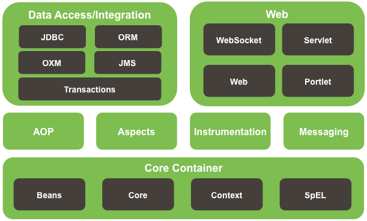
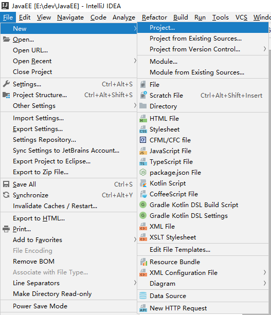
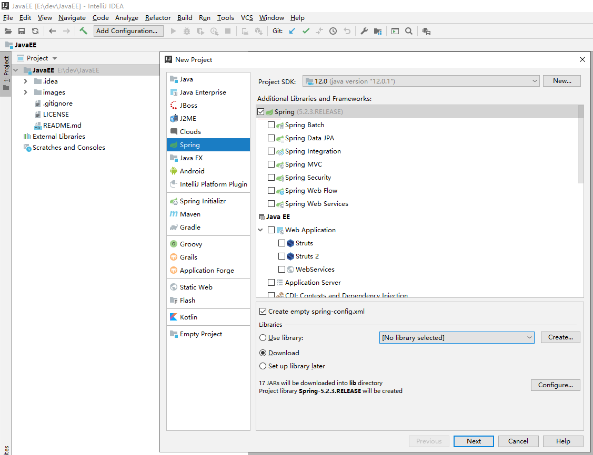
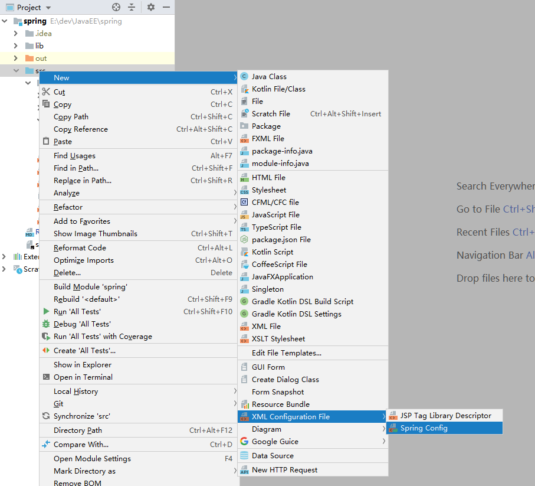

# Spring


## 什么是Spring
```text
Spring是一个开源的java框架。
Spring为简化企业级应用开发而生。
Spring是一个IOC(DI)和AOP容器框架。

特点：
* 轻量级
    Spring是非侵入性的，基于spring开发的应用，其对象可以不依赖spring的API
* 依赖注入
    DI：dependency injection，依赖注入、
    IOC：Inversion of Control，控制反转
* 面向切面编程
    AOP：aspect oriented programming
* 容器
    Spring 是一个容器, 因为它包含并且管理应用对象的生命周期
* 框架
    Spring 实现了使用简单的组件配置组合成一个复杂的应用. 在 Spring 中可以使用 XML 和 Java 注解组合这些对象
* 一站式
    在 IOC 和 AOP 的基础上可以整合各种企业应用的开源框架和优秀的第三方类库 
    （实际上 Spring 自身也提供了展现层的 SpringMVC 和 持久层的 Spring JDBC）
```

spring jar包下载
```text
https://repo.spring.io/webapp/#/artifacts/browse/tree/General/libs-release-local/org/springframework/spring/5.2.7.RELEASE/spring-5.2.7.RELEASE-dist.zip
```

* spring模块


## idea创建spring工程
* 新建工程
      
    
      

* 创建bean类或其他类
    [User bean类](../spring/src/com/java/first/bean/User.java)

* 新建spring配置文件
      
    
    在spring配置文件[spring-config.xml](../spring/src/spring-config.xml)中配置bean
    ```text
    <!-- 配置bean -->
    <bean id="user" class="com.java.first.bean.User">
        <!-- 通过类中的setter方法设置属性值 -->
        <property name="name" value="赵敏"/>
        <property name="age" value="18"/>
        <property name="sex" value="0"/>
    </bean>
    ```

* 测试
    [测试用例 testUser()](../spring/src/com/java/first/www/Main.java)


