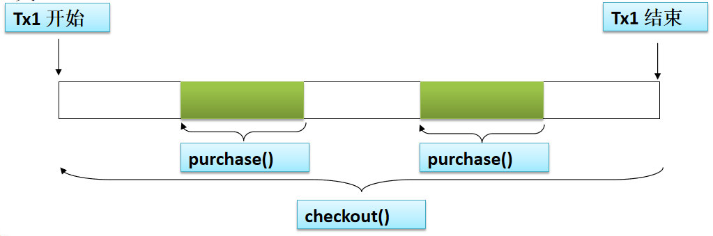
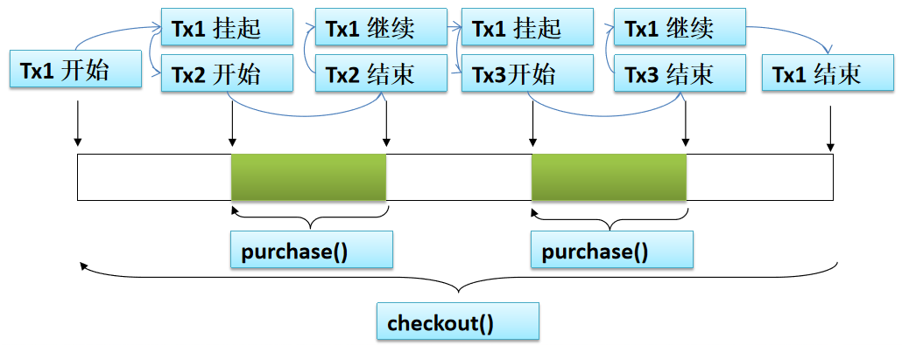

Spring对JDBC的支持
==

## JdbcTemplate
```text
为了使 JDBC 更加易于使用, Spring 在 JDBC API 上定义了一个抽象层, 以此建立一个 JDBC 存取框架: JdbcTemplate
```

### 简化JdbcTemplate查询
```text
* 每次使用都创建一个 JdbcTemplate 的新实例, 这种做法效率很低下.
* JdbcTemplate 类被设计成为线程安全的, 所以可以再 IOC 容器中声明它的单个实例, 并将这个实例注入到所有的 DAO 实例中.
* Spring JDBC 框架还提供了一个 JdbcDaoSupport 类来简化 DAO 实现. 该类声明了 jdbcTemplate 属性, 
它可以从 IOC 容器中注入, 或者自动从数据源中创建.
```

### 注入JDBC模板配置
[jdbc.xml](src/jdbc.xml)  
[EmployeeDao](src/com/java/jdbc/dao/EmployeeDao.java)  
[DepartmentDao](src/com/java/jdbc/dao/DepartmentDao.java) 

### JdbcTemplate数据库操作
* 更新操作（执行insert、update、delete）
    [testUpdate()](src/com/java/jdbc/jdbcTest.java)  
    
* 批量更新操作
    [testBatch()](src/com/java/jdbc/jdbcTest.java)  
    
* 查询单行
    [testQueryForObject()](src/com/java/jdbc/jdbcTest.java)  

* 查询多行
    [testQueryForList()](src/com/java/jdbc/jdbcTest.java)  

* 查询单值
    [testQueryForOneValue()](src/com/java/jdbc/jdbcTest.java)  
    
### 在JdbcTemplate中使用具名参数
```text
* 在经典的 JDBC 用法中, SQL 参数是用占位符 ? 表示,并且受到位置的限制. 
定位参数的问题在于, 一旦参数的顺序发生变化, 就必须改变参数绑定. 

* 在 Spring JDBC 框架中, 绑定 SQL 参数的另一种选择是使用具名参数(named parameter). 

* 具名参数: SQL 按名称(以冒号开头)而不是按位置进行指定. 
具名参数更易于维护, 也提升了可读性. 具名参数由框架类在运行时用占位符取代

* 具名参数只在 NamedParameterJdbcTemplate 中得到支持
```

spring配置
```xml
<!-- 配置具名参数的 NamedParameterJdbcTemplate，需要指定constructor-arg -->
<bean id="namedParameterJdbcTemplate" class="org.springframework.jdbc.core.namedparam.NamedParameterJdbcTemplate">
    <constructor-arg ref="dataSource"/>
</bean>
```

示例  
[namedParameterJdbcTemplateTest](src/com/java/jdbc/namedParameterJdbcTemplateTest.java)  


## Spring对sql事务管理
[sql事务简介](https://github.com/cucker0/mysql/blob/master/md/5_01_DCL%E6%95%B0%E6%8D%AE%E6%8E%A7%E5%88%B6%E8%AF%AD%E8%A8%80.TCL%E4%BA%8B%E5%8A%A1%E6%8E%A7%E5%88%B6%E8%AF%AD%E8%A8%80.md)

```text
* Spring 既支持编程式事务管理, 也支持声明式的事务管理. 

* 编程式事务管理: 将事务管理代码嵌入到业务方法中来控制事务的提交和回滚. 
    在编程式管理事务时, 必须在每个事务操作中包含额外的事务管理代码. 

* 声明式事务管理: 大多数情况下比编程式事务管理更好用. 
    它将事务管理代码从业务方法中分离出来, 以声明的方式来实现事务管理. 
    事务管理作为一种横切关注点, 可以通过 AOP 方法模块化.
    Spring 通过 Spring AOP 框架支持声明式事务管理.

```

* Spring中的事务管理器
```text
Spring 的核心事务管理抽象是org.springframework.transaction.PlatformTransactionManager 接口，
用 Spring 的哪种事务管理策略(编程式或声明式), 事务管理器都是必须的
```

## 用@Transactional注解声明式地管理事务
```text
* 为了将方法定义为支持事务处理的, 可以为方法添加 @Transactional 注解. 根据 Spring AOP 基于代理机制, 只能标注公有方法.

* 可以在方法或者类级别上添加 @Transactional 注解. 当把这个注解应用到类上时, 这个类中的所有公共方法都会被定义成支持事务处理的. 

* 在 Bean 配置文件中只需要启用 <tx:annotation-driven> 元素, 并为之指定事务管理器就可以了. 

* 如果事务处理器的名称是 transactionManager, 就可以在<tx:annotation-driven> 元素中省略 transaction-manager 属性. 
    这个元素会自动检测该名称的事务处理器.
```

[transaction.xml](src/transaction.xml)  
[BookDaoImpl](src/com/java/transaction/daoImpl/BookDaoImpl.java)  
[BookShopServiceImpl 注解事务](src/com/java/transaction/service/BookShopServiceImpl.java)  
[测试用到的sql](sql/mysp.sql)


### 事务传播属性
```text
当事务方法被另一个事务方法调用时, 必须指定事务应该如何传播. 
例如: 方法可能继续在现有事务中运行, 也可能开启一个新事务, 并在自己的事务中运行.
```

Spring支持事务的传播行为

传播属性 |描述 
:--- |:---
Propagation.REQUIRED |如果有事务在运行，当前的方法就在这个事务内运行，<br>否则就启动一个新的事务，并在自己的事务内运行。不显示的配置此，默认为此值 
Propagation.REQUIRES_NEW |当前的方法必须启动一个新的事务，并在它自己的事务内运行。<br>如果有其他的事务在运行，就先把它挂起。等自己的事务运行完后，再恢复前面挂起的事务
Propagation.SUPPORTS |如果有事务在运行，当前的方法就在这个事务内运行，<br>否则它可以不在事务中运行 
Propagation.NOT_SUPPORTED |当前的方法就应该运行在事务中。如果有运行的事务，将它先挂起 
Propagation.MANDATORY |当前的方法必须运行在事务内部，如果没有正在运行的事务，就抛出异常 
Propagation.NEVER |当前的方法不应该运行在事务中。如果有运行的事务，就抛出异常 
Propagation.NESTED |如果有事务在运行，当前的方法就应该在这个事务的嵌套事务中运行。<br>否则就启动一个新事务，并在它自己的事务内运行 

* REQUIRED传播行为
    ```text
    当 BookShopService 的 purchase() 方法被另一个事务方法 checkout() 调用时,
    它默认会在现有的事务内运行. 这个默认的传播行为就是 REQUIRED. 
    因此在 checkout() 方法的开始和终止边界内只有一个事务. 这
    个事务只在 checkout() 方法结束的时候被提交, 结果用户一本书都买不了
    
    ```
    

* REQUIRES_NEW传播行为
    ```text
    必须启动一个新事务, 并在自己的事务内运行. 如果有事务在运行, 就应该先挂起它.
    ```
    

### 事务隔离级别、异常回滚控制、readOnly指定事务是否为只读、事务超时控制
```text
@Transactional(propagation = Propagation.REQUIRES_NEW,
    isolation = Isolation.READ_COMMITTED,
    rollbackFor = {IOException.class, SQLException.class},
    noRollbackFor = {BookStockException.class},
    readOnly = false,
    timeout = 3)


@Transactional 开启事务
     1. 事务传播控制
         @Transactional(propagation = Propagation.REQUIRED)  // 开启事务，相当于@Transactional，即有事务即可，当父方法有事务时，不再开启自己的事务
         @Transactional(propagation = Propagation.REQUIRES_NEW)  // 开启使用自己的事务，执行时，先挂起父方法的事务
     2. 指定事务的隔离级别
         isolation：指定事务的隔离级别，
         可选值：
            Isolation.DEFAULT, 
            Isolation.READ_UNCOMMITTED, 
            Isolation.READ_COMMITTED, 
            Isolation.REPEATABLE_READ, 
            Isolation.SERIALIZABLE
     3. 异常回滚控制
         默认回滚所有的RuntimeException异常
         rollbackFor：必须回滚的异常，可以指定多个，{}列表里指定多个
         noRollbackFor： 不回滚的异常，可以指定多个，{}列表里指定多个
     4. readOnly指定事务是否为只读
         这个事务只读取数据但不更新数据
         可选值：true, false
     5. 事务超时控制
         timeout: 超时时间，单位为秒，默认值为 -1，表示不超时rollbackFor与noRollbackFor的情况
         超时后，将强制回滚所有事务
```

## xml配置声明式管理事务
[transaction_xml.xml](src/transaction_xml.xml)  
[BookDaoImpl](src/com/java/transaction_xml/daoImpl/BookDaoImpl.java)  
[BookShopServiceImpl 注解事务](src/com/java/transaction_xml/service/BookShopServiceImpl.java)  
[测试用到的sql](sql/mysp.sql)
