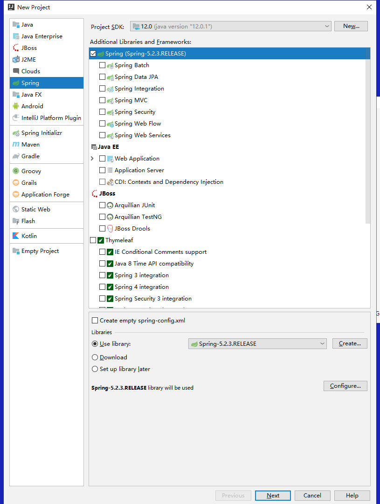
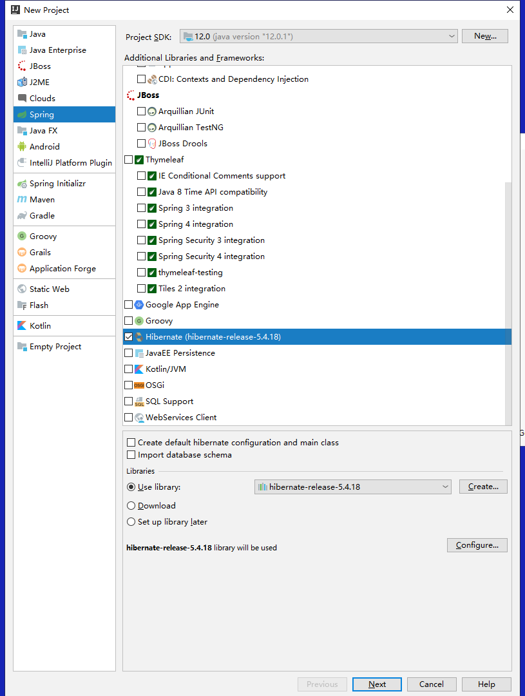
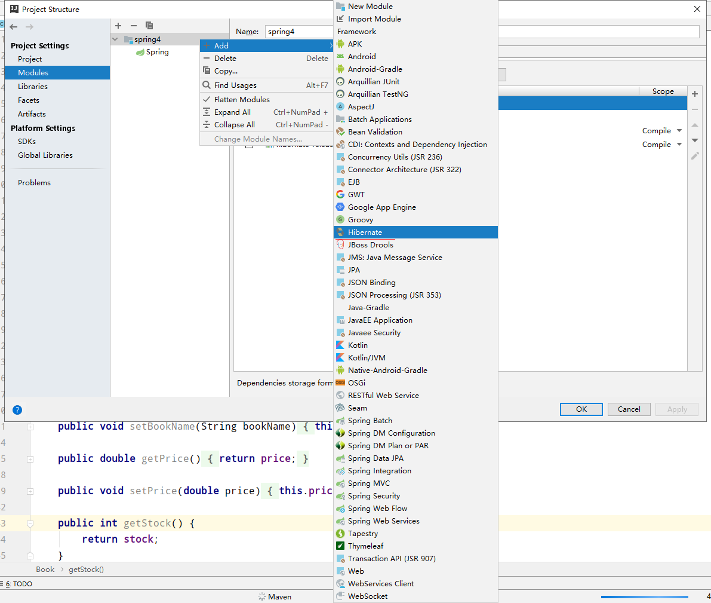
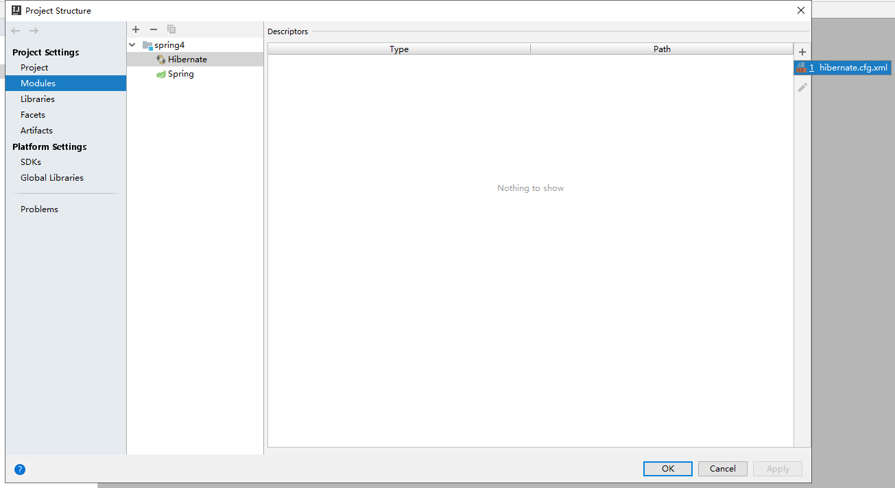
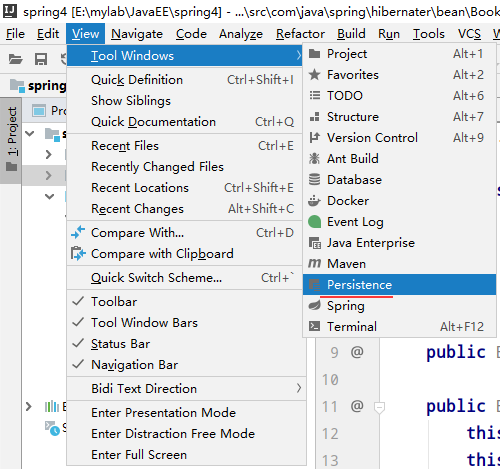
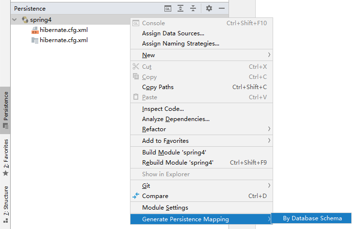
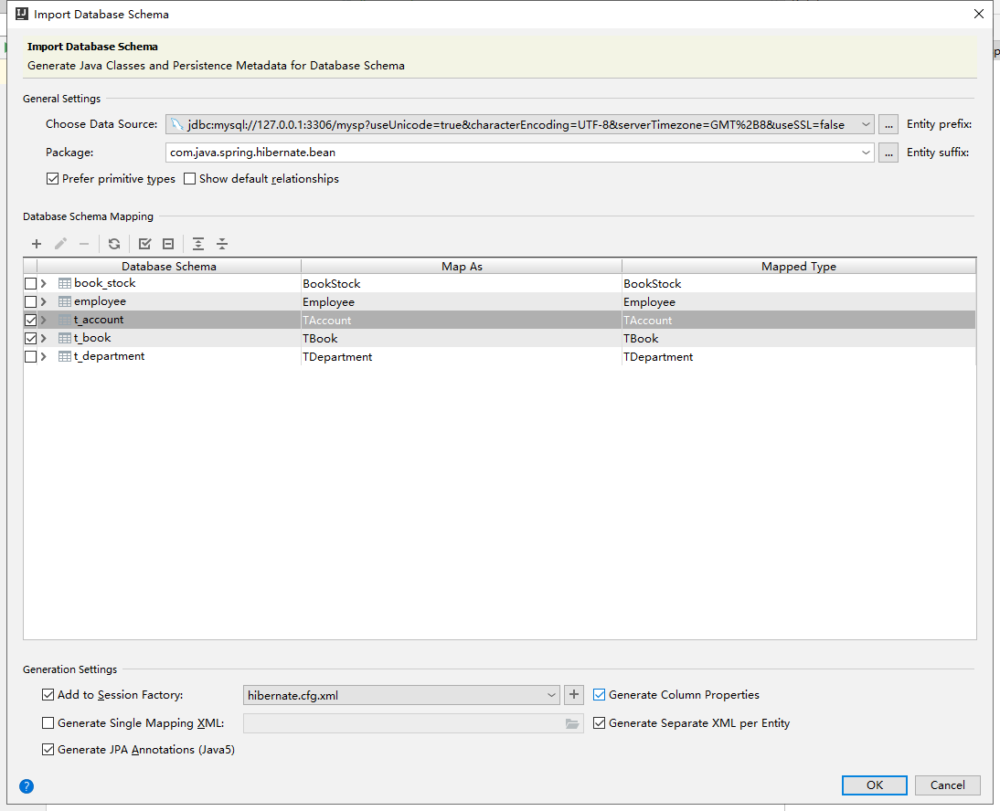

Spring与Hibernate整合
==

## 环境要求
* 需要Hibernate jar包库
    >到http://hibernate.org/orm/下载稳定版，使用其 lib\required的jar包
* 需要Spring jar包库
* 需要aspectjweaver jar包

## 整合操作步骤
1. 新建Srping、hibernate工程
      
      

2. 创建相应的Bean实体类，与表对应，在idea中类名须以T开头
    [TAccount](src/com/java/spring/hibernate/bean/TAccount.java)  
    [TBook](src/com/java/spring/hibernate/bean/TBook.java)  
    
3. 为bean实体类创建相应的hbm.xml文件

    要求必须有id字段
    [Account.hbm.xml](src/com/java/spring/hibernate/bean/Account.hbm.xml)
    [Book.hbm.xml](src/com/java/spring/hibernate/bean/Book.hbm.xml)

4. 添加hibernate.cfg.xml配置文件
    [hibernate.cfg.xml](src/hibernate.cfg.xml)
      
    
      
    
5. idea上配置databaseSource
      
      
      
      
    
6. 添加db.properties
    [db.properties](src/db.properties)  
    
7. spring配置文件
    
    spring配置sessionFactory
    ```xml
    <!-- 配置Hibernate 的SessionFactory实例
     通过Spring提供的LocalSessionFactoryBean进行配置
     -->
    <bean id="sessionFactory" class="org.springframework.orm.hibernate5.LocalSessionFactoryBean">
        <!-- 配置数据源属性 -->
        <property name="dataSource" ref="dataSource"/>
        <!-- 配置hibernate配置文件的位置及名称 -->
        <property name="configLocation" value="classpath:hibernate.cfg.xml"/>
        <!-- 配置hibernate 映射文件的位置及名称，可以使用通配符 -->
        <property name="mappingLocations" value="classpath:com/java/spring/hibernate/bean/*.hbm.xml"/>
    </bean>
    ```
    [spring.xml](src/spring.xml)

8. 写好相应的dao、service方法  
    
    用 Hibernate 的上下文 Session 持久化对象
    [BookDaoImpl](src/com/java/spring/hibernate/daoImpl/BookDaoImpl.java)  
    [BookShopServiceImpl](src/com/java/spring/hibernate/service/BookShopServiceImpl.java)

9. 测试

    [测试用例](src/test/com/java/spring/hibernate/Main.java)
    
